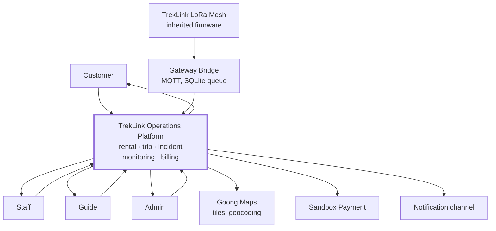
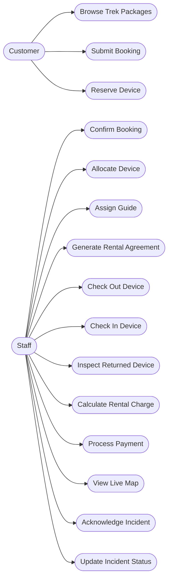
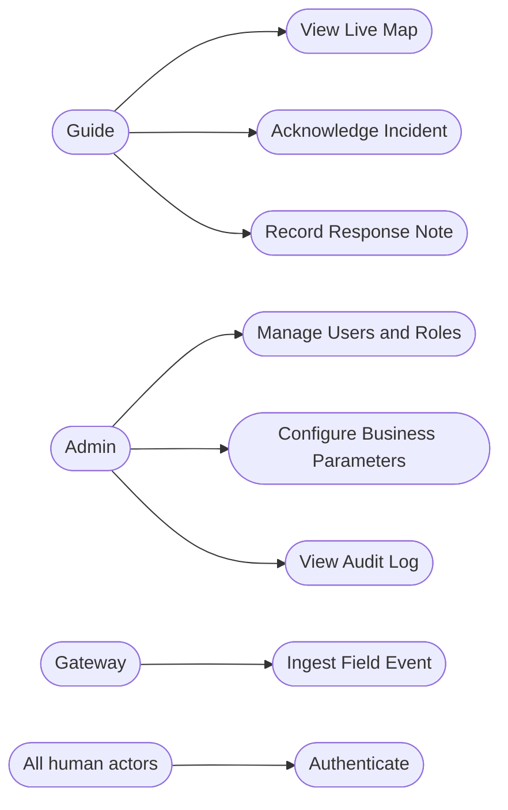
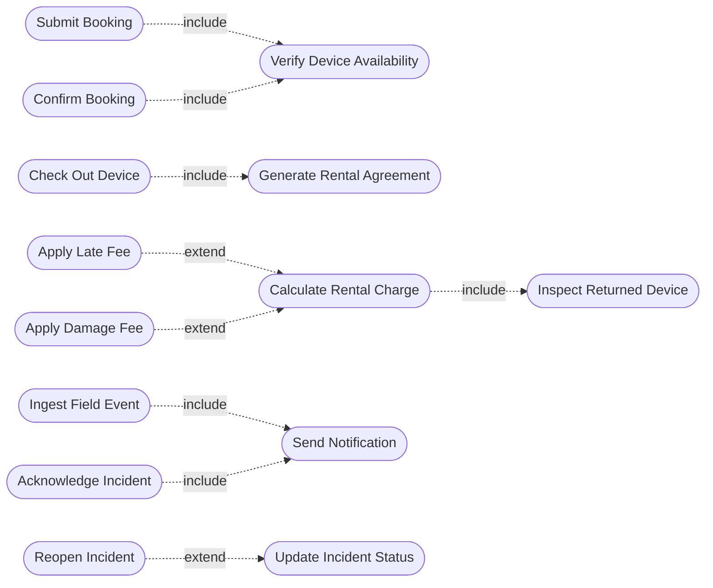
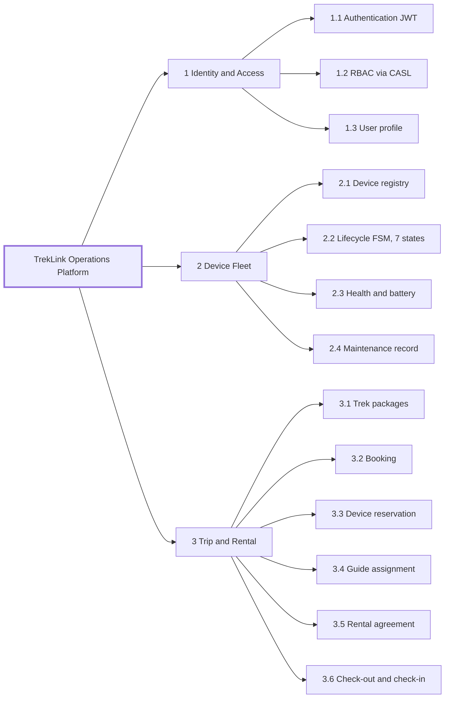
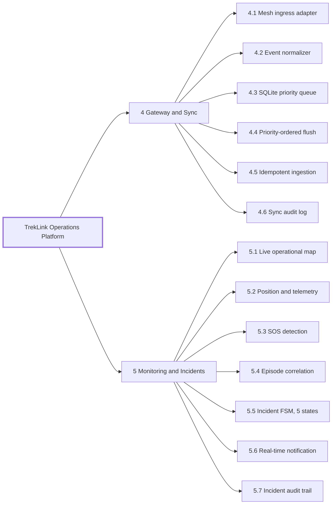
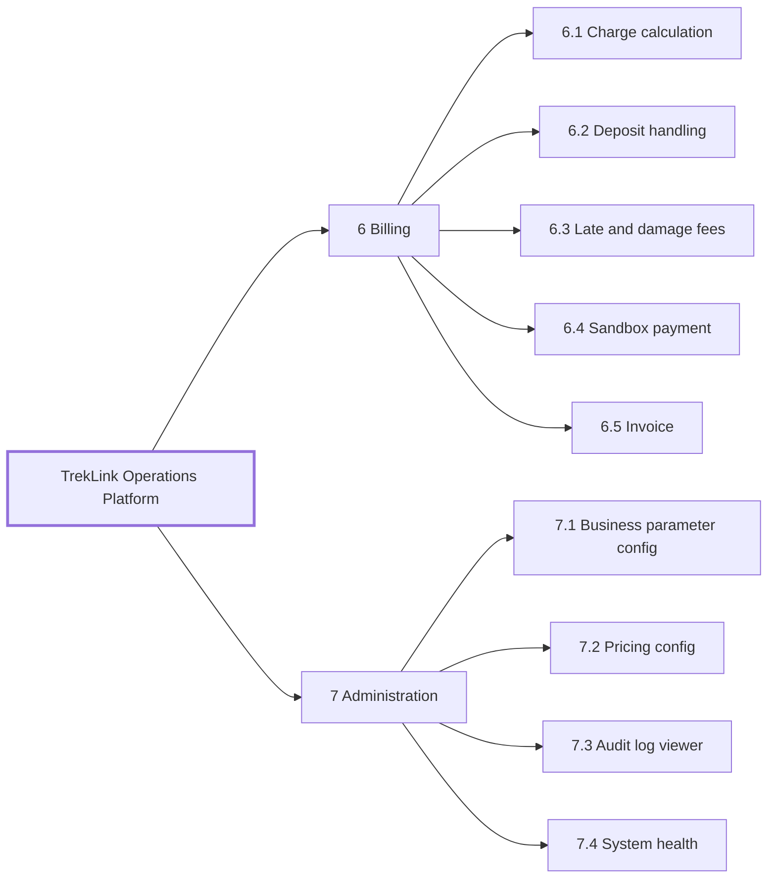

# TrekLink — Requirements Foundation

> **What this is.** The five requirement artifacts SEP490 requires by the end of W3 and presents at
> Review 1 (W4): Context Diagram, Actors, Use Cases, Feature Tree, Business Rule Matrix, and the
> Exception Scenario Matrix. Report 3 (SRS) is written **from** this file; it is not a second copy.
>
> **Source of the Main Flows** these decompose: [`05-main-flows.md`](05-main-flows.md) (**D-016**).
>
> **Anti-fail checks this file exists to pass** (SEP490 W3, and the faculty fault handbook §2):
> no requirement of the form "Admin manages everything" · use cases are functions, not workflows ·
> `include` / `extend` / generalization used correctly · every actor present · use case names in
> verb-object form · every Main Flow carries at least one exception scenario · every business rule
> traceable to a requirement, an implementation and a test case.

---

## 1. Context Diagram

The system boundary, the external actors, and the external systems it exchanges data with. Nothing
about internal structure appears here — that is the architecture diagram's job. See **Figure 1**.

***Figure 1*** — Context Diagram. The system boundary, its four human actors, and the external systems it exchanges data with. Internal structure is deliberately absent — that is the architecture diagram's job. Placement: rotated plate, 145.1 x 266.0 mm, labels at 9.14 pt.

---

## 2. Actors

| Actor | Type | Description | Main Flows |
|---|---|---|---|
| **Customer** | Primary, human | Books trek packages, reserves devices, pays, views own history | MF-01, MF-05 |
| **Staff** | Primary, human | Operations: bookings, allocation, check-out/in, inspection, billing, incident coordination | MF-01, MF-03, MF-04, MF-05 |
| **Guide** | Primary, human | Leads the trek, carries a device, confirms handover, responds in the field | MF-01, MF-03, MF-04 |
| **Admin** | Primary, human | Users and roles, device types, pricing and threshold configuration, system health, audit logs | all |
| **TrekLink Device** | Secondary, system | ESP32 LoRa node — emits SOS, position, telemetry. Inherited firmware | MF-02, MF-03, MF-04 |
| **Gateway Bridge** | Secondary, system | Normalizes mesh packets, buffers in SQLite, publishes to MQTT | MF-02, MF-03, MF-04 |
| **Goong Maps** | External system | Vector map tiles and geocoding (**D-012**) | MF-04 |
| **Sandbox Payment** | External system | Mock payment settlement — no real funds (**charter §8**) | MF-05 |
| **Scheduler** | Secondary, system | Time-triggered rules: reservation expiry, stale detection, auto-escalation | MF-01, MF-03, MF-04 |

**Role generalization.** `Admin` generalizes `Staff` for read access — every screen Staff can read,
Admin can read. It does **not** generalize for operational actions: an Admin does not acknowledge
incidents by virtue of being an Admin. Model this as generalization on the read use cases only,
and do not draw a blanket arrow that implies Admin inherits everything.

---

## 3. Use Cases

Named verb-object. Each is a **function a user invokes**, not a multi-step process — a use case that
needs eight steps to describe is a workflow, and the Main Flow diagrams in
[`05-main-flows.md`](05-main-flows.md) are where workflows belong.

### 3.1 Use case diagram

Split across three figures so every label clears the 7 pt legibility floor (see [`01-conventions/13-diagram-and-figure-conventions.md`](../01-conventions/13-diagram-and-figure-conventions.md)).
See **Figure 2**, **Figure 3** and **Figure 4**.

***Figure 2*** — Use cases invoked by Customer and Staff. Placement: inline, 87.4 x 266.0 mm, labels at 7.62 pt.

***Figure 3*** — Use cases invoked by Guide, Admin and the Gateway, plus the authentication case shared by all human actors. Placement: inline, 135.8 x 266.0 mm, labels at 14.43 pt.

***Figure 4*** — `include` and `extend` relationships. An included case always runs; an extending case runs only when its condition holds. Placement: rotated plate, 182.0 x 186.6 mm, labels at 9.98 pt.

### 3.2 `include` and `extend` — how they are used here

Getting these backwards is the single most-cited UML error in the faculty handbook, so the rule is
stated explicitly rather than assumed.

- **`include`** — the included use case **always** runs as part of the base. Mandatory, not
  conditional. *Submit Booking* always verifies availability; *Check Out Device* always generates the
  agreement; *Calculate Rental Charge* always follows inspection.
- **`extend`** — the extending use case runs **only when a condition holds**. Optional. *Apply Late
  Fee* extends *Calculate Rental Charge* only when the device came back late; *Reopen Incident*
  extends *Update Incident Status* only when new beacons arrive after resolution.
- **Generalization** — used only between actors, and only for read access (§2). No use-case
  generalization is modelled; every use case here is concrete.

### 3.3 Use case catalogue

| UC | Name | Actor | Main Flow | Priority |
|---|---|---|---|---|
| UC-01 | Browse Trek Packages | Customer | MF-01 | Medium |
| UC-02 | Submit Booking | Customer | MF-01 | High |
| UC-03 | Reserve Device | Customer | MF-01 | High |
| UC-04 | Confirm Booking | Staff | MF-01 | High |
| UC-05 | Allocate Device | Staff | MF-01 | High |
| UC-06 | Assign Guide | Staff | MF-01 | High |
| UC-07 | Generate Rental Agreement | Staff | MF-01 | Medium |
| UC-08 | Check Out Device | Staff | MF-01 | High |
| UC-09 | Check In Device | Staff | MF-05 | High |
| UC-10 | Inspect Returned Device | Staff | MF-05 | High |
| UC-11 | Calculate Rental Charge | Staff | MF-05 | High |
| UC-12 | Process Payment | Staff | MF-05 | Medium |
| UC-13 | Ingest Field Event | Gateway | MF-02 | **Highest** |
| UC-14 | View Live Map | Staff, Guide, Admin | MF-04 | High |
| UC-15 | Acknowledge Incident | Staff, Guide | MF-03 | **Highest** |
| UC-16 | Update Incident Status | Staff | MF-03 | **Highest** |
| UC-17 | Record Response Note | Guide, Staff | MF-03 | High |
| UC-18 | Manage Users and Roles | Admin | — | Medium |
| UC-19 | Configure Business Parameters | Admin | — | High |
| UC-20 | View Audit Log | Admin | — | Medium |
| UC-21 | Authenticate | all human actors | — | High |
| UC-22 | Verify Device Availability | *included* | MF-01 | High |
| UC-23 | Send Notification | *included* | MF-03, MF-02 | High |
| UC-24 | Apply Late Fee | *extends UC-11* | MF-05 | Medium |
| UC-25 | Apply Damage Fee | *extends UC-11* | MF-05 | Medium |
| UC-26 | Reopen Incident | *extends UC-16* | MF-03 | Medium |

Review 1 presents **use cases of Medium priority and above** — which, as it happens, is all of them.

---

## 4. Feature Tree

Split across three figures for legibility — as one diagram it renders 6696 px wide and prints at 1.58 pt. See **Figure 5**, **Figure 6** and **Figure 7**.

***Figure 5*** — Feature Tree, part 1 of 3 — Identity and Access, Device Fleet, Trip and Rental. Placement: inline, 110.0 x 266.0 mm, labels at 8.42 pt.

***Figure 6*** — Feature Tree, part 2 of 3 — Gateway and Sync, Monitoring and Incidents. Placement: inline, 108.2 x 266.0 mm, labels at 8.29 pt.

***Figure 7*** — Feature Tree, part 3 of 3 — Billing and Administration. Placement: inline, 154.6 x 266.0 mm, labels at 12.26 pt.

---

## 5. Business Rule Matrix

The handbook's complaint is business rules that live only in the document. Every row therefore
carries where it is implemented and how it is tested; a row whose Implementation column stays empty
at Review 2 is a finding, not a formatting gap.

Columns marked *pending* are honest — nothing is implemented yet (see §7).

| BR ID | Business Rule | Requirement | Implementation | Test Case |
|---|---|---|---|---|
| BR-01 | A device may be reserved by at most one booking for any given date range | FR-BOOK-02 | `rentals` — transactional reserve with row lock | TC-01 concurrent reserve |
| BR-02 | A booking cannot be confirmed without an available device and an available guide | FR-BOOK-04 | `rentals`, `trips` | TC-02 |
| BR-03 | Cancellation fee is applied per the configured schedule and by notice period | FR-BOOK-07 | `billing` — config-driven | TC-03 |
| BR-04 | A device below the configured minimum battery may not be checked out | FR-DEV-05 | `devices` | TC-04 |
| BR-05 | Device state transitions follow the 7-state FSM; no transition may be skipped | FR-DEV-01 | `devices` — FSM guard | TC-05 state matrix |
| BR-06 | Every field event is persisted at most once, keyed on `eventId` | FR-EVT-01 | `gateway-sync` — unique index | **TC-06 10× replay ⇒ 0 duplicates** |
| BR-07 | On reconnection, all P0 events flush before any P1, P2 or P3 | FR-EVT-03 | `gateway` queue ordering | TC-07 ordering compliance ≥99 % |
| BR-08 | An SOS episode from one device within the correlation window yields exactly one Incident | FR-EVT-05 | `incidents` — episode correlation | TC-08 beacon storm |
| BR-09 | Beacon cadence above the configured threshold raises a `Suspected` episode | FR-EVT-06 | `incidents` — cadence anomaly | TC-09 discriminator loss |
| BR-10 | Incident transitions follow the 5-state FSM; each records actor, timestamp and note | FR-INC-02 | `incidents` — FSM + audit | TC-10 |
| BR-11 | The incident audit trail is append-only; no entry may be edited or deleted | FR-INC-04 | `incidents` — DB constraint | TC-11 |
| BR-12 | New beacons after resolution reopen the Incident rather than creating a second one | FR-INC-06 | `incidents` | TC-12 |
| BR-13 | A Guide may read only their own trip's devices and incidents | FR-AUTH-03 | `auth` — CASL policy, server-side | TC-13 cross-trip access denied |
| BR-14 | Every mutating endpoint requires both a JWT guard and a policy check | FR-AUTH-01 | `auth` | TC-14 |
| BR-15 | A device silent beyond the stale threshold is displayed as stale with its last-seen time | FR-MON-03 | `monitoring` | TC-15 |
| BR-16 | Positions outside plausible bounds or with implausible jumps are rejected and logged | FR-MON-05 | `monitoring` — validation | TC-16 |
| BR-17 | Rental charge = base rate + late fee + damage fee − deposit; deposit applies before balance | FR-BILL-01 | `billing` | TC-17 |
| BR-18 | Late fee accrues per the configured rate after the configured grace period | FR-BILL-02 | `billing` — config-driven | TC-18 |
| BR-19 | A rental may not be closed while a payment balance is outstanding | FR-BILL-05 | `billing` | TC-19 payment failure |
| BR-20 | Damage fee above the deposit produces an invoiced balance, never a negative refund | FR-BILL-06 | `billing` | TC-20 |
| BR-21 | A fee waiver above the configured threshold must be approved by someone other than the inspector | FR-BILL-08 | `billing` — separation of duty | TC-21 |
| BR-22 | A device not returned within the configured grace period is retired with a loss record | FR-DEV-09 | `devices` | TC-22 |
| BR-23 | No business parameter is a source literal; each is configurable and demonstrable | NFR-CFG-01 | all modules + Configuration Matrix | TC-23 live change demo |
| BR-24 | Map tiles must come from a provider that correctly depicts Vietnamese sovereignty | NFR-LEG-01 | `frontend` — config-driven provider | TC-24 sovereignty screenshot check |

---

## 6. Exception Scenario Matrix

Consolidated from the per-flow tables in [`05-main-flows.md`](05-main-flows.md). The faculty
handbook's five generic probes — payment fails mid-way, two users act simultaneously, user cancels
after approval, data out of plausible range, role A attempts role B's action — are all covered, and
are marked ✦.

| ID      | Main Flow | Scenario                                      | Expected behaviour                                             | Impl | Tested |
| ------- | --------- | --------------------------------------------- | -------------------------------------------------------------- | ---- | ------ |
| E01-1 ✦ | MF-01     | Two customers reserve the last device at once | Transactional lock; loser told unavailable; never oversold     | ☐    | ☐      |
| E01-2 ✦ | MF-01     | Cancel after confirmation, before check-out   | Booking cancelled, device released, fee per policy             | ☐    | ☐      |
| E01-3   | MF-01     | Device fails guide health check               | Handover rejected, device → Maintenance, re-allocate           | ☐    | ☐      |
| E01-4   | MF-01     | No guide available                            | Conflict surfaced before confirmation                          | ☐    | ☐      |
| E01-5   | MF-01     | Booking overlaps existing rental              | Rejected, conflict identified                                  | ☐    | ☐      |
| E02-1   | MF-02     | Uplink drops mid-flush                        | Only confirmed rows deleted; resume from head                  | ☐    | ☐      |
| E02-2   | MF-02     | Duplicate packet delivery                     | Unique `eventId` ⇒ no-op. 10× replay ⇒ 0 duplicates            | ☐    | ☐      |
| E02-3   | MF-02     | Gateway restarts with queued events           | Disk-backed queue survives; no new `eventId`s minted           | ☐    | ☐      |
| E02-4   | MF-02     | Malformed packet                              | Logged, counted, dropped; loop never crashes                   | ☐    | ☐      |
| E02-5   | MF-02     | Queue exceeds bound in long outage            | Shed P3 first, never P0; policy configurable; logged           | ☐    | ☐      |
| E02-6   | MF-02     | Clock skew between hosts                      | Order by queue sequence + priority, not wall clock             | ☐    | ☐      |
| E03-1   | MF-03     | SOS text frame lost over RF                   | Cadence anomaly raises `Suspected` at lower confidence         | ☐    | ☐      |
| E03-2   | MF-03     | Dozens of beacons in one episode              | Appended to open Incident; one fall ⇒ one Incident             | ☐    | ☐      |
| E03-3 ✦ | MF-03     | Two staff acknowledge simultaneously          | First write wins; second sees current state and actor          | ☐    | ☐      |
| E03-4   | MF-03     | SOS from device with no active trip           | Incident still created, flagged unassigned                     | ☐    | ☐      |
| E03-5   | MF-03     | Repeat trigger after window expiry            | New Incident; window never splits or merges an episode         | ☐    | ☐      |
| E03-6   | MF-03     | Beacons arrive after resolution               | Incident reopens; reopen recorded in audit trail               | ☐    | ☐      |
| E03-7   | MF-03     | WebSocket down when SOS lands                 | Record persisted regardless; client reconciles on reconnect    | ☐    | ☐      |
| E04-1   | MF-04     | Device goes silent                            | Marker ages to stale with explicit last-seen                   | ☐    | ☐      |
| E04-2   | MF-04     | Gateway offline                               | Per-gateway connectivity indicator turns stale, visibly        | ☐    | ☐      |
| E04-3   | MF-04     | Browser loses WebSocket                       | Auto-reconnect, state resync, visible indicator                | ☐    | ☐      |
| E04-4 ✦ | MF-04     | Implausible position or coordinate jump       | Rejected at validation, logged, not plotted                    | ☐    | ☐      |
| E04-5 ✦ | MF-04     | Guide requests another guide's trip           | Server-side denial; data never reaches the client              | ☐    | ☐      |
| E04-6   | MF-04     | Map provider unreachable or key rejected      | Visible error state; device and incident panels still work     | ☐    | ☐      |
| E05-1   | MF-05     | Device returned late                          | Late fee itemised on the invoice, never folded into a total    | ☐    | ☐      |
| E05-2   | MF-05     | Device returned damaged                       | Damage recorded with evidence; deposit applied first           | ☐    | ☐      |
| E05-3   | MF-05     | Device never returned                         | Rental escalates; retired with loss record after grace         | ☐    | ☐      |
| E05-4 ✦ | MF-05     | Payment fails part-way                        | Rental stays open; balance visible; no partial state written   | ☐    | ☐      |
| E05-5   | MF-05     | Damage fee exceeds deposit                    | Deposit consumed, balance invoiced; never a negative refund    | ☐    | ☐      |
| E05-6   | MF-05     | Fails inspection with no prior incident       | Still → Maintenance; condition independent of incident history | ☐    | ☐      |
| E05-7 ✦ | MF-05     | Inspector also approves the fee waiver        | Separation of duty above the configured threshold              | ☐    | ☐      |

---

## 7. Honest status

Per the golden rule — *"có làm mới ghi, không làm đừng ghi"*, only write what has been built — this
section states plainly where the project stands, so nothing above is read as a claim of completion.

| Layer | Status as of 2026-09-16 |
|---|---|
| Specs | `gateway-sync` complete (requirements, design, tasks). The other eight modules are template stubs |
| Backend | Scaffolding only — `app.module.ts`, response interceptor, exception filter, Prisma service. Eight empty module directories |
| Gateway | Four skeleton files: entry point, MQTT client, SQLite priority queue, serial reader |
| Frontend | Dashboard page, live map widget, API client, socket client |
| Database | Prisma schema with 7 models and 6 enums; `Incident.eventId` still carries the pre-D-006 conflated key and is marked stale in-file |
| Implementation of any Main Flow | **None.** MF-01…MF-05 are all at 0 % |

Every Implementation and Tested cell in §5 and §6 is therefore unticked, and must stay unticked
until the code and the test exist. The Review 2 anti-fail check is precisely that these columns
stop being empty — filling them ahead of the work is the failure mode the handbook names.
