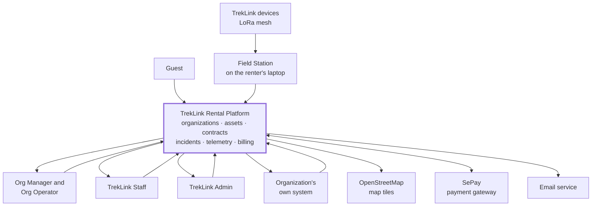
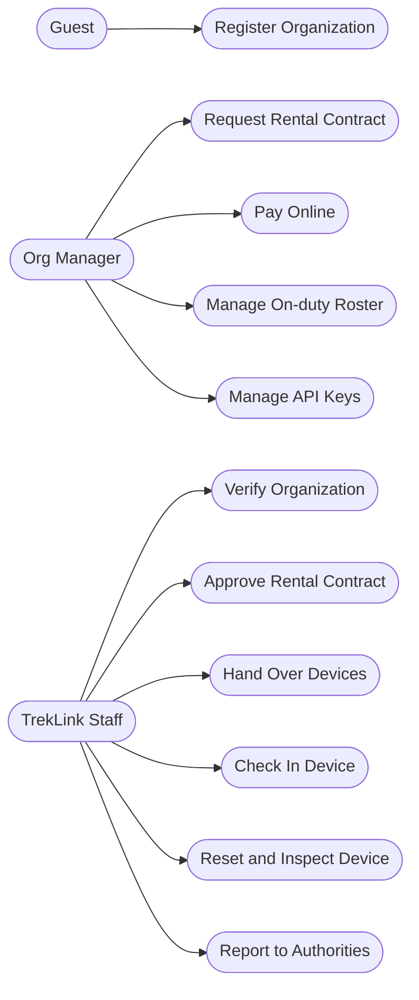
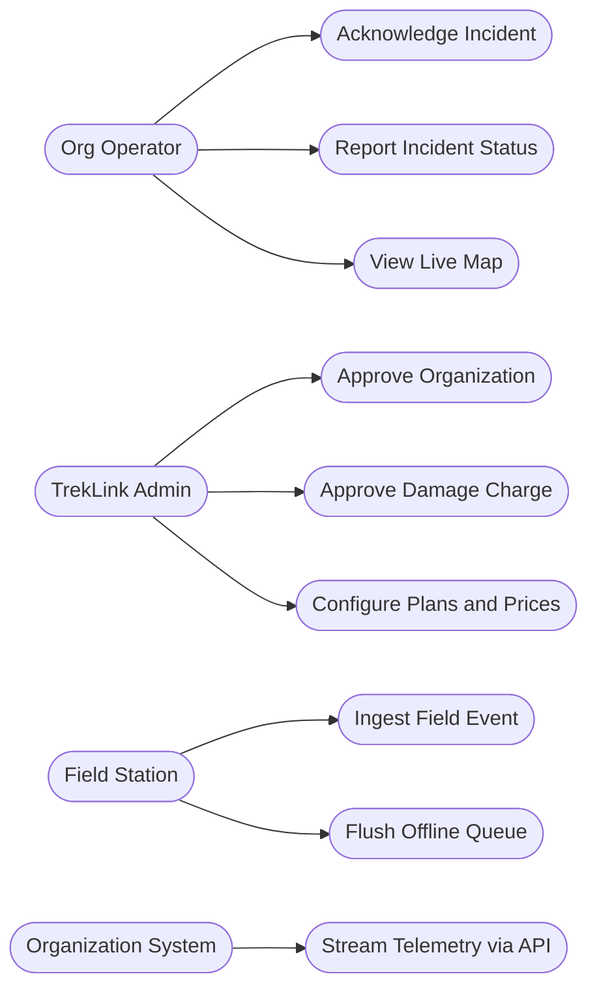
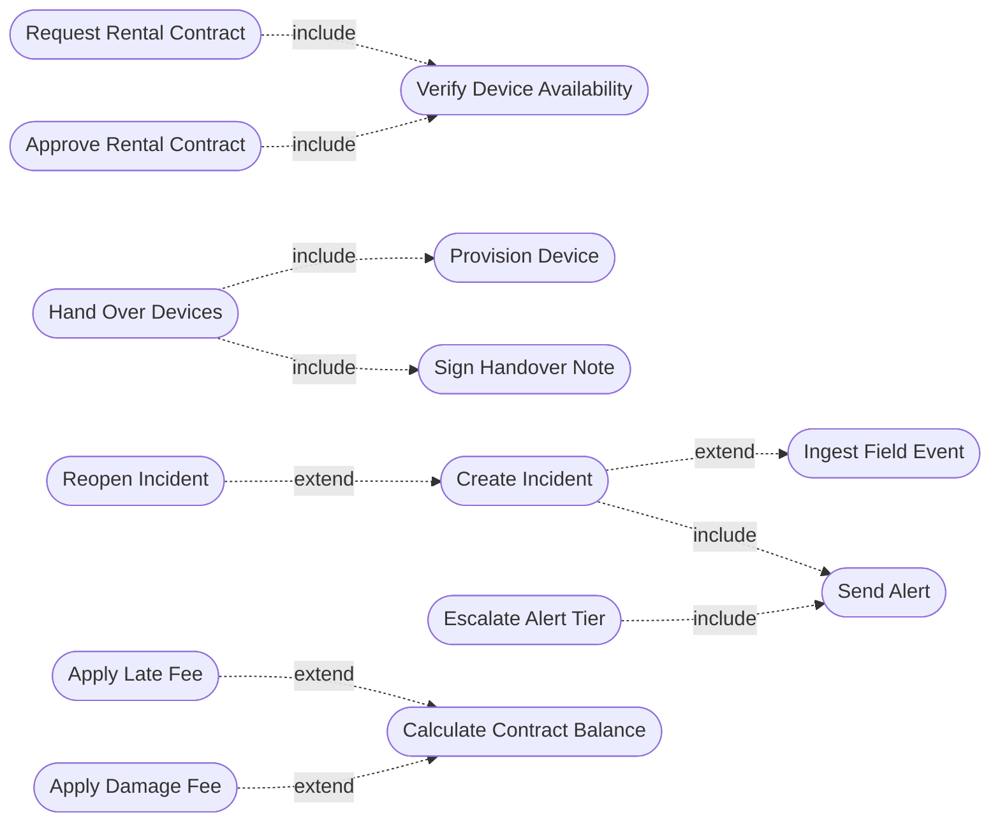
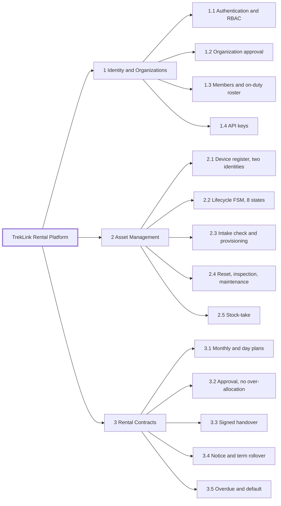
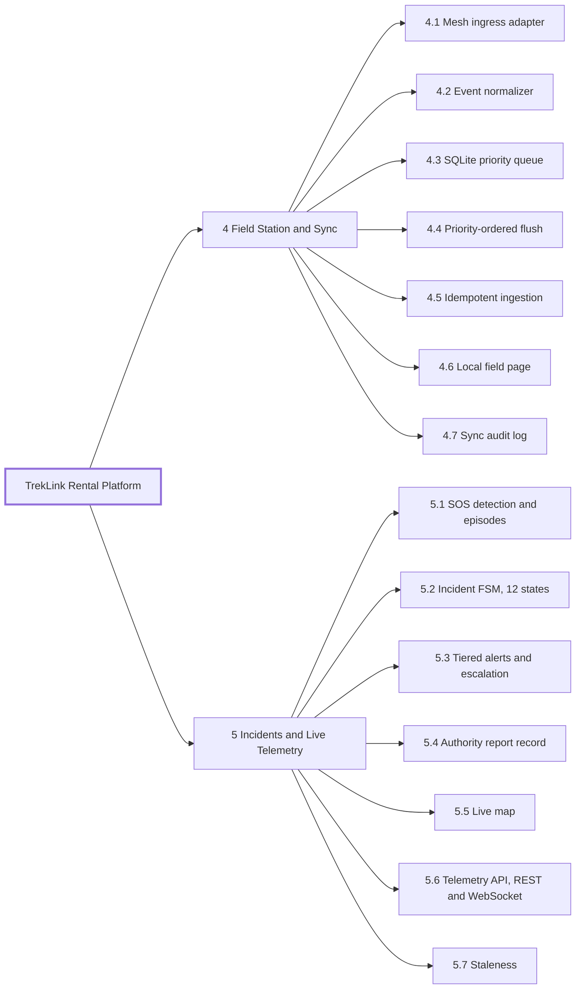
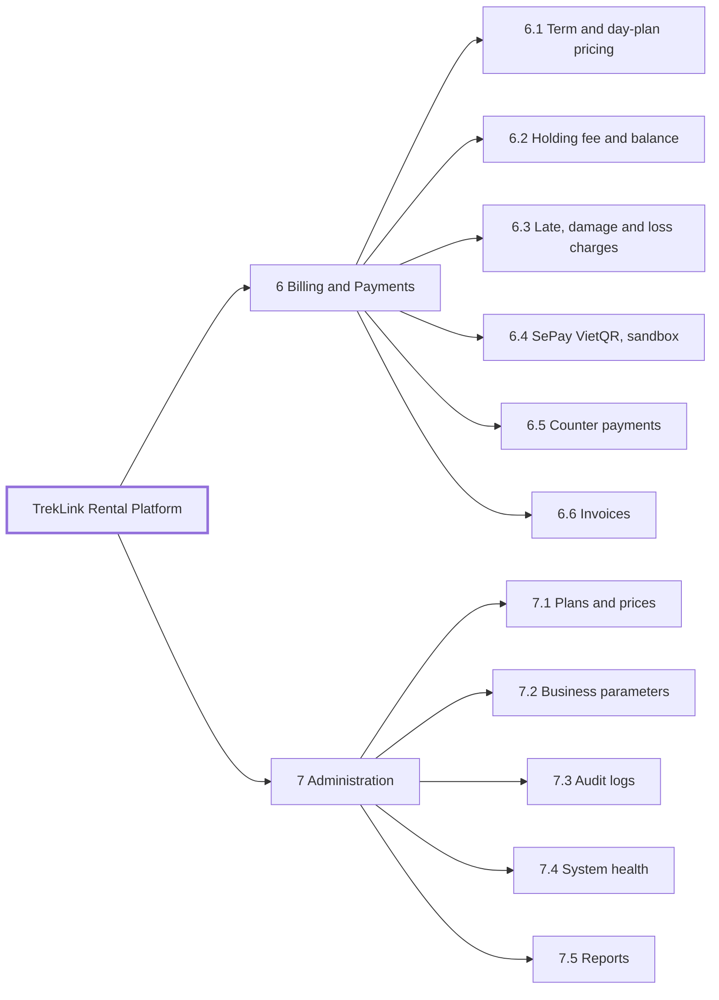

# TrekLink: Requirements Foundation

> **What this is.** The five requirement artifacts SEP490 requires by the end of W3 and presents at
> Review 1 (W4): Context Diagram, Actors, Use Cases, Feature Tree, Business Rule Matrix, and the
> Exception Scenario Matrix. Report 3 (SRS) is written **from** this file; it is not a second copy.
>
> **Source of the Main Flows** these decompose: [`05-main-flows.md`](05-main-flows.md) (**D-033**, superseding D-016).
>
> **Rewritten 2026-10-03** for the enterprise rental platform (D-033, D-034, D-035). The full use case catalogue, the specifications and the functional requirements live in the Report 3 generator (`capstone/scripts/srs/srs_data.py`); this file holds the diagrams and matrices it draws from.
>
> **Anti-fail checks this file exists to pass** (SEP490 W3, and the faculty fault handbook §2):
> no requirement of the form "Admin manages everything" · use cases are functions, not workflows ·
> `include` / `extend` / generalization used correctly · every actor present · use case names in
> verb-object form · every Main Flow carries at least one exception scenario · every business rule
> traceable to a requirement, an implementation and a test case.

---

## 1. Context Diagram

The system boundary, the external actors, and the external systems it exchanges data with. Nothing
about internal structure appears here, that is the architecture diagram's job. See **Figure 1**.

```mermaid
flowchart TB
    A1[Guest] --> SYS
    A2[Org Manager and<br/>Org Operator] --> SYS
    A3[TrekLink Staff] --> SYS
    A4[TrekLink Admin] --> SYS
    A5[Organization's<br/>own system] --> SYS
    SYS --> A2
    SYS --> A3
    SYS --> A4
    SYS --> A5
    SYS["TrekLink Rental Platform<br/>organizations · assets · contracts<br/>incidents · telemetry · billing"]
    E1[TrekLink devices<br/>LoRa mesh] --> E2[Field Station<br/>on the renter's laptop]
    E2 --> SYS
    SYS --> E3[OpenStreetMap<br/>map tiles]
    SYS <--> E4[SePay<br/>payment gateway]
    SYS --> E5[Email service]
    style SYS stroke-width:3px
```

***Figure 1***: Context Diagram. The system boundary, its human actors, the organization's own system, and the external systems it exchanges data with. Placement: rotated plate, 145.1 x 266.0 mm, labels at 9.14 pt.

---

## 2. Actors

| Actor | Type | Description | Main Flows |
|---|---|---|---|
| **Guest** | Primary, human | Registers an organization | MF-01 |
| **Org Manager** | Primary, human | Signs contracts and handover notes, requests plans, pays, manages members, roster and API keys; last alert tier | MF-01, MF-03, MF-04, MF-05 |
| **Org Operator** | Primary, human | On-duty member: receives alerts, acknowledges, reports status, watches the map, runs the Field Station | MF-02, MF-03, MF-04 |
| **TrekLink Staff** | Primary, human | Verification, contract approval, device intake, handover, check-in, reset and inspection, payments at the counter, authority reports | MF-01, MF-03, MF-05 |
| **TrekLink Admin** | Primary, human | Organization approval, plans and prices, parameters, damage approvals, retirement, platform accounts | all |
| **Organization System** | External system | The organization's own software reading telemetry with its API key | MF-04 |
| **TrekLink Device** | Secondary, system | ESP32 LoRa node; emits SOS, position, telemetry | MF-02, MF-03, MF-04 |
| **Field Station** | Secondary, system | TrekLink's executable on the renter's laptop: queue, upload, local page | MF-02, MF-04 |
| **Scheduler** | Secondary, system | Alert tiers, staleness, term rollover, overdue and default | MF-03, MF-04, MF-05 |
| **SePay** | External system | VietQR payment requests and confirming webhooks, sandbox | MF-01, MF-05 |
| **OpenStreetMap** | External system | Raster map tiles (**D-031**) | MF-04 |

**Role generalization.** A TrekLink Admin holds every TrekLink Staff permission; an Org Manager
holds every Org Operator permission inside the same organization. Device holders are not actors:
they use the stock Meshtastic app.

---

## 3. Use Cases

Named verb-object. Each is a **function a user invokes**, not a multi-step process; the Main Flow
diagrams in [`05-main-flows.md`](05-main-flows.md) are where workflows belong. The full catalogue
(UC-01 to UC-59) with specifications is generated into Report 3 §2.2 from `srs_data.py`.

### 3.1 Use case diagram

The headline use cases, split across three figures for legibility. See **Figure 2**, **Figure 3**
and **Figure 4**.

```mermaid
flowchart LR
    GUE([Guest])
    OMG([Org Manager])
    STF([TrekLink Staff])
    GUE --> U1([Register Organization])
    OMG --> U15([Request Rental Contract])
    OMG --> U19([Pay Online])
    OMG --> U5([Manage On-duty Roster])
    OMG --> U6([Manage API Keys])
    STF --> U2([Verify Organization])
    STF --> U17([Approve Rental Contract])
    STF --> U20([Hand Over Devices])
    STF --> U43([Check In Device])
    STF --> U44([Reset and Inspect Device])
    STF --> U35([Report to Authorities])
```

***Figure 2***: Use cases invoked by the Guest, the Org Manager and TrekLink Staff. Placement: inline, 100.3 x 266.0 mm, labels at 10.19 pt.

```mermaid
flowchart LR
    OOP([Org Operator])
    ADM([TrekLink Admin])
    FST([Field Station])
    OSY([Organization System])
    OOP --> U32([Acknowledge Incident])
    OOP --> U33([Report Incident Status])
    OOP --> U38([View Live Map])
    OSY --> U39([Stream Telemetry via API])
    ADM --> U3([Approve Organization])
    ADM --> U48([Approve Damage Charge])
    ADM --> U56([Configure Plans and Prices])
    FST --> U26([Ingest Field Event])
    FST --> U27([Flush Offline Queue])
```

***Figure 3***: Use cases invoked by the Org Operator, the TrekLink Admin, the Field Station and the organization's own system. Placement: inline, 110.0 x 266.0 mm, labels at 11.69 pt.

```mermaid
flowchart LR
    U15([Request Rental Contract]) -. include .-> U16([Verify Device Availability])
    U17([Approve Rental Contract]) -. include .-> U16
    U20([Hand Over Devices]) -. include .-> U14([Provision Device])
    U20 -. include .-> U21([Sign Handover Note])
    U29([Create Incident]) -. extend .-> U26([Ingest Field Event])
    U29 -. include .-> U30([Send Alert])
    U31([Escalate Alert Tier]) -. include .-> U30
    U36([Reopen Incident]) -. extend .-> U29
    U46([Apply Late Fee]) -. extend .-> U45([Calculate Contract Balance])
    U47([Apply Damage Fee]) -. extend .-> U45
```

***Figure 4***: `include` and `extend` relationships. An included case always runs; an extending case runs only when its condition holds. Placement: rotated plate, 182.0 x 187.7 mm, labels at 10.21 pt.

### 3.2 `include` and `extend`: how they are used here

- **`include`**: the included use case **always** runs as part of the base. Request and Approve
  Rental Contract always verify availability; Hand Over Devices always provisions every device and
  captures the signed handover note; Create Incident and Escalate Alert Tier always send an alert.
- **`extend`**: the extending use case runs **only when a condition holds**. Create Incident extends
  Ingest Field Event when the event is an SOS or crosses the cadence threshold; Reopen Incident
  extends Create Incident when the same device raises a new SOS inside the reopen window; Apply Late
  Fee and Apply Damage Fee extend Calculate Contract Balance when the return is late or damaged.
- **Generalization**: only between actors (§2).

---

## 4. Feature Tree

Split across three figures for legibility. See **Figure 5**, **Figure 6** and **Figure 7**.

```mermaid
flowchart LR
    ROOT[TrekLink Rental Platform]
    ROOT --> F1[1 Identity and Organizations]
    ROOT --> F2[2 Asset Management]
    ROOT --> F3[3 Rental Contracts]
    F1 --> F1a[1.1 Authentication and RBAC] & F1b[1.2 Organization approval] & F1c[1.3 Members and on-duty roster] & F1d[1.4 API keys]
    F2 --> F2a[2.1 Device register, two identities] & F2b[2.2 Lifecycle FSM, 8 states] & F2c[2.3 Intake check and provisioning] & F2d[2.4 Reset, inspection, maintenance] & F2e[2.5 Stock-take]
    F3 --> F3a[3.1 Monthly and day plans] & F3b[3.2 Approval, no over-allocation] & F3c[3.3 Signed handover] & F3d[3.4 Notice and term rollover] & F3e[3.5 Overdue and default]
    style ROOT stroke-width:3px
```

***Figure 5***: Feature Tree, part 1 of 3, Identity and Organizations, Asset Management, Rental Contracts. Placement: inline, 91.4 x 266.0 mm, labels at 7.25 pt.

```mermaid
flowchart LR
    ROOT[TrekLink Rental Platform]
    ROOT --> F4[4 Field Station and Sync]
    ROOT --> F5[5 Incidents and Live Telemetry]
    F4 --> F4a[4.1 Mesh ingress adapter] & F4b[4.2 Event normalizer] & F4c[4.3 SQLite priority queue] & F4d[4.4 Priority-ordered flush] & F4e[4.5 Idempotent ingestion] & F4f[4.6 Local field page] & F4g[4.7 Sync audit log]
    F5 --> F5a[5.1 SOS detection and episodes] & F5b[5.2 Incident FSM, 12 states] & F5c[5.3 Tiered alerts and escalation] & F5d[5.4 Authority report record] & F5e[5.5 Live map] & F5f[5.6 Telemetry API, REST and WebSocket] & F5g[5.7 Staleness]
    style ROOT stroke-width:3px
```

***Figure 6***: Feature Tree, part 2 of 3, Field Station and Sync, Incidents and Live Telemetry. Placement: inline, 100.4 x 266.0 mm, labels at 7.69 pt.

```mermaid
flowchart LR
    ROOT[TrekLink Rental Platform]
    ROOT --> F6[6 Billing and Payments]
    ROOT --> F7[7 Administration]
    F6 --> F6a[6.1 Term and day-plan pricing] & F6b[6.2 Holding fee and balance] & F6c[6.3 Late, damage and loss charges] & F6d[6.4 SePay VietQR, sandbox] & F6e[6.5 Counter payments] & F6f[6.6 Invoices]
    F7 --> F7a[7.1 Plans and prices] & F7b[7.2 Business parameters] & F7c[7.3 Audit logs] & F7d[7.4 System health] & F7e[7.5 Reports]
    style ROOT stroke-width:3px
```

***Figure 7***: Feature Tree, part 3 of 3, Billing and Payments, Administration. Placement: inline, 130.4 x 266.0 mm, labels at 9.99 pt.

---

## 5. Business Rule Matrix

The business rules (BR-01 to BR-35), each with the requirement that states it, the module that
implements it and its test case, are generated into Report 3 §5.1 from the SRS builder, so the
identifiers cannot drift between this file and the report. Every Implementation and Tested cell is
empty until the code and the test exist.

---

## 6. Exception Scenario Matrix

The per-flow tables in [`05-main-flows.md`](05-main-flows.md) are the source: E01-1 to E01-7,
E02-1 to E02-6, E03-1 to E03-9, E04-1 to E04-7 and E05-1 to E05-7. Report 3 §5.2 consolidates them
with the requirement each one tests. The faculty handbook's five generic probes are covered:
payment failing part-way (E01-4, E05-4), two users acting at once (E01-1, E03-3), cancellation after
approval (E01-7), data outside plausible range (E04-6), and one organization reaching another's data
(E04-4).

---

## 7. Honest status

| Layer | Status as of 2026-10-03 |
|---|---|
| Specs | The `treklink-web` module specs were written for the booking scope and are being rewritten against D-033 to D-035 |
| Backend | The `platform` module (health, business parameters, audit log) is implemented; the other modules are empty |
| Database | The Prisma schema still carries the booking scope (`TrekPackage`, `Booking`); its migration follows the spec rewrite |
| Implementation of any Main Flow | **None.** MF-01 to MF-05 are all at 0 % |
