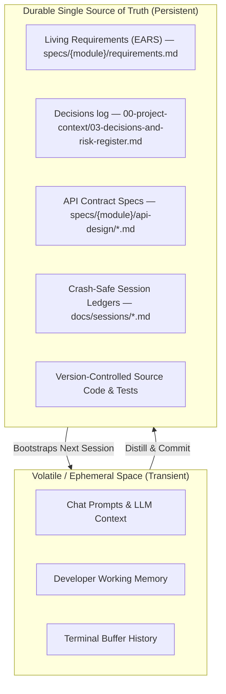
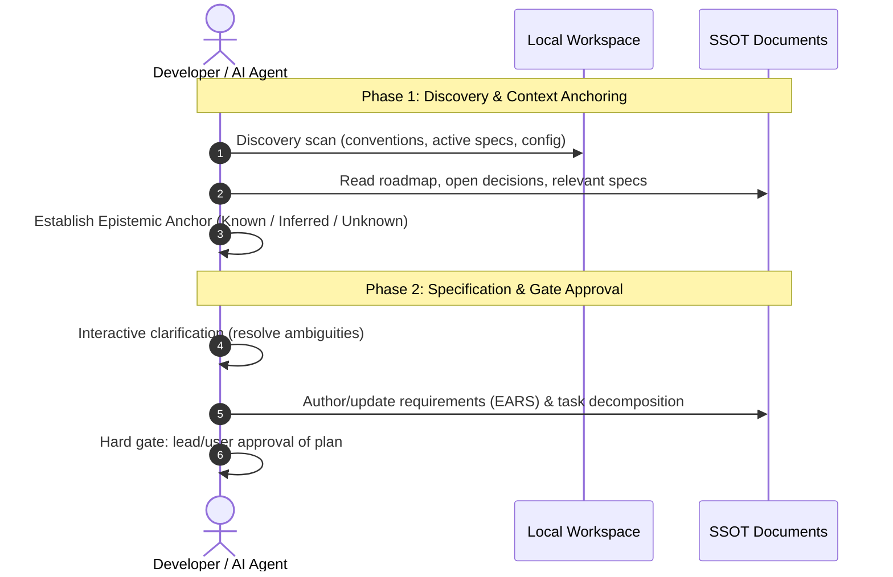
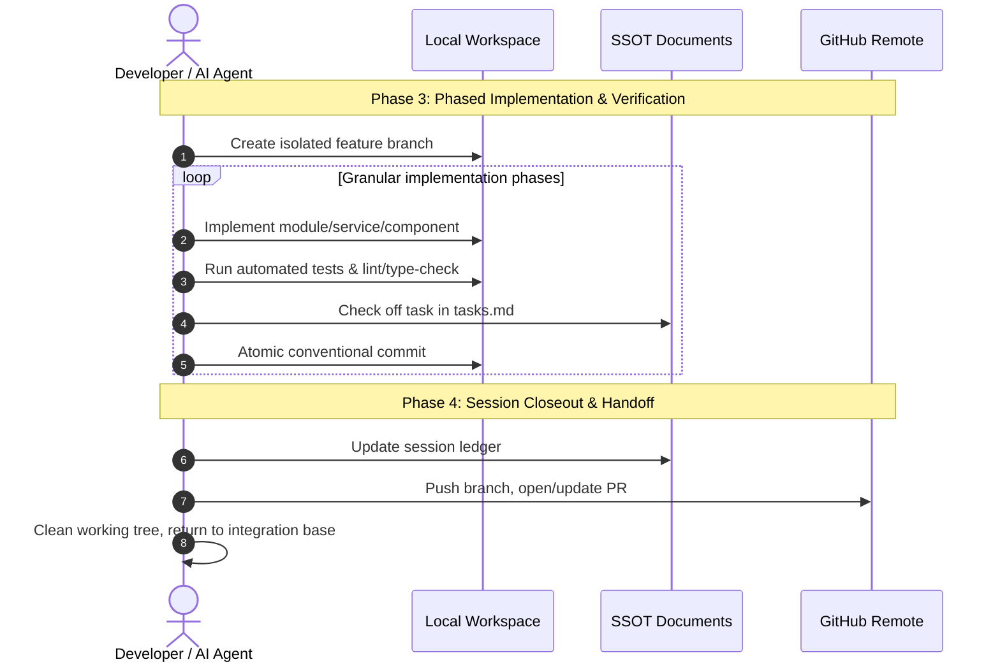

# Core Engineering Philosophy: Session-Based Development & Living SSOT

> **Fundamental Law of Engineering Continuity**: In modern software engineering with human-AI collaboration, conversational memory is volatile, ephemeral, and lossy. **The codebase and its living documents are the only durable sources of truth.** Every decision, state transition, and requirement MUST be grounded in structured documents, and every work stream MUST execute in bounded, crash-resilient sessions.

This applies with extra force on TrekLink: a 5-person team working 2-week sprints across 4 codebases (firmware [frozen], gateway, backend, frontend), reviewed by lecturers at fixed checkpoints (Week 4/8/14) who were not in the room for any implementation decision. If it isn't written down, the reviewer can't grade it and the next session can't resume it.

---

## 1. The Core Philosophy

Software projects fail not from lack of code, but from **context drift, ungrounded assumptions, and fragmented memory**. To eliminate this entropy, this framework rests on two pillars:

1. **Documents as the Single Source of Truth (SSOT)**: If a requirement, architectural choice, or API contract is not written down in an official document, **it does not exist**.
2. **Session-Based Development (SBD)**: All engineering work is structured into deterministic, self-contained sessions with rigorous pre-flight discovery, milestone checkpoints, and explicit handoffs.

See **Figure 1**.



***Figure 1*** — Volatile context versus durable SSOT. Anything that exists only in a chat window is lost at session end; anything that matters is written to a document under version control. Placement: rotated plate, 136.6 x 266.0 mm, labels at 9.92 pt.

---

## 2. Pillar I: Living Documentation as SSOT

### 2.1 The SSOT Hierarchy

| Level | Document Type | Purpose | Mutability |
|:---:|---|---|---|
| **Tier 1** | Project Charter, System Architecture & Data Schema | Module boundaries, domain entities, invariants | High ceremony; requires team + supervisor sign-off (esp. at Review 1/2) |
| **Tier 2** | Feature Specs (`specs/{module}/`) | EARS requirements, API contracts, task breakdowns | Updated per module/user story; locked during implementation |
| **Tier 3** | Engineering Conventions (`docs/conventions/`, this folder) | Architecture rules, code style, Git flow, agent discipline | Living rules; updated on retrospective consensus |
| **Tier 4** | Session Ledgers & Worklogs (`docs/sessions/`) | Current milestone progress, test metrics, open bugs | Frequently updated during active sessions |
| **Tier 5** | Source Code & Test Suites | Concrete implementation fulfilling Tiers 1–3 | Changes only to satisfy Tiers 1–4 |

### 2.2 In-Repo Living Documents

- **Zero third-party dependency for context**: docs live inside the repo, version-controlled, next to the code they describe.
- **Atomic spec-code merges**: when an endpoint changes, its `specs/{module}/api-design/*.md` file is updated **in the same PR**. This generalizes to every tier above it, not just API endpoints: a finding that touches the charter, a decision, a spec, or a convention gets that document updated **in the same working pass it was found in** — see `08-ai-agent-steering-and-discipline.md` Stage 2.5b. A doc update queued for "later in the session" is functionally the same failure mode as an endpoint shipped without its spec update — just easier to miss because nothing blocks the PR on it.
- **No stale documentation**: specs gate coding, they aren't written after the fact.

---

## 3. Pillar II: Session-Based Development (SBD)

Break open-ended work into bounded execution cycles — 1–3 hours for humans, or one AI-agent context window.

### 3.1 The 4-Phase Session Lifecycle

See **Figure 2**.



***Figure 2*** — The session lifecycle, phases 1 and 2 — discovery and context anchoring, then specification and the approval gate. No code is written before the gate. Placement: rotated plate, 179.9 x 266.0 mm, labels at 8.58 pt.

See **Figure 3**.



***Figure 3*** — The session lifecycle, phases 3 and 4 — phased implementation with verification, then closeout and handoff. Placement: rotated plate, 182.0 x 257.9 mm, labels at 7.66 pt.

### Phase 1: Discovery & Context Anchoring
1. **Discovery scan**: conventions, active specs, roadmap position (which sprint/week are we in).
2. **Epistemic Reality Anchor**:
   - **KNOWN**: verified from files read this session.
   - **INFERRED**: derived pattern (state confidence).
   - **UNKNOWN**: missing context — flag **before** proceeding, check `03-decisions-and-risk-register.md` for anything OPEN that blocks you.
3. **Kalama Empirical Proof Standard**: reject "seems reasonable" — accept only what's backed by file evidence or test output.

### Phase 2: Specification & Gate Approval
1. Never write production code from a bare chat prompt or vague issue.
2. Author/review the 3-file spec suite in `specs/{module}/`: `requirements.md` → `design.md` → `tasks.md`.
3. Pause and clarify edge cases before coding.

### Phase 3: Phased Implementation & Verification
1. Branch off `dev` (or `main` for hotfixes).
2. Work `tasks.md` phase-by-phase.
3. **Read-Before-Write**: never edit a file not opened and inspected this session.
4. Run `npm test` / `npm run lint` / `npm run typecheck` (per-package — see `05-backend-conventions.md`, `06-frontend-conventions.md`) after every atomic phase.

### Phase 4: Session Closeout & Crash-Safe Handoff
1. Update the session ledger.
2. Commit with bracket tags (`feat:`, `fix:`, `refactor:`, `docs:` — full list in `07-github-workflow-git-conventions.md`).
3. Rebase on the upstream integration branch.
4. Push and open/update the PR; output a concise handoff so the next session (human or AI) resumes with zero overhead.

---

## 4. Crash-Safe Memory Checkpoint Protocol

> **(Session 4 revision — namespacing for concurrency)** The original version of this section
> allowed a single rolling `docs/sessions/current.md` as an alternative to per-date files. That's
> unsafe once more than one session (human or AI-agent) can be active on the repo at the same
> time — a five-person team plus their own AI agents, each possibly running more than one session
> window, is exactly that case. **Per-session-instance files are now mandatory, not optional.**
> This isn't paperwork: this exact gap caused a real loss this term — a Session 4 audit produced
> several non-obvious findings (firmware wire-format facts, scaffold bugs) that sat only in chat
> output, in a repo that already had this protocol on paper, because nothing forced them to disk
> mid-session. See `08-ai-agent-steering-and-discipline.md` Stage 2.5 for the enforcement rule.

**Tracked tier** — `docs/sessions/<YYYY-MM-DD>-<HHMM>-<topic-slug>.md`, one file per session
instance (e.g. `2026-09-13-1830-gateway-sync-audit.md`). `docs/sessions/current.md` is no longer
where work-in-progress gets written — it becomes a short **index**: a few lines per active or
recent session file, updated whenever a session file is created or closed out, so a new session
can see at a glance what else is/was in flight before re-deriving it.

**Personal scratch tier** — same pattern, one level down: `ignore/[name]/docs/sessions/<YYYY-MM-DD>-<HHMM>-<topic-slug>.md`
per session instance, replacing the old single shared `ignore/[name]/docs/current-progress.md`.
That file still exists but changes role: a short rolling pointer/summary ("latest: see
`sessions/2026-09-13-1830-gateway-sync-audit.md`"), not the place high-frequency scratch writes
go — that would recreate the same collision risk one level down.

Maintain a session file at every major milestone, and — per the enforcement rule in
`08-ai-agent-steering-and-discipline.md` Stage 2.5 — immediately on any non-obvious finding, not
only at milestones:

```markdown
# Session Checkpoint: 2026-09-14 — gateway-sync

## 1. Active Focus & Objectives
- Module: Gateway Bridge — SQLite priority queue (TP2)
- Branch: feat/TK-45-gateway-priority-queue

## 2. Completed Milestones
- [x] Phase 1: SQLite schema for P0-P3 queue tiers
- [x] Phase 2: Enqueue/dequeue with priority ordering + unit tests

## 3. Immediate Next Steps (for resuming session)
1. Implement MQTT publish-on-reconnect flush routine
2. Add integration test: 30s / 2min / 5min connectivity-loss simulation
3. Wire health-reporting endpoint (queue depth per tier)

## 4. Uncommitted State / Known Blockers
- Working tree: clean (commit `a1b2c3d`)
- Test status: 18/18 passing
- Open questions: none (D-001 ORM decision doesn't block gateway work)
```

---

## 5. Context Window & Token Budget Management (AI Agents)

1. **Context decay**: past ~70–80% capacity, reasoning fidelity drops. Compact proactively.
2. **Proactive compaction**: grep for the specific error, don't dump whole logs; read targeted line ranges, not whole large files; summarize findings into the session ledger instead of re-reading the repo every turn.
3. **Handoff over compounding**: for multi-day work (e.g. TP2's whole Gateway Bridge), split into clean sessions — Session N ends by committing + updating `tasks.md`; Session N+1 boots by reading the spec, with a full context budget for implementation.

---

## 6. Tenets of Iterative Refinement

1. **Working software at every step**: never leave `dev` in a broken/uncompilable state. Incomplete work stays on its feature branch.
2. **Minimal sufficient change**: solve the registered requirement — no speculative abstractions ahead of the TP schedule.
3. **Continuous verification**: a feature is done when tests prove it satisfies the EARS requirements, not when code is typed.
