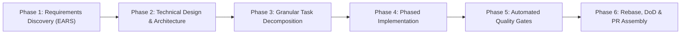

# Spec-Driven Development Workflow (SDSDW)

> **Core Axiom**: Specification is the architectural blueprint of software. Writing code without an approved specification is constructing a building without an engineering schematic. This workflow guarantees requirements, interactions, contracts, and tasks are formally verified before a single line of production code is written, this is the "Kiro spec-driven development" pattern (`requirements.md` → `design.md` → `tasks.md`) combined with session-based development from `01-session-based-development-and-ssot.md`.

---

## 1. Executive Overview

See **Figure 1**.



***Figure 1***: The spec-before-code gate: EARS requirements, then design, then granular task decomposition. Each phase is approved before the next begins. Placement: rotated plate, 32.1 x 266.0 mm, labels at 10.70 pt.

### Universal tenets
1. **Spec before code** (Read → Clarify → Design → Code). Never guess business rules, RBAC edge cases, or error conditions, TrekLink's grading depends on traceable requirements (RQ1–RQ3 must map back to specific FRs).
2. **Standardized directory topology**: specs live in `specs/{module_name}/` inside each repo, next to the code.
3. **EARS-compliant criteria** for every functional requirement.
4. **Mermaid** for all architecture diagrams, state machines (Device 7-state, Incident 5-state, these are graded deliverables), and sequence flows.
5. **In-codebase tracked deliverables**: specs, migrations, and docs are committed, never left in an uncommitted scratchpad.
6. **Docs sync at the moment of discovery, not at phase-exit cleanup** (`08-ai-agent-steering-and-discipline.md` Stage 2.5b). If implementation, testing, or a code-level investigation reveals that a requirement, design assumption, or task in this module's spec was wrong or incomplete, fix `requirements.md`/`design.md`/`tasks.md` in that same working pass, immediately, not queued for a later "update the docs" step. Phase 6's `6.3` below is a final **audit** that sync already happened throughout, not the first time specs get touched.

---

## 2. Directory Structure (`specs/{module_name}/`)

TrekLink modules (per the roadmap's TP mapping and `07-github-workflow-git-conventions.md`'s `module:*` labels): `auth`, `devices`, `rentals`, `trips`, `gateway-sync`, `incidents`, `monitoring`, `billing`, `frontend`.

```text
specs/{module_name}/
├── requirements.md                  # EARS-format business rules & criteria
├── design.md                        # Architecture, domain models, sequence flows, state machines
├── tasks.md                         # Phased, granular implementation checklist
└── api-design/                      # One file per endpoint, using 02-templates/04-api-endpoint-template.md
    ├── 00-api-testing-guide.md      # Swagger / Postman / curl walkthrough
    ├── 01-post-devices-register.md
    ├── 02-get-devices-list.md
    └── ...

# Example for the gateway-sync module:
specs/gateway-sync/
├── requirements.md    # eventId scheme, P0-P3 priority rules, idempotency criteria
├── design.md           # SQLite queue schema, MQTT topic design, reconnect/flush sequence diagram
├── tasks.md
└── api-design/
    └── 01-post-events-ingest.md
```

Frontend-only concerns (screens, component architecture) live under `specs/frontend/` with the same 3-file pattern, referencing backend `api-design/` files rather than duplicating them.

---

## 3. Phase-by-Phase Execution Protocol

### Phase 1: Requirements Discovery & EARS Specification

#### 1. Context ingestion
Review the relevant section of `00-project-context/01-project-charter.md`, existing entities in `design.md` of dependent modules, and upstream/downstream module boundaries (e.g. `incidents` depends on `devices` + `rentals` existing first).

#### 2. Interactive clarification interview (mandatory quality gate)
Before writing specs or code, formulate 3–5 high-value clarifying questions targeting:
- **Domain edge cases**: e.g. what happens to an in-field device's rental record if a trip's Guide reports it lost?
- **Authorization**: which of Admin/Staff/Guide/Customer can trigger this action; ownership checks (a Guide can only see their own assigned trips).
- **Reliability**: for gateway-sync/incidents, does this requirement interact with idempotency or priority ordering?

> **MANDATORY HARD STOP**: stop after presenting the questions and wait for an explicit answer. No specs, designs, tasks, or code before that.

#### 3. Authoring `requirements.md` in EARS syntax

| Pattern | Template | TrekLink example |
|---|---|---|
| **Ubiquitous** | *The system SHALL [response]* | The system SHALL record actor (user ID + role) and UTC timestamp on every incident state transition. |
| **Event-driven** | *WHEN [trigger], the system SHALL [response]* | WHEN a valid SOS event passes the idempotency check, the system SHALL create exactly one Incident and notify Staff + Guide via WebSocket within 2 seconds. |
| **State-driven** | *WHILE [state], the system SHALL [response]* | WHILE a device is in `Maintenance` status, the system SHALL reject any rental allocation attempt referencing it. |
| **Unwanted behavior** | *IF [condition/error], THEN the system SHALL [response]* | IF the same `eventId` is delivered more than once, THEN the system SHALL discard the duplicate without creating a second Incident. |
| **Optional feature** | *WHERE [feature/flag], the system SHALL [response]* | WHERE sandbox payment mode is enabled, the system SHALL mark all transactions with a `sandbox: true` flag. |

### Phase 2: Technical Architecture & Design (`design.md`)

**Backend/gateway modules**:
1. Domain & data modeling, entities, enums, FK constraints, state machines (render as Mermaid `stateDiagram-v2` for Device/Incident FSMs).
2. Service & queue architecture, NestJS providers/services, MQTT topics, SQLite queue schema for gateway-sync.
3. Endpoint spec (`api-design/*.md`) using `02-templates/04-api-endpoint-template.md`.

**Frontend**:
1. Component architecture (Feature-Sliced Design, see `06-frontend-conventions.md`).
2. Server vs. client vs. form state lifecycle.
3. Validation schemas (Zod) mirroring backend `class-validator` DTOs 1:1.

### Phase 3: Granular Task Decomposition (`tasks.md`)

```markdown
# Implementation Tasks: [Module Name]

## Phase 1: Foundation & Domain Modeling
- [ ] 1.1 Define entities/enums (Prisma, per D-001)
- [ ] 1.2 Write migration(s)
- [ ] 1.3 Add DTOs and error codes

## Phase 2: Core Service / Mutation Logic
- [ ] 2.1 Implement service method(s) with class-validator DTO input
- [ ] 2.2 Wrap multi-table writes in a transaction
- [ ] 2.3 Unit test success + failure paths

## Phase 3: Query / Retrieval
- [ ] 3.1 Implement paginated list/query endpoints
- [ ] 3.2 Unit test filter/sort/pagination boundaries

## Phase 4: API Presentation Layer
- [ ] 4.1 Controller + Guards (JWT + RBAC/CASL)
- [ ] 4.2 Swagger/OpenAPI annotations
- [ ] 4.3 Integration tests for the HTTP contract (match api-design/*.md exactly)

## Phase 5: Frontend Integration (if applicable)
- [ ] 5.1 API client + TypeScript types
- [ ] 5.2 Form (RHF + Zod) or view wired to TanStack Query
- [ ] 5.3 Loading/empty/error states

## Phase 6: End-to-End Verification & DoD Audit
- [ ] 6.1 Full test suite green
- [ ] 6.2 Lint + typecheck clean
- [ ] 6.3 Audit: confirm `specs/{module}/api-design/*.md` already matches actual behavior — it
      should have been updated live in Phases 1-5 per tenet #6 above, so this is a check, not
      the first edit. If it's out of sync here, that's a process miss to flag, not routine cleanup.
```

### Phase 4: Phased Implementation
Never skip ahead. Atomic commits per subtask with bracket tags (`07-github-workflow-git-conventions.md`). Zero magic strings, centralize error codes and route constants.

### Phase 5: Automated Testing & Verification Gates
- **Unit tests**: every domain rule, FSM transition, validator branch (esp. idempotency and priority-ordering logic, these are graded NFRs).
- **Integration tests**: DB persistence, unique constraints, transaction rollback.
- **Static analysis**: 0 build warnings, 0 lint errors, strict TypeScript.

### Phase 6: GitHub Flow, Rebase & PR Assembly
1. One branch: `feat/TK-nn-short-desc` off `dev`, carrying spec commits first, then code+tests (see `07-github-workflow-git-conventions.md` §2.3).
2. `git fetch origin && git rebase origin/dev`.
3. Open the PR, `.github/pull_request_template.md` loads automatically. DoD checked, test output pasted, specs referenced, `Model used:` declared. Fill the optional Design DoD block if this branch introduced or changed a spec. Then move the Jira card to `IN REVIEW` and ping the reviewer in Zalo.

---

## 4. Universal Phase Exit Gate Matrix

| Phase | Core Deliverable | Mandatory Exit Gate |
|:---|:---|:---|
| 1A: Clarification | Interview | **STOP & WAIT** for answers |
| 1B: Requirements | `requirements.md` | All rules in unambiguous EARS syntax |
| 2: Technical Design | `design.md` + `api-design/` | Architecture/schema/Mermaid diagrams reviewed |
| 3: Task Decomposition | `tasks.md` | Granular checklist approved by lead |
| 4: Implementation | Source code | Matches design, minimal sufficient change |
| 5: Verification | Test suite | 100% pass, 0 lint/type errors |
| 6: Delivery & Review | Rebased branch & PR | Linear history, DoD verified, PR description compiled |
