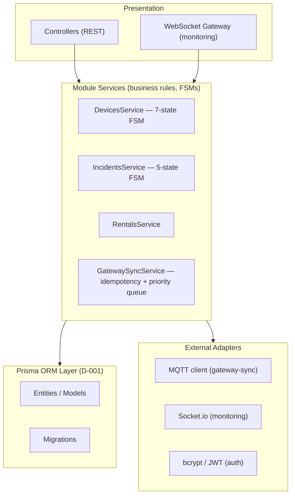

# Architectural Conventions — NestJS Backend / Node Gateway / React Frontend

> **Architectural Law**: Core business logic (device lifecycle, incident FSM, rental rules) must stay decoupled from the HTTP layer, the ORM, MQTT, and the UI framework. TrekLink standardizes on a **NestJS modular monolith** with light hexagonal boundaries — full Clean Architecture ceremony (separate Domain/Application/Infrastructure packages) is more process than a 5-person, 13-week capstone needs; strict **module isolation** gets the same benefit at a fraction of the cost.

> **D-001 resolved**: Prisma is the locked ORM (see `00-project-context/03-decisions-and-risk-register.md`). Entity examples below use Prisma only.

---

## 1. Module Topology

Each NestJS **module** = one bounded context from the charter. One module per top-level folder under `src/modules/`:

```text
backend/src/
├── modules/
│   ├── auth/            # login, JWT issuance, RBAC/CASL policies
│   ├── devices/         # device registration, 7-state FSM, telemetry
│   ├── rentals/         # booking, allocation, check-out/in, deposits/fees
│   ├── trips/            # trek packages, trip scheduling, guide assignment
│   ├── gateway-sync/     # event ingestion endpoint, idempotency, sync audit log
│   ├── incidents/        # 5-state SOS FSM, notifications, audit trail
│   ├── monitoring/       # WebSocket gateway for live map/telemetry push
│   └── billing/          # pricing, invoices, mock/sandbox payment
├── common/
│   ├── filters/          # global exception filter → standard envelope
│   ├── interceptors/     # response-shaping interceptor → standard envelope
│   ├── guards/           # JwtAuthGuard, PoliciesGuard (CASL)
│   ├── decorators/       # @CurrentUser(), @CheckPolicies()
│   └── dto/              # PagedResultDto and other shared shapes
└── main.ts
```

Each module folder contains, at minimum: `*.module.ts`, `*.controller.ts`, `*.service.ts`, `dto/`, `entities/` (or `schema.prisma` slice), and `*.spec.ts` tests colocated.

### 1.1 Cross-Module Rule (replaces "layer" boundaries)
- A module may depend on another module's **exported service** (via NestJS DI, imported through that module's `exports` array) — never reach into another module's repository, entity, or internal service directly.
- Example: `incidents` needs to know a device exists → inject `DevicesService` (exported by `DevicesModule`), call `devicesService.findById(id)`. It must **not** import a Prisma repository/client for `Device` directly.
- Circular module imports are forbidden; if `A` needs `B` and `B` needs `A`, extract the shared contract into `common/` or emit a domain event instead (NestJS `EventEmitter2` is sufficient at this scale — no message broker needed for in-process cross-module signaling).



---

## 2. Entity & Audit Conventions

Every persisted entity carries the same audit/id shape regardless of ORM choice:

- **`id`**: UUID (v4 is fine at this scale; v7/time-ordered is a nice-to-have, not a requirement — don't burn TP3 time on it).
- **`createdAt`** / **`updatedAt`**: UTC timestamps, auto-managed by the ORM.
- **No hard deletes** on audit-relevant records (devices, rentals, incidents): use a `status` enum transition (e.g. `Retired`, `Cancelled`) instead of `DELETE FROM`. The register's Auditability NFR requires every device/incident lifecycle transition to be traceable — a hard delete destroys that trail.

**Prisma** (`schema.prisma` slice):
```prisma
model Device {
  id            String   @id @default(uuid())
  hardwareVariant String
  status        DeviceStatus @default(AVAILABLE)
  batteryPct    Int?
  lastSeenAt    DateTime?
  createdAt     DateTime @default(now())
  updatedAt     DateTime @updatedAt
}

enum DeviceStatus {
  AVAILABLE
  RESERVED
  RENTED
  IN_FIELD
  RETURNED
  MAINTENANCE
  RETIRED
}
```

### 2.1 State Machines Are Not Just an Enum
Device (7-state) and Incident (5-state) transitions are **graded deliverables** (register requires 2 UML State Machine diagrams). Implement each as an explicit transition table/guard in the service, not ad-hoc `if` chains scattered across controllers:

```typescript
// devices/device-fsm.ts
const ALLOWED_TRANSITIONS: Record<DeviceStatus, DeviceStatus[]> = {
  AVAILABLE:   ['RESERVED', 'MAINTENANCE', 'RETIRED'],
  RESERVED:    ['RENTED', 'AVAILABLE'],
  RENTED:      ['IN_FIELD', 'RETURNED'],
  IN_FIELD:    ['RETURNED'],
  RETURNED:    ['MAINTENANCE', 'AVAILABLE'],
  MAINTENANCE: ['AVAILABLE', 'RETIRED'],
  RETIRED:     [],
};
```
Same pattern for `incidents` (`Detected → Acknowledged → In Progress → Resolved → Closed`), with every transition writing an append-only audit row (`actorId`, `role`, `timestamp`, `note`).

---

## 3. Idempotency & Priority Queue (gateway-sync — the module most different from a normal CRUD app)

- **eventId** — **updated per D-006 (Session 3).** The original formula published here, `${deviceId}:${sessionId}:${sequenceNumber}`, is **not constructible from what the firmware currently transmits**: neither `sessionId` nor `sequenceNumber` exists anywhere in the packet format, and `MeshPacket.id` is a 10-bit rolling counter OR'd with 22 random bits, re-seeded at every boot (`Router.cpp:168`) — a flood-dedup token, not a sequence. Two keys replace it:
  - **Packet dedup key** — `GatewayEvent.eventId = sha256(nodeNum : packetId)`. Unique index on the ingestion table; on conflict, no-op (don't re-read the row unless you need the original result to return the same response).
  - **Episode correlation** — a *lookup*, not a hash: find an open `Incident` for the device whose `lastEventAt` is inside the episode window; append if found, create if not. A hash-bucket key splits one SOS across two Incidents whenever an episode straddles a bucket boundary.

  Rationale, alternatives rejected, and schema consequences: **D-006** in `00-project-context/03-decisions-and-risk-register.md`. Worked design: `treklink-web/specs/gateway-sync/design.md` §1.1–§2.4.

  > **Open, per D-008**: the firmware is editable this term. Adding a real boot-`sessionId` and a per-packet `sequenceNumber` firmware-side would make the original formula constructible and is a strict improvement. The split key above is correct and functional either way — treat a firmware-side sequence as a layered upgrade, not a prerequisite.
- **SQLite queue (gateway side)**: a single table `event_queue(id, event_id, priority, payload, created_at, retry_count)`, flushed in `ORDER BY priority ASC, created_at ASC` on reconnect. Keep this logic in the gateway package, isolated from MQTT transport code, so it's unit-testable without a live broker.
- **Backend ingestion**: the idempotency check and the Incident-creation side-effect must be in the same DB transaction — never "check then create" as two separate round-trips, or a concurrent duplicate delivery races past the check (this is exactly what the register's 20-simultaneous-events NFR is testing for).

---

## 4. Module Isolation & Parallel Team Scaling

To let 4 teammates work TP2–TP5 concurrently without merge conflicts:

1. **One module = one folder = one owner-of-the-day**. Don't let two people edit `src/modules/devices/` on two different branches simultaneously without coordinating.
2. **Cross-module calls only through exported services**, never through direct repository/entity imports (see §1.1). This is what actually prevents merge hell — two people can safely add fields to their own module's entity without stepping on each other.
3. Frontend can develop against `specs/{module}/api-design/*.md` contracts (mocked) before the real backend endpoint exists — this is why the API design doc is written **before** implementation, not after.

---

## 5. Frontend Architecture: Feature-Sliced Design (FSD)

```text
frontend/src/
├── app/         # Router, providers (QueryClientProvider, AuthProvider), global styles
├── pages/       # Route-level screens: DashboardPage, TripMonitorPage, DeviceFleetPage (composition only, zero raw API calls)
├── widgets/     # Large compositions: LiveMapWidget, IncidentQueueWidget, DeviceTable
├── features/    # User-triggered actions: CreateBookingModal, AcknowledgeIncidentButton, CheckOutDeviceForm
├── entities/    # Domain representations: DeviceBadge, IncidentStatusPill, TripCard
└── shared/      # UI kit, apiClient.ts, socketClient.ts, hooks, utils
```

- **Dependency rule**: `shared → entities → features → widgets → pages → app`. Lower layers never import from higher ones.
- `monitoring`'s live map and WebSocket subscription logic belongs in `widgets/LiveMapWidget`, built on `shared/socketClient.ts` — keep the Leaflet.js instance and the Socket.io listener encapsulated there, not spread across pages.
