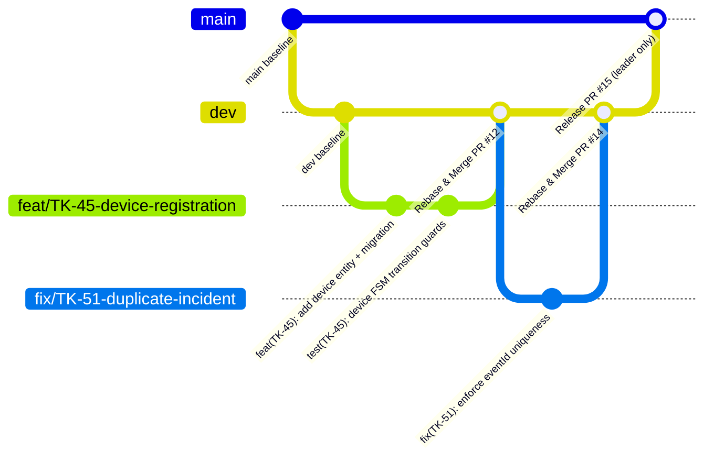
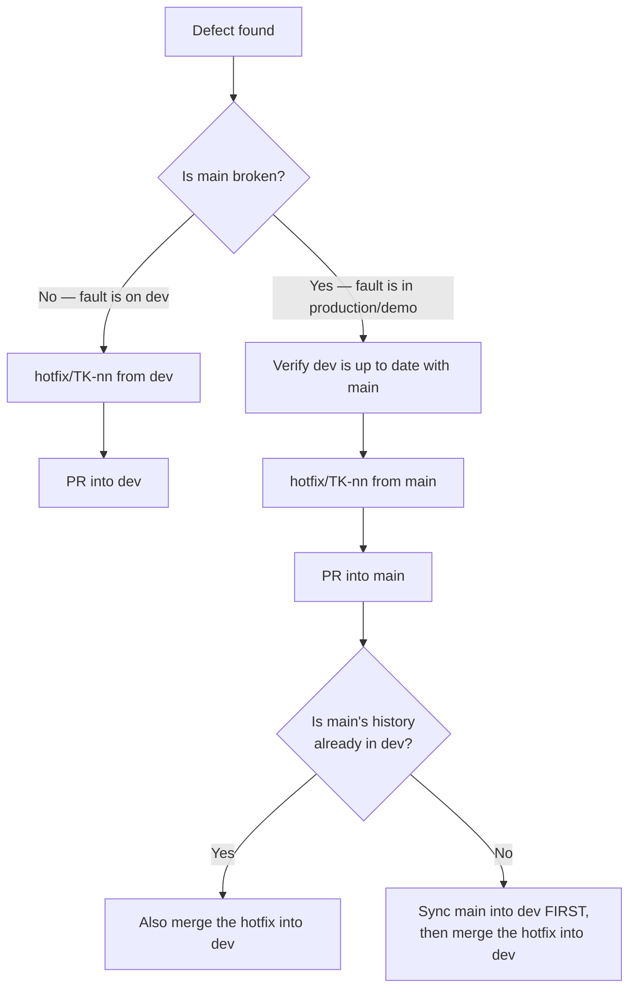

# GitHub Workflow, Branching, Commits & Pull Requests

> **Conventions v2, supersedes everything written before 2026-09-13.** The previous version of
> this file described a `develop` branch and a dual `Design`/`Implementation` branch model
> inherited from the school's `Git_Lab_Guide.pdf`. Neither matches reality: no repository has ever
> had a `develop` branch, and the dual-branch model doubles PR overhead for a 5-person team on a
> 13-week term. Decision **D-009** records the change and supersedes **D-003**.

> [!NOTE]
> **PR = MR.** "Pull Request" (GitHub) and "Merge Request" (GitLab) are used interchangeably
> across this documentation and in team chat. They mean the same thing and follow the same
> workflow. The school's guide says MR; GitHub says PR; we say either.

---

## 1. Repositories

Three repositories under [`github.com/TrekLink-Team`](https://github.com/TrekLink-Team), cloned as
siblings inside one `capstone/` parent folder. See the root `README.md` §1 for the full layout and
why the parent folder matters for AI agents.

| Repo | Contents | Branch model |
|---|---|---|
| `treklink-docs` | This documentation set (SSOT). No application code. | Full model below |
| `treklink-web` | The active build: `gateway/`, `backend/`, `frontend/` as workspace packages | Full model below |
| `treklink-firmware` | Inherited SU26 firmware, editable per D-008, surgical fixes only | Full model below |

**All three repos use identical conventions.** Same branches, same commit format, same PR process,
same AI agent rules. There is no "this repo is different" exception. A teammate who learns the
workflow in one repo knows it in all three.

The `capstone/` parent folder is also git-versioned but **never published**, it exists so an AI
agent opened on `capstone/` can read all three repos plus `Documents/` in one context window.

---

## 2. Branch Model

See **Figure 1**.



***Figure 1***: Branch topology. `dev` is the integration branch; feature branches rebase onto it and are deleted after merge. There is no `develop`, and merge commits are prohibited. Placement: rotated plate, 170.5 x 266.0 mm, labels at 10.75 pt.

### 2.1 The branches

| Branch | Branches from | Merges into | Purpose |
|---|---|---|---|
| `main` | — | — | **Protected.** Production / demo-ready state. This *is* the release, there are no `release/*` branches. |
| `dev` | `main` | `main` | **Protected.** Active integration branch. Everything lands here first. |
| `feat/*` | `dev` | `dev` | New capability. One per Jira story or task. |
| `fix/*` | `dev` | `dev` | Defect in unreleased work (found on `dev`, or a GitHub Issue bug). |
| `hotfix/*` | `dev` **or** `main` | see §2.4 | Urgent defect. Branch point depends on where the fault is. |
| `docs/*` | `dev` | `dev` | Documentation-only changes. Primary branch type in `treklink-docs`. |
| `chore/*` | `dev` | `dev` | Dependencies, tooling, config, cleanup. No behaviour change. |

> [!IMPORTANT]
> **No direct pushes. Ever. To any branch.** Every change, including a one-line typo fix, including
> the leader's own changes, is branched, pushed, and merged through a PR. There is no exception for
> "it's tiny" or "it's urgent". Urgency is what `hotfix/*` is for, and a hotfix is still a PR.

### 2.2 Branch naming

```
{type}/{JIRA-KEY}-{short-kebab-description}
```

| Example | Notes |
|---|---|
| `feat/TK-45-device-registration` | Standard case. Jira key, then 2–4 words. |
| `fix/TK-51-duplicate-incident-on-replay` | |
| `docs/TK-88-handbook-v1` | |
| `chore/TK-12-bump-nestjs-10` | |
| `hotfix/TK-99-jwt-expiry-crash` | |
| `chore/repo-gitignore-cleanup` | No Jira key. Housekeeping has no card. |
| `fix/daily-report-reported-mentions` | No Jira key. Automation and CI work has no card. |

Rules:
- **Lower-case, kebab-case** after the type. No underscores, no `CamelCase`, no spaces.
- **Jira key uppercase**, exactly as Jira issued it (`TK-45`, not `tk-45`).

> [!IMPORTANT]
> **Jira keys exist for Epics and User Stories only** (**D-024**). A branch carries a key when its
> unit of work is an Epic or a User Story card. Everything else carries no key and uses a plain
> descriptive branch name: repository housekeeping, CI and automation, tooling, conventions and
> documentation that is not a story deliverable, and the Task or Subtask breakdown under a story,
> which is tracked inside the parent card rather than as its own branch.
>
> Do not invent a card so a branch can have a key. An invented card pollutes the backlog, the
> Coverage Matrix and the burndown, all three of which the supervisor reads.
- Keep it under ~50 characters total. The description is a reminder, not a summary.
- One branch per unit of work. Do not accumulate unrelated changes on a long-lived personal branch.

**Why the Jira key is in the branch name**: the org-level Jira↔GitHub integration scans branch
names, commit messages, and PR titles for issue keys. With the key present, the Jira card's
Development panel auto-populates with the branch, its commits, and its PR, for free, with zero
extra effort from you. That is the traceability the supervisor and the council look for, and it
costs nothing but a naming habit.

### 2.3 Design and implementation live on the same branch

The old dual-branch model (`features/Design_X` + `features/Implementation_X`) is **retired**.
A single `feat/*` branch carries the spec commits *and* the implementation commits, in that order.

You still cannot write code before the spec exists, the spec-before-code gate in
[`02-spec-driven-development-workflow.md`](02-spec-driven-development-workflow.md) is unchanged and
non-negotiable. The gate is enforced by *commit order within the branch*, not by a second branch:
the reviewer reads `git log` and sees `docs(TK-45): requirements + design for devices` landing
before `feat(TK-45): implement device entity`. That gives the same review independence at half the
PR overhead.

The Design DoD section in the PR template is therefore **optional**, fill it in when the branch
introduced or changed a spec, skip it when it didn't.

### 2.4 Hotfix protocol

Hotfixes are branch-specific. Which branch you cut from depends on where the fault actually is.

See **Figure 2**.



***Figure 2***: Defect routing: whether a fault becomes a hotfix off `main` or an ordinary fix off `dev` depends on whether `main` is broken. Placement: inline, 101.1 x 266.0 mm, labels at 9.95 pt.

**Before cutting any hotfix**: bring every branch up to date. A hotfix applied to a stale base is
how a fix gets silently reverted by the next merge. Concretely:

```bash
git fetch origin
git checkout main && git pull origin main
git checkout dev  && git pull origin dev
# confirm dev contains main's history:
git log --oneline main ^dev        # must print nothing
```

If that last command prints commits, `dev` is behind `main`, sync it before hotfixing, or the fix
will only exist on one side.

A hotfix landed on `main` **must also reach `dev`**, always. A fix that lives only on `main` will be
undone the next time `dev` is promoted.

---

## 3. Commit Conventions

### 3.1 Format

```
{type}({scope}): {imperative description}
```

The scope is the **Jira key** when the unit of work is an Epic or a User Story card (**D-024**).
Housekeeping, CI, automation, tooling and conventions work has no key, so it has no scope.

```bash
git commit -m "feat(TK-45): add device FSM transition guard"
git commit -m "fix(TK-51): reject duplicate eventId before incident creation"
git commit -m "docs(TK-88): add Jira workflow chapter to handbook"
git commit -m "chore: refactor conventions files"          # no card — plain, unscoped
```

### 3.2 Types

All standard Conventional Commit types are available:

| Type | Use for |
|---|---|
| `feat` | New capability |
| `fix` | Bug fix |
| `docs` | Documentation only |
| `test` | Adding or fixing tests |
| `refactor` | Restructuring with no behaviour change |
| `perf` | Performance work |
| `style` | Formatting, whitespace, lint fixes, no logic |
| `chore` | Dependencies, tooling, config, housekeeping |
| `ci` | CI/CD pipeline changes |
| `build` | Build system, bundler, compiler config |
| `revert` | Reverting a previous commit |

### 3.3 Scope

Mandatory **where meaningful**. Use the Jira key. When the change is genuinely general,
cross-cutting, or has no card, repository housekeeping, a sweep across every file, a `.gitignore`
tweak, **omit the scope entirely** rather than inventing one:

```bash
chore: refactor conventions files          # correct — general, no card
chore(misc): refactor conventions files    # wrong — "misc" is noise
```

### 3.4 Quality rules

1. Understandable from the subject line alone.
2. No vague messages. `"update"`, `"fix bug"`, `"wip"`, `"asdf"` tell the next reader nothing.
3. One logical change per commit.
4. Never bundle formatting churn with functional changes, that is what `style:` is for.
5. Imperative mood: "add", not "added" or "adds".
6. English only. See §6.

### 3.5 Commit messages are a practice, not a gate

> [!NOTE]
> **Commit hygiene must never block a delivery.** There is no commitlint hook and no CI check on
> commit messages, deliberately. When you are shipping at 23:50 the night before a review, a
> commit that says `fix: login` is acceptable and nobody will chase you for it.
>
> Adhere to the format whenever you reasonably can, it is what makes `git log --oneline` readable
> during Review 2 prep and what feeds the Jira Development panel. But a perfect commit history on
> an unshipped feature is worth nothing. Ship, then tidy if there's time.

---

## 4. Rebase Discipline

We keep linear history. No merge commits anywhere, ever.

### 4.1 Before opening a PR

```bash
git fetch origin
git rebase origin/dev
# resolve conflicts, preserving business rules — re-read the spec if unsure
npm test                                   # must pass before you push
git push --force-with-lease origin feat/TK-45-device-registration
```

Always `--force-with-lease`, never `--force`. It refuses to overwrite work you haven't seen, which
matters when an AI agent or a second machine has pushed to the same branch.

### 4.2 After *any* PR merges into `dev`: everybody rebases

This is a team-wide obligation, not a courtesy:

- **If you have no open PR**: `git checkout dev && git pull origin dev` before you branch again.
- **If you have an open PR**: rebase it onto the new `dev` and force-push. Your PR now reviews
  against current reality.

```bash
git fetch origin
git checkout feat/TK-45-device-registration
git rebase origin/dev
npm test
git push --force-with-lease
```

This is why **a merge into `dev` must be announced in the Zalo group** (see
[`12-communication-and-daily-reports.md`](12-communication-and-daily-reports.md)). The announcement
is the signal for everyone to stop, pull, and rebase. Merging silently and letting four teammates
discover it through conflicts three hours later is the single most expensive avoidable mistake on
this project.

---

## 5. Pull Requests

### 5.1 Opening a PR

```bash
git push -u origin feat/TK-45-device-registration
gh pr create \
  --base dev \
  --title "feat(TK-45): device registration" \
  --body-file .github/pull_request_template.md \
  --assignee @me \
  --reviewer {reviewer-github-handle}
```

Then **ping the reviewer in Zalo** with the PR link. GitHub notifications are not reliably read;
the Zalo ping is what actually starts the review clock.

**Draft PRs** are allowed as a work-in-progress signal, and reviewers will not look at them. When
you want a review, mark it Ready for Review, that is the explicit handoff. A draft PR sitting for
two days is not "waiting for review", it is not in the queue at all.

**Stacked PRs** (a PR based on another open PR) are allowed. Set the `--base` to the parent branch
and say so in the description, so the reviewer knows the diff includes inherited commits.

### 5.2 Who reviews

The **backlog's `Reviewer` field is the default reviewer** and it is binding. It is set per story
in [`../03-backlog/02-user-stories.md`](../03-backlog/02-user-stories.md).

- The leader (**KhoaDD**) is the Product Owner and default reviewer for most stories.
- **TanNB** and **LongLP** are delegated reviewers, the leader may assign review to either when
  capacity requires it.
- **The PR author may re-assign the reviewer** if the assigned reviewer is busy, without asking
  permission first. Tell the new reviewer; you do not need to tell the busy one.

### 5.3 Self-approval: the narrow exception

> [!WARNING]
> **A PR author may self-approve and merge ONLY if the change meets every one of these:**
> - under **50 lines** changed, and
> - **no behavioural impact**, nothing a test or a user could observe differently, and
> - it is housekeeping: a chore, a cleanup, a file move, formatting, a comment, a doc typo.
>
> **Everything else requires a second party. Including the leader's own PRs.**

The Product Owner is not exempt. When the leader authors a non-trivial PR, the leader **must run a
separate AI review pass on it before merging**, a fresh agent session, pointed at the diff, with
no memory of having written the code. The output of that pass goes in the PR as a review comment.

The reasoning is not bureaucratic: work is not correct because of who produced it. An author
reviewing their own code re-reads their intent, not their output. A fresh reviewer, human or
agent, reads what is actually there. That asymmetry is the entire value of review, and it does
not disappear when the author happens to be the PO.

### 5.4 Reviewing a PR

Pull the branch and actually run it. Reading the diff in the browser is not a review.

```bash
gh pr checkout 42
npm ci

# Run the same gates the author was supposed to run:
npm --prefix backend  run lint && npm --prefix backend  run typecheck && npm --prefix backend  test
npm --prefix gateway  run lint && npm --prefix gateway  run typecheck && npm --prefix gateway  test
npm --prefix frontend run lint && npm --prefix frontend run typecheck && npm --prefix frontend run build

# Bring up the local stack if the change touches runtime behaviour:
docker compose up -d
```

**Unit tests are not optional and not negotiable.**
- The author runs them and they pass **before** the PR is opened.
- The reviewer runs them **again** on their own machine.
- A feature with no tests is not done. Shipping untested code by simply not writing a test is
  cheating the gate, and the reviewer should request changes on that basis alone.
- A **failing test is evidence of a flaw** until the author explains otherwise. "That test is
  flaky" is a claim that needs proof, not a dismissal.

Then decide, using the severity vocabulary in
[`03-operational-workflows.md`](03-operational-workflows.md) §4:
`[APPROVED]` · `[CHANGES REQUESTED]` · `[NEEDS FIXES]`.

> [!NOTE]
> **On "LGTM".** It is a legitimate approval for a genuinely small, genuinely clear change you have
> actually read and run. It is not a way to clear your review queue. If the diff is 400 lines and
> your review is four characters, you did not review it, you signed for it. Use it gracefully.

### 5.5 Review SLA

- A PR opened during working hours (**08:00–17:00**) is reviewed **before 17:00 that day**.
- A PR left unreviewed at 17:00 becomes **top priority the next morning**.
- Absolute ceiling: **1 day**. After that the author escalates in Zalo, or re-assigns per §5.2.

### 5.6 Mid-review fixes

When changes are requested:

1. Open the PR skill / read the review comments in full before touching anything.
2. `git checkout feat/TK-45-...`, confirm you are on the right branch. Fixing a review on `dev`
   is a classic and painful mistake.
3. Fix, commit (`fix(TK-45): address review — validate deviceId length`), rebase if `dev` moved.
4. `git push --force-with-lease`.
5. **Comment on the PR** saying what you changed and what you deliberately did not. Then wait.
   Pushing silently does not re-request review.

If you are stuck on a review comment rather than disagreeing with it, move the Jira card to
`NEEDS HELP` and say so in the PR, see [`10-jira-tracking-and-workflow.md`](10-jira-tracking-and-workflow.md) §4.

### 5.7 Merging

| Situation | Method |
|---|---|
| Single commit on the branch | **Rebase and merge** |
| Multiple commits on the branch | **Squash and merge** |
| Anything at all | **Never "Create a merge commit"** |

> [!IMPORTANT]
> **"Create a merge commit" is prohibited in this project.** It produces a non-linear history that
> makes `git log --oneline`, `git bisect`, and Review-2 traceability materially harder. Disable it
> in repository settings so the option is not offered.

**Branch deletion after merge:**
- `feat/*`, `fix/*`, `docs/*`, `chore/*`, `hotfix/*` → **delete the source branch** ("Delete branch
  after PR"). They are temporary by definition and a stale branch list hides the live work.
- `dev` → `main` → **never delete the source branch.** `dev` is permanent.

**Who merges into `main`**: the leader only. The supervisor never touches the repository, all
review flows through the leader, who opens and merges the `dev` → `main` PR.

**How `dev` reaches `main`: fast-forward, never the merge button (D-025).** The release PR is
still opened and approved as usual, but it is landed by the leader with a fast-forward push:

```bash
git fetch origin
git merge-base --is-ancestor origin/main origin/dev && git push origin origin/dev:main
```

GitHub's "Rebase and merge" re-creates every commit with a new SHA even when a fast-forward is
possible, and "Squash and merge" collapses them into one new commit. Either way `main` ends up with
commits `dev` does not have, and the next release PR conflicts on every file both sides touched.
A fast-forward push gives `main` exactly `dev`'s commits. It is not a force-push, so branch
protection permits it for an admin while `enforce_admins` is off, and GitHub marks the open release
PR as merged. If `merge-base --is-ancestor` fails, `main` has diverged: stop and realign first
(D-025 records the procedure) rather than pushing a merge.

---

## 6. Language Rule (Hard Requirement)

> [!IMPORTANT]
> **ENGLISH ONLY** in every artifact this project produces: source code, identifiers, comments,
> commit messages, branch names, PR titles and descriptions, review comments, specs, conventions,
> documentation, Jira cards, and diagrams.
>
> **You may prompt an AI agent in Vietnamese.** English is preferred and gets better results, but
> chatting to your agent in Vietnamese is fine. Regardless of what language you prompted in,
> **everything the agent writes into the repository must be English.**
>
> The only sanctioned exception is a daily-report entry, where Vietnamese is tolerated when English
> would cost you clarity, see [`12-communication-and-daily-reports.md`](12-communication-and-daily-reports.md) §3.

This is not stylistic preference. The council reads the artifacts, the roadmap mandates English
(§06 rule 5), and a mixed-language codebase is unreviewable.

---

## 7. Branch Protection Settings

Configure once per repository, by the leader, in Settings → Branches.

> [!NOTE]
> **Applied on 2026-09-22** to all four code repositories: `treklink-docs`, `treklink-web`,
> `treklink-firmware` and `TrekLink-Team.github.io`. Both `main` and `dev` in each carry the
> settings below, plus `delete_branch_on_merge`. `capstone` is deliberately unprotected (D-022).
>
> One deviation, deliberate: `enforce_admins` is **off**. The rule below already exempts the
> leader from the force-push block, and with no collaborators configured (see the setup gap at
> the end of this section) a hard admin gate would make every pull request unmergeable. Turn
> `enforce_admins` on once the org has members who can approve.

### `main`
- Require a pull request before merging.
- Require **1 approval**.
- Block force-push **for all members except the leader**.
- Disallow "Create a merge commit"; allow rebase-merge and squash-merge only.
- Do not allow deletions.

### `dev`
- Require a pull request before merging.
- Require **1 approval** from the assigned reviewer (see §5.2, §5.3 for the self-approval carve-out).
- Block force-push **for all members except the leader**.
- Disallow "Create a merge commit"; allow rebase-merge and squash-merge only.

### CI is an indicator, not a gate

> [!NOTE]
> **A red CI does not block merging.** CI is advisory on this project, deliberately. A 13-week
> term with a hardware dependency produces plenty of legitimately-red pipelines (missing device,
> flaky integration, an unconfigured secret) and a hard gate would mean waiting on infrastructure
> instead of delivering.
>
> **But red CI means merge with caution.** Specifically:
> - The **leader may merge** a red-CI PR at their discretion.
> - A **non-leader reviewer may not**, they must get the leader's explicit go-ahead first.
> - Either way, **say in the PR why it's red** before merging. An unexplained red merge is how a
>   real break gets normalised into background noise.

### Known setup gap

> [!WARNING]
> **The GitHub organisation does not yet have collaborators configured**, so reviewers cannot
> currently be assigned in the UI. Until the leader adds all five members to the
> `TrekLink-Team` org with write access, reviewer assignment happens by Zalo ping and the
> `--reviewer` flag will fail. This is a one-time setup task owned by the leader.

---

## 8. Where Work Is Tracked

Jira is the single work tracker. GitHub Issues hold daily reports and real defects only.
Full detail in [`10-jira-tracking-and-workflow.md`](10-jira-tracking-and-workflow.md).

| Concern | Lives in |
|---|---|
| Epics, User Stories, Tasks, Subtasks, sprints, board, timeline | **Jira** ([TK project](https://treklink-capstone.atlassian.net/jira/software/projects/TK/summary)) |
| Daily reports | **GitHub Issues** (`treklink-docs`) |
| Standalone bugs & blockers | **GitHub Issues** (`treklink-docs` or the affected repo) |
| The authoritative backlog with EARS criteria | **`treklink-docs/_docs/03-backlog/`** (read-only to members) |
| Specs | **`treklink-web/specs/{module}/`** |

> [!NOTE]
> GitHub **Milestones are no longer used as sprints**, sprints live in Jira. The `points:*` and
> `type:*` label taxonomy is retained, but only for labelling daily reports and bug issues. See
> [`../.github/labels-and-milestones.md`](../.github/labels-and-milestones.md).

---

## 9. Quick Reference

```bash
# ── Start work ────────────────────────────────────────────────────────────────
git fetch origin && git checkout dev && git pull origin dev
git checkout -b feat/TK-45-device-registration

# ── Work ──────────────────────────────────────────────────────────────────────
git add -p
git commit -m "feat(TK-45): add device FSM transition guard"

# ── Before opening the PR ─────────────────────────────────────────────────────
git fetch origin && git rebase origin/dev
npm test                                    # must be green
git push -u origin feat/TK-45-device-registration --force-with-lease
gh pr create --base dev --title "feat(TK-45): device registration"
# → then ping the reviewer in Zalo, and move the Jira card to IN REVIEW

# ── Reviewing someone else's PR ───────────────────────────────────────────────
gh pr checkout 42 && npm ci && npm test
gh pr review 42 --approve                   # or --request-changes --body "..."

# ── After any merge lands on dev ──────────────────────────────────────────────
git fetch origin && git rebase origin/dev && git push --force-with-lease
```

---

## 10. GitLab → GitHub Concept Map

For anyone cross-reading the school's `Git_Lab_Guide.pdf`:

| GitLab (school guide) | TrekLink on GitHub |
|---|---|
| Merge Request (MR) | Pull Request (PR), terms used interchangeably |
| Issue Board | Jira board (Kanban view) |
| Labels (effort points 1/2/3/5/8/13) | Jira story points, same Fibonacci scale (1/2/3/5/8/13/21) |
| Milestones (sprints) | Jira sprints |
| Child tasks | Jira subtasks, and see §8: subtasks are PR-controlled, not backlogged |
| `develop` branch | **`dev`** |
| `features/Implementation_X` + `features/Design_X` | **one** `feat/TK-nn-desc` branch |
| `release/sprint_x` | **dropped**, `main` is the release |
| `hotfix/Bug_X` | `hotfix/TK-nn-desc` |
| `[Feature]` bracket-tag commits | **Conventional Commits**, `feat(TK-45): ...` |
| MR approval + merge | PR review + Rebase-and-merge (or Squash if multi-commit) |
