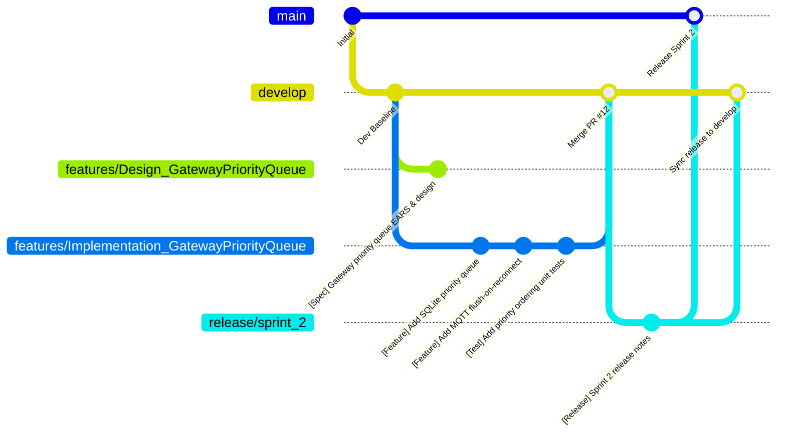

# GitHub Workflow, Commits & Pull Request Conventions

> Re-expresses the school's `Git_Lab_Guide.pdf` (v1.0, Aug 2025) for **GitHub** (org: [`github.com/TrekLink-Team`](https://github.com/TrekLink-Team)). The philosophy is identical — issue tracking with effort points, sprint milestones, dual Design/Implementation branches per story, structured PR review — only the tool-specific mechanics change. Table at the end maps every GitLab concept to its GitHub equivalent 1:1.

---

## 1. Repositories

Per Decision D-004 (`00-project-context/03-decisions-and-risk-register.md`), default to **multi-repo** under the org:

| Repo | Contents |
|---|---|
| `TrekLink-Team/treklink-firmware` | Inherited SU26 firmware — **read-only this term**; branch protection blocks direct pushes, no new PRs expected |
| `TrekLink-Team/treklink-gateway` | Gateway Bridge (Node.js/TypeScript) |
| `TrekLink-Team/treklink-backend` | NestJS backend |
| `TrekLink-Team/treklink-web` | React frontend |
| `TrekLink-Team/docs` (optional) | This documentation set, if kept separate from the app repos |

Each active repo (`gateway`, `backend`, `web`) carries its own copy of `.github/` (PR/issue templates, labels) and its own `specs/` folder.

---

## 2. GitHub Issue Board (replaces GitLab Issue Board)

### 2.1 Labels (replaces GitLab Labels)
Two orthogonal label groups — every issue gets one from each:

**Effort points** (same 1/2/3/5/8/13 scale as the GitLab guide):
| Label | Color |
|---|---|
| `points: 1` | `#6699cc` |
| `points: 2` | `#99cc66` |
| `points: 3` | `#ffcc66` |
| `points: 5` | `#ff9966` |
| `points: 8` | `#ff6666` |
| `points: 13` | `#cc3366` |

**Module** (matches `00-project-context/02-roadmap-and-milestones.md` §3):
`module:auth` · `module:devices` · `module:rentals` · `module:trips` · `module:gateway-sync` · `module:incidents` · `module:monitoring` · `module:billing` · `module:frontend` · `module:devops` · `module:docs`

Plus: `type:epic`, `type:story`, `type:task`, `type:bug`, `type:spec`, `type:chore`, and review-tracking labels `review-1`, `review-2`, `review-3` for anything a specific capstone review depends on. Full taxonomy + a `gh` CLI bulk-create script: [`.github/labels-and-milestones.md`](../.github/labels-and-milestones.md).

### 2.2 Milestones (replaces GitLab Milestones = Sprints)
One GitHub Milestone per 2-week sprint, per `02-roadmap-and-milestones.md` §2/§3. GitHub Milestones only have a due date (no start date) — put the sprint window in the description field, e.g.:
> `Sprint 2 (Sep 21 – Oct 4, 2026) — TP1 close / TP2-TP3 ramp / Review 1 in this sprint`

### 2.3 Issues (replaces GitLab "Create issue")
Use the **User Story** issue form (`.github/ISSUE_TEMPLATE/user_story.md`) — mirrors the columns in `02-templates/User_Story_Backlog_TEMPLATE.xlsx` (Issue Type, Summary as "As a... I want... so that...", numbered Acceptance Criteria, Priority, Story Points). Required on every issue: Assignee, one `points:*` label, one `module:*` label, and a Milestone (sprint).

### 2.4 Child Tasks (replaces GitLab "Create child tasks")
Use **GitHub sub-issues** (Issues → "Add sub-issue") to break a Story into Tasks, or a Markdown task list in the issue body if sub-issues aren't available on the plan in use:
```markdown
### Sub-tasks
- [ ] #124 SQLite queue schema
- [ ] #125 MQTT publish-on-flush
- [ ] #126 Reconnect/backoff logic
```
Referencing another issue number (`#124`) auto-links it; GitHub shows linked issues' checkbox state on the parent.

### 2.5 Board view
Use a **GitHub Project (board)** scoped to the org or per-repo, columns `Backlog → Ready → In Progress → In Review → Done`, filtered/grouped by the Milestone (sprint) and `module:*` label — this is the direct equivalent of the GitLab issue board.

---

## 3. Git Branching Strategy (unchanged philosophy)



| Branch | Origin → Destination | Purpose |
|---|---|---|
| `main` | Merged only from `release/*` or `hotfix/*` | **Protected.** Demo/defense-ready state only. |
| `develop` | Branches from `main`; merges features | **Protected.** Active integration branch. |
| `features/*` | Branches from `develop`; merges into `develop` | Bounded story/task work |
| `hotfix/*` | Branches from `main`; merges into `main` **and** `develop` | Critical defect fixes |
| `release/*` | Branches from `develop`; merges into `main` and `develop` | Pre-Review/pre-Defense stabilization; always has release notes |

### 3.1 Branch Naming Rules (identical to the GitLab guide)
- **Feature — Implementation**: `features/Implementation_{UserStoryName}`
- **Feature — Design**: `features/Design_{UserStoryName}` (needs Figma for frontend work, or an `api-design/*.md` for backend work)
- **Hotfix**: `hotfix/Bug_{UserStoryName}`
- **Release**: `release/sprint_{N}` (e.g. `release/sprint_2` for the Sprint 2 cut — see the sprint numbering in the roadmap; use this instead of the original guide's semver tags since the register runs on sprints, not product versions)

### 3.2 Dual-Branch Convention per Story
1. **Design branch**: `requirements.md`, `design.md`, `api-design/`, wireframes, `tasks.md`.
2. **Implementation branch**: source code, migrations, tests.

Separating them lets a reviewer (or the supervisor at Review 1/2) approve the API contract/EARS criteria independently of — and often before — the code.

---

## 4. Commit Discipline

### 4.1 The 4 Core Rules
1. Understandable from the subject line alone.
2. No vague messages (`"Fix bug"`, `"Update"`, `"WIP"` are banned).
3. One logical change per commit.
4. Never bundle formatting/whitespace cleanup with functional changes.

### 4.2 Bracket-Tag Vocabulary

| Tag | Purpose | Example |
|---|---|---|
| `[Feature]` | New capability | `[Feature] Implement 7-state device FSM transition guard (#41)` |
| `[Fix]` | Bug fix | `[Fix] Correct priority ordering on gateway queue flush (#58)` |
| `[Refactor]` | No behavior change | `[Refactor] Extract idempotency check into shared guard (#33)` |
| `[Test]` | New/updated tests | `[Test] Add 10x duplicate-eventId replay test (#59)` |
| `[Security]` | IAM/crypto/permissions | `[Security] Enforce CASL policy on device retire endpoint (#47)` |
| `[Spec]` | Design docs, API specs, EARS | `[Spec] Author requirements.md for incidents module (#20)` |
| `[Perf]` | Performance work | `[Perf] Add index on gateway_events.event_id (#61)` |
| `[Docs]` | Non-spec documentation | `[Docs] Update deployment guide for Docker Compose v2 (#70)` |
| `[Chore]` | Deps, tooling, config | `[Chore] Bump NestJS to 10.x (#14)` |

---

## 5. Upstream Rebase Protocol (Linear History)

```bash
git fetch origin
git checkout features/Implementation_{UserStoryName}
git rebase origin/develop
# resolve conflicts, preserving business rules
git add . && git rebase --continue
npm test   # 100% pass required before pushing
git push --force-with-lease origin features/Implementation_{UserStoryName}
```

---

## 6. Pull Requests (replaces GitLab Merge Requests)

### 6.1 Multiple PR Templates via GitHub's native chooser
GitHub supports multiple templates in `.github/PULL_REQUEST_TEMPLATE/`. Opening a PR shows a template picker automatically; to force one directly, append `?expand=1&template=implementation.md` (or `design.md`) to the compare URL. See the actual files:
- [`.github/PULL_REQUEST_TEMPLATE/implementation.md`](../.github/PULL_REQUEST_TEMPLATE/implementation.md)
- [`.github/PULL_REQUEST_TEMPLATE/design.md`](../.github/PULL_REQUEST_TEMPLATE/design.md)

Both preserve the GitLab guide's Definition of Done / Review Checklist / Test Coverage / Change Description / Related Tasks structure, rewritten for this stack (NestJS/React tests, not generic "unit tests").

### 6.2 Creating PRs via GitHub CLI (replaces GitLab push options)
```bash
git push -u origin features/Implementation_{UserStoryName}
gh pr create \
  --base develop \
  --head features/Implementation_{UserStoryName} \
  --title "[Feature] Implementation: {UserStoryName}" \
  --body-file .github/PULL_REQUEST_TEMPLATE/implementation.md \
  --label "module:gateway-sync" --label "points: 5" \
  --milestone "Sprint 2"
```

### 6.3 Concurrent PRs (the team's existing GitLab habit — carries over unchanged)
Nothing about GitHub restricts having several open PRs against `develop` at once across different modules (see the roadmap's parallel-lane suggestion). Keep each PR scoped to one module/story so reviews stay small; require at least one teammate review + green CI (`develop` branch protection rule) before merge; prefer **squash merge** into `develop` to keep bracket-tag commit history readable on `git log --oneline`.

### 6.4 Branch Protection (repo settings — set up once per repo)
- `main`: require PR, require passing CI, require 1+ review, no force-push.
- `develop`: require PR, require passing CI, no force-push (force-with-lease only allowed on personal `features/*` branches, never on `develop`/`main`).

---

## 7. GitLab → GitHub Concept Map

| GitLab (per `Git_Lab_Guide.pdf`) | GitHub equivalent |
|---|---|
| Labels (effort points) | Labels (`points: N`) |
| Milestones (sprint, start+due date) | Milestones (due date only — encode start date in description) |
| Issue | Issue (with `ISSUE_TEMPLATE/user_story.md`) |
| Child tasks | Sub-issues / linked task-list checkboxes |
| Issue Board | GitHub Projects (board view) |
| Merge Request (MR) | Pull Request (PR) |
| `merge_request.create` push option | `gh pr create` |
| MR approval + merge | PR review + squash merge, gated by branch protection |
| `features/Implementation_*`, `features/Design_*`, `hotfix/*`, `release/*` | **Unchanged** — same names, same purpose |
