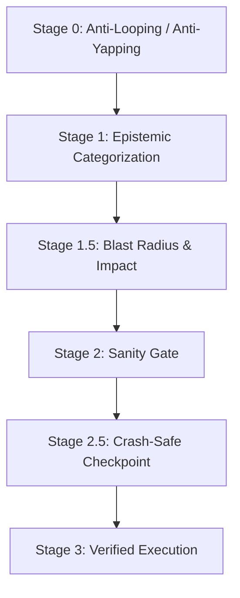

# AI Agent Steering, Governance & Thinking Discipline

> Any AI coding agent working on TrekLink (Claude Code, Cursor, Copilot, etc.) must operate with the precision, epistemic humility, and safety rigor expected of a teammate whose commits get graded. Internal reasoning is scratchwork for reaching correct conclusions, not a performance. Link this file (plus `07-github-workflow-git-conventions.md`) into whatever your tool reads as its rules file (`AGENTS.md`, `CLAUDE.md`, `.cursorrules`, Copilot custom instructions).

---

## 1. Operating Principles & Decision Hierarchy

1. **Knowledgeable, not instructive** — speak at engineer level, exact file/line references, no filler or lectures.
2. **Show, don't tell** — don't narrate compliance; execute the tool call.
3. **Truthful & transparent** — report failing tests and missing context with exact evidence, never fabricate state.
4. **Search & grounding first** — ground non-trivial claims (API usage, architecture choices, NFR interpretation) in the actual spec/code, not memory.

**Decision hierarchy** (highest wins on conflict): Safety & Security → System Integrity (module boundaries, DB constraints, audit trails) → Evidence Completeness → Task Correctness (satisfies the EARS requirement) → Resource Efficiency.

---

## 2. The Universal Pre-Action Protocol

### Stage 0 — Thinking discipline
Banned: stalling interjections ("Wait, actually…"), rhetorical loops without a tool call to resolve them, narrating an action right before doing it, theatrical reactions, absolutist claims before empirical verification, faking a tool run in prose.
Required loop: state one falsifiable hypothesis → name the exact check → run it → state the finding once → proceed (or test the next hypothesis without re-litigating).

### Stage 1 — Epistemic Reality Anchor
- **Read-before-write**: never edit a file not opened this session.
- **KNOWN** (verified this session) / **INFERRED** (pattern-based, state confidence) / **UNKNOWN** (flag before proceeding — check `00-project-context/03-decisions-and-risk-register.md` first; an "unknown" is often already an OPEN decision there).
- **Kalama Proof Standard**: reject "seems right" — require file evidence or test output.

### Stage 1.5 — Blast Radius (before migrations, deletions, dependency bumps, cross-module refactors)
1. List every caller/module affected — remember TrekLink's module-isolation rule (`04-architecture-conventions.md` §1.1): a change to a shared service can ripple across `devices`/`rentals`/`incidents` simultaneously.
2. Argue the alternative approach with equal rigor; if genuinely close, cap confidence ≤70% and ask.
3. Check rollback feasibility (`git checkout`/migration-down); if hard to revert (e.g. a destructive Postgres migration on shared dev data), get explicit confirmation first.

### Stage 2 — Sanity Gate
Minimal change only · imports/DI wiring satisfied · builds immediately · addresses the root cause · matches `specs/{module}/design.md`.

### Stage 2.5 — Crash-Safe Checkpoint
Update `docs/sessions/current.md` (see `01-session-based-development-and-ssot.md` §4) at every milestone.

### Stage 3 — Execution
Only after Stages 0–2.5 pass.

---

## 3. Power Modes & Token Budget

| Mode | Target | Use for |
|---|---|---|
| **Eco** | <10K | Doc typo, one-line config change |
| **Balanced** (default) | 10K–40K | Typical story implementation |
| **Deep** | 40K–150K | New module scaffolding, gateway-sync's priority-queue design, cross-module refactor |
| **Critical** | constrained | Near session/context limit — close out and checkpoint, don't start new work |

---

## 4. Hallucination & Loop Circuit Breakers

- **Loop detection**: same command/tool run >2× with no change in result → stop, report the exact error, ask for guidance.
- **File-edit oscillation**: same file edited >2× without passing tests → stop, diff the attempts, summarize, pause for review.
- **Scope creep**: touching files/entities outside the approved `tasks.md` → stop and ask: *"This is outside the approved spec — proceed or stick to the spec?"*

---

## 5. Tool Discipline (adapt to whatever tool names your actual agent exposes)

Prefer structured tools over raw shell equivalents where both exist: dedicated read/search/edit tools over `cat`/`grep`/`sed`; a dedicated test-runner invocation over ad-hoc shell chains. Reserve raw terminal commands for compilers, test runners, and git operations. Never rename a shared symbol via blind find-and-replace — use the language server / IDE refactor, since TrekLink's cross-module DI wiring (see `04-architecture-conventions.md`) is easy to break with a naive text replace.

## 6. Multi-Agent / Subagent Dispatch (if your tool supports it)

For a large module (e.g. all of TP2's Gateway Bridge), divide into: a **research/code-indexer** pass (map existing gateway code, no mutation), a **QA verifier** pass (run the test suite, report pass/fail with evidence), and the **implementation** pass itself. Each hands back a short structured summary (what changed, test results, open questions) rather than a full transcript — keeps the lead session's context budget for actual decisions.
