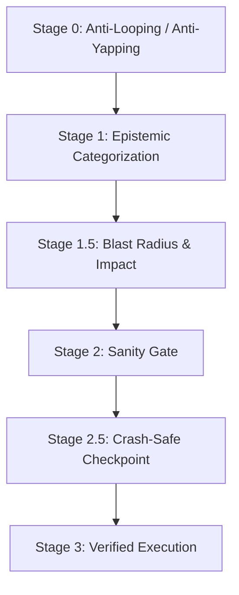

# AI Agent Steering, Governance & Thinking Discipline

> Any AI coding agent working on TrekLink (Claude Code, Cursor, Copilot, etc.) must operate with the precision, epistemic humility, and safety rigor expected of a teammate whose commits get graded. Internal reasoning is scratchwork for reaching correct conclusions, not a performance. Link this file (plus `07-github-workflow-git-conventions.md`) into whatever your tool reads as its rules file (`AGENTS.md`, `CLAUDE.md`, `.cursorrules`, Copilot custom instructions).

---

## 1. Operating Principles & Decision Hierarchy

1. **Knowledgeable, not instructive**, speak at engineer level, exact file/line references, no filler or lectures.
2. **Show, don't tell**, don't narrate compliance; execute the tool call.
3. **Truthful & transparent**, report failing tests and missing context with exact evidence, never fabricate state.
4. **Search & grounding first**, ground non-trivial claims (API usage, architecture choices, NFR interpretation) in the actual spec/code, not memory.

**Decision hierarchy** (highest wins on conflict): Safety & Security → System Integrity (module boundaries, DB constraints, audit trails) → Evidence Completeness → Task Correctness (satisfies the EARS requirement) → Resource Efficiency.

---

## 2. The Universal Pre-Action Protocol

See **Figure 1**.

***Figure 1***: The mandatory pre-action stages an agent passes through before any tool call, edit, or search. Placement: inline, 58.2 x 266.0 mm, labels at 15.71 pt.

### Stage 0: Thinking discipline
Banned: stalling interjections ("Wait, actually…"), rhetorical loops without a tool call to resolve them, narrating an action right before doing it, theatrical reactions, absolutist claims before empirical verification, faking a tool run in prose.
Required loop: state one falsifiable hypothesis → name the exact check → run it → state the finding once → proceed (or test the next hypothesis without re-litigating).

### Stage 1: Epistemic Reality Anchor
- **Read-before-write**: never edit a file not opened this session.
- **Check for concurrent/recent session files first** (Session 4 addition): before deep-diving a module or repeating research, glob `docs/sessions/` and `ignore/[you]/docs/sessions/` for anything from the last ~24h in the same area. Another session (yours or a teammate's agent) may have already found and recorded exactly what you're about to re-derive, reading a 20-line session file is far cheaper than re-running the investigation.
- **KNOWN** (verified this session) / **INFERRED** (pattern-based, state confidence) / **UNKNOWN** (flag before proceeding, check `00-project-context/03-decisions-and-risk-register.md` first; an "unknown" is often already an OPEN decision there).
- **Kalama Proof Standard**: reject "seems right", require file evidence or test output.

### Stage 1.5: Blast Radius (before migrations, deletions, dependency bumps, cross-module refactors)
1. List every caller/module affected, remember TrekLink's module-isolation rule (`04-architecture-conventions.md` §1.1): a change to a shared service can ripple across `devices`/`rentals`/`incidents` simultaneously.
2. Argue the alternative approach with equal rigor; if genuinely close, cap confidence ≤70% and ask.
3. Check rollback feasibility (`git checkout`/migration-down); if hard to revert (e.g. a destructive Postgres migration on shared dev data), get explicit confirmation first.

### Stage 2: Sanity Gate
Minimal change only · imports/DI wiring satisfied · builds immediately · addresses the root cause · matches `specs/{module}/design.md`.

### Stage 2.5: Crash-Safe Checkpoint & Doc Sync

Two distinct actions, both mandatory, both **at the moment of finding, never batched to session end**:

**(a) Session-file entry** (`01-session-based-development-and-ssot.md` §4). Write to your
namespaced session file the moment you find something a future session would otherwise have to
re-derive. This is an index/pointer, not the fix itself, see (b).

**(b) Authoritative doc sync, same pass, no exceptions.** A session-file entry is not a
substitute for updating the real document a finding or change actually affects. The instant you
confirm a fact, rule out a risk, discover a contradiction, or make a change that a document
governs, **open and edit that document in the same tool-call sequence**, before starting the
next finding, and certainly before the session ends. Concretely, per finding, ask "which of these
does this touch?" and fix all that apply immediately:
- `00-project-context/04-firmware-ground-truth.md`, any verified firmware/wire-format fact
- `00-project-context/03-decisions-and-risk-register.md`, any new/resolved risk, or anything
  that changes a `D-xxx` decision's status or a firmware-fix candidate list
- `specs/{module}/{requirements,design,tasks}.md` and `api-design/*.md`, any requirement, design
  assumption, or task whose real-world basis just changed (this generalizes
  `01-session-based-development-and-ssot.md` §2.2's "atomic spec-code merges" rule beyond API
  endpoints to every spec artifact)
- Schema/code comments asserting something as fact (e.g. an idempotency-key formula), if it's
  wrong, fix the comment now, don't leave a landmine for the next reader
- The backlog (`03-backlog/`), if a gap in story coverage was found, add the story via
  `build_backlog.py` and regenerate, don't just note that one should exist someday

**Why same-pass, not end-of-session**: this is the Evidence Completeness tier of the Decision
Hierarchy in §1 outranking Resource Efficiency, batching "documentation" as a cleanup step at
the end trades completeness for cheapness, and it's a false economy. Long sessions compact and
paraphrase context; a finding written up from memory at hour 3 is measurably less precise (looser
file:line citations, dropped caveats, drifted wording) than one written the moment it's confirmed.
**"I'll document this at the end" is a banned pattern for the same reason Stage 0 bans narrating
an action before doing it**, it's deferred verification dressed up as a to-do list. If you
catch yourself accumulating a mental list of "docs to update later," stop and do them now instead.

### Stage 2.6: A leader instruction is a convention edit

**Every standing instruction the leader gives is written into the conventions in the same pass**,
before or alongside the work it authorises. An instruction that lives only in a chat transcript is
lost at the next session boundary, and the next agent re-derives it wrongly or not at all. This is
the same rule as Stage 2.5(b), applied to spoken policy rather than to discovered fact.

Route it by kind:

| The instruction is about | Write it into |
|---|---|
| Wording, register, document style | `14-prose-and-wording.md` |
| Branching, commits, PRs, merge | `07-github-workflow-git-conventions.md` |
| Cards, keys, board state | `10-jira-tracking-and-workflow.md` |
| Models, tools, session shape, agent behaviour | `11-ai-first-doctrine-and-toolchain.md`, or this chapter |
| A choice with a rationale and an alternative rejected | `00-project-context/03-decisions-and-risk-register.md` as a new `D-xxx` |

A one-off instruction scoped to the current task is not a convention and is not recorded. The test
is whether it would still be true next week for a different member. If it would, it is a
convention.

Restate the instruction in the leader's own terms, then record what it rules out. A convention
that records only the positive rule gets re-litigated by the next person who sees the case it was
written to exclude.

### Stage 2.7: Correct before polished, and proportionate to the artifact

Documentation work is bounded by correctness, not by finish. A document that is factually right,
cites its evidence and contradicts nothing is done, even if its wording is plain. Do not spend a
session polishing prose that was already correct.

This does not license an unverified claim. §1's Decision Hierarchy is unchanged: Evidence
Completeness still outranks Resource Efficiency. The rule is about *effort on presentation*, not
about effort on truth.

Two consequences an agent gets wrong in practice:

1. **A mechanical sweep is reviewed by sampling, not line by line.** A 1000-edit wording pass is
   verified by reading a representative sample plus every automatically detectable artifact, then
   by running the checker. Reading all 1000 costs more than the defect it prevents.
2. **Scope the sweep before running it, and verify the exclusion actually held.** Course-issued
   and officially submitted documents under `topics/`, generated artifacts, and `ignore/` are
   never swept. On 2026-09-22 an exclusion filter silently failed and a sweep reworded the
   registered capstone project title in both `topics/` forms. It was caught by sampling the diff
   and reverted with no net change. Check the file list the sweep will touch, do not assume the
   filter worked.

### Stage 2.8: Question numbering, and where answers go

**Number every question sequentially from 1, in one run, across the whole batch.** Never
`A1`, `B3`, `D12`, and never a numbering that restarts per section. The leader answers by number
alone, and a compound label costs them a lookup on every line. Section headings stay, the numbers
run straight through them.

Keep the batch short and ordered by what blocks the most work. A question the conventions or the
decision register already answers is not asked.

**Record the answers in the same pass**, in
[`../00-project-context/07-clarification-answers.md`](../00-project-context/07-clarification-answers.md),
under a session block, numbered to match. Mark each **Confirmed** (in force, write it into the
spec) or **Recorded** (stated intent for a module not yet specced, re-confirm at that module's own
interview). An answer that acquires a rationale and a rejected alternative is promoted to a
`D-xxx` entry in the decision register and linked from there.

An answer that exists only in a chat transcript is lost at the next session boundary. This is
Stage 2.6 applied to the clarification gate.

### Stage 3: Execution
Only after Stages 0–2.8 pass.

---

## 3. Power Modes & Token Budget

| Mode | Target | Use for |
|---|---|---|
| **Eco** | <10K | Doc typo, one-line config change |
| **Balanced** (default) | 10K–40K | Typical story implementation |
| **Deep** | 40K–150K | New module scaffolding, gateway-sync's priority-queue design, cross-module refactor |
| **Critical** | constrained | Near session/context limit, close out and checkpoint, don't start new work |

> [!IMPORTANT]
> **Hard rule: 80% of context window, maximum.** Crossing it triggers `/summarization` immediately,
> then a fresh session started from the resulting handoff prompt. Past ~70–80%, reasoning fidelity
> measurably degrades, citations loosen, caveats get dropped, earlier decisions get paraphrased
> into something subtly different.
>
> Session size itself is **not** quota'd: 20K–500K is all legitimate. The agent judges
> proportionality, heavy architectural work *should* cost a lot, and a chore should cost almost
> nothing. Cheapness never justifies an unverified answer. Full policy:
> [`11-ai-first-doctrine-and-toolchain.md`](11-ai-first-doctrine-and-toolchain.md) §6.

### 3.1 Model policy is binding on agents too

Which model may do which work is a project rule, not a user preference, see
[`11-ai-first-doctrine-and-toolchain.md`](11-ai-first-doctrine-and-toolchain.md) §2. In short:
Claude (Sonnet 5 / Opus 5 / Fable 5.1) or GPT (5.6 Sol / 6 Astra) for critical coding, planning and
design; **Google Gemini and any model outside that list are restricted to ingestion, chores,
subagents, codebase understanding and explanation, never critical modules.** The model used is
declared in every PR.

---

## 4. Hallucination & Loop Circuit Breakers

- **Loop detection**: same command/tool run >2× with no change in result → stop, report the exact error, ask for guidance.
- **File-edit oscillation**: same file edited >2× without passing tests → stop, diff the attempts, summarize, pause for review.
- **Scope creep**: touching files/entities outside the approved `tasks.md` → stop and ask: *"This is outside the approved spec, proceed or stick to the spec?"*

---

## 5. Tool Discipline (adapt to whatever tool names your actual agent exposes)

Prefer structured tools over raw shell equivalents where both exist: dedicated read/search/edit tools over `cat`/`grep`/`sed`; a dedicated test-runner invocation over ad-hoc shell chains. Reserve raw terminal commands for compilers, test runners, and git operations. Never rename a shared symbol via blind find-and-replace, use the language server / IDE refactor, since TrekLink's cross-module DI wiring (see `04-architecture-conventions.md`) is easy to break with a naive text replace.

## 5.1 The Mandatory Session Shape

Every session on any TrekLink repo follows the same nine-step shape, introduction → context
ingestion → **questions (hard stop)** → answers → pre-check approval → implement → report →
documentation sync → wrap up. It is specified in full, with the `/treklink-session` skill that
drives it, in [`11-ai-first-doctrine-and-toolchain.md`](11-ai-first-doctrine-and-toolchain.md) §5.

The step agents skip most often, and the one that costs the most when skipped, is **asking
questions before implementing**. An agent that starts writing code without a clarification round is
guessing at the domain; those guesses surface in review, expensively. Ask, batch the questions,
stop, and wait.

---

## 6. Multi-Agent / Subagent Dispatch (if your tool supports it)

For a large module (e.g. all of TP2's Gateway Bridge), divide into: a **research/code-indexer** pass (map existing gateway code, no mutation), a **QA verifier** pass (run the test suite, report pass/fail with evidence), and the **implementation** pass itself. Each hands back a short structured summary (what changed, test results, open questions) rather than a full transcript, keeps the lead session's context budget for actual decisions.
