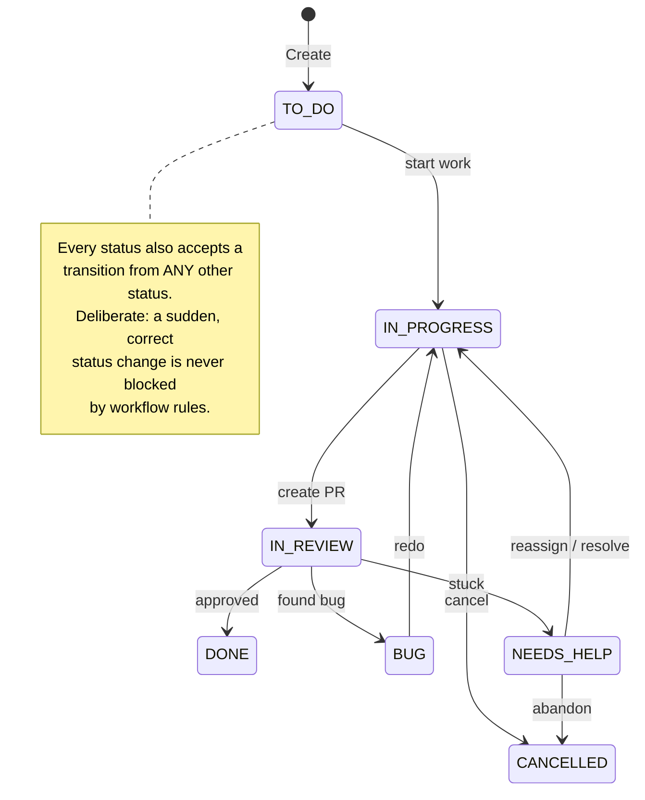
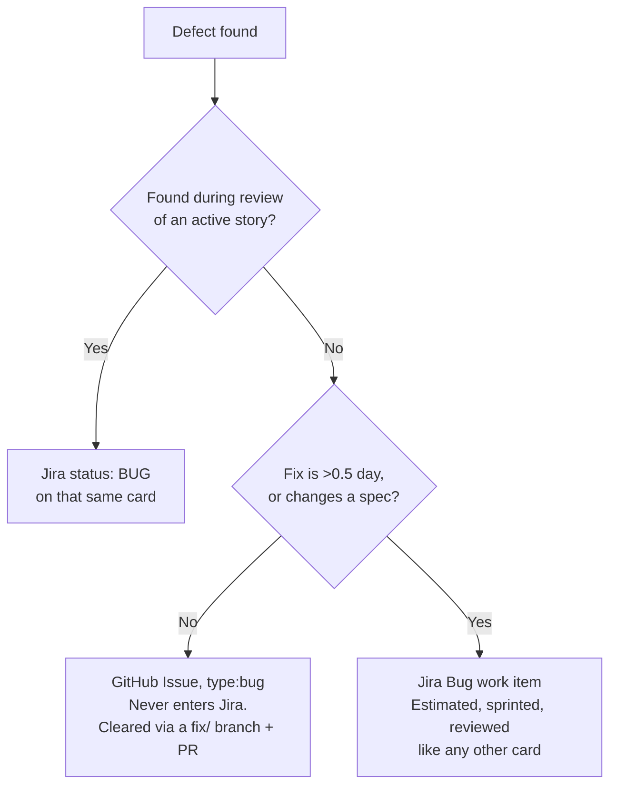
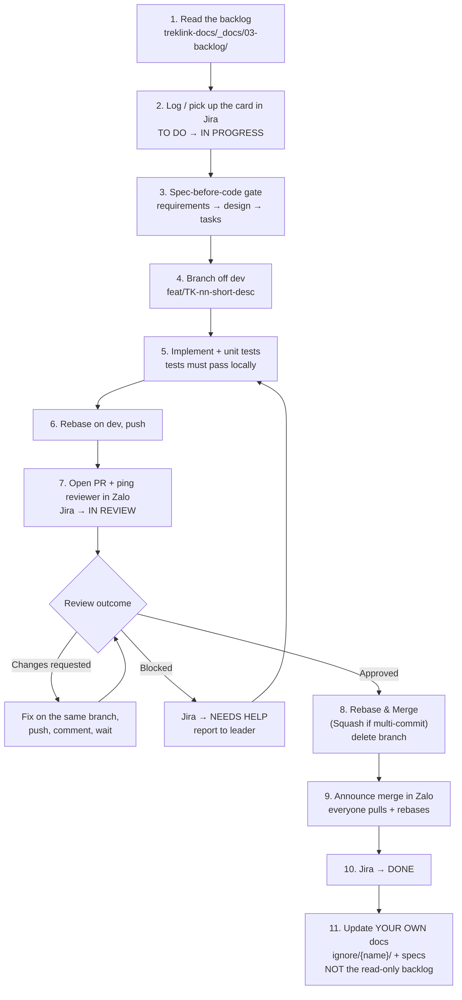

# Jira Tracking, Board Workflow & the Development Loop

> **Jira is the single work tracker.** Epics, User Stories, Tasks, Subtasks, sprints, the board and
> the timeline all live in Jira. GitHub Issues hold daily reports and standalone bugs — nothing
> else. This chapter is the authority on how work is logged, moved, and closed.
>
> **Project**: [`TK` — treklink-capstone.atlassian.net](https://treklink-capstone.atlassian.net/jira/software/projects/TK/summary)
> **Framework**: Scrum, 2-week sprints aligned to the roadmap calendar.

---

## 1. The Three Places Work Lives

A recurring source of confusion, settled here once:

| Artifact | Where | Who writes it | Mutability |
|---|---|---|---|
| **The backlog** — 88 stories with EARS acceptance criteria, owners, reviewers, points | [`../03-backlog/`](../03-backlog/) in `treklink-docs` | **Leader only**, via `build_backlog.py` + a `docs:` PR | **Read-only to members.** Never hand-edit the generated `.md` files. |
| **The tracker** — live cards, sprint state, board position | **Jira** | Leader creates Epics/Stories; anyone creates Tasks/Subtasks | Live, moves constantly |
| **The spec** — full EARS requirements, design, tasks | `treklink-web/specs/{module}/` | The story's owner | Per-story, locked during implementation |

The backlog is the **source**; Jira is the **execution copy**. A story's EARS criteria in the
backlog get expanded into that module's `requirements.md` when its sprint starts. If the two ever
disagree after that point, the spec wins — it is the more detailed, reviewed artifact.

---

## 2. Work Item Hierarchy

```
Epic  (E1–E8, from the backlog — leader creates)
  └── User Story  (US-001 … US-088, from the backlog — leader creates)
        └── Subtask  (invented during implementation — anyone creates)
```

### 2.1 Epics and User Stories — leader creates

Epic and Story cards mirror the backlog one-for-one. The leader creates them in Jira at sprint
planning, carrying over the backlog's summary, acceptance criteria, owner, reviewer, and points.

**A member may create an Epic or Story** when one is genuinely missing or miscellaneous work
appears that nobody anticipated. Tell the leader when you do, so it can be reconciled back into the
backlog.

### 2.2 Subtasks — anyone creates, and they stay out of the backlog

> [!IMPORTANT]
> **Subtasks are never logged in the backlog.** They exist in Jira and in the PR, and nowhere else.
>
> A subtask is how you break "implement device registration" into "write the migration", "add the
> DTO", "wire the guard". That decomposition is real work-management, but recording it in the
> authoritative backlog is documentation effort with no delivery attached to it. Put the breakdown
> in the PR description or the module's `tasks.md`, where the reviewer will actually read it.

### 2.3 Story points

Manual, set by judgement at sprint planning. The scale is base-5 for granular control at the low
end without becoming fiddly at the high end:

```
1 · 2 · 3 · 5 · 10 · 15 · 20 · 25 · 30 · …
```

Points estimate **difficulty**, not hours. A 1 is trivial, a 5 is an ordinary day's story, and
anything at 20+ is a signal the story should probably be split.

---

## 3. The Board Workflow



| Status | Meaning | Who moves it here |
|---|---|---|
| **TO DO** | Card exists, nobody has started | Created by leader at planning |
| **IN PROGRESS** | Branch cut, work underway | Owner, when they start |
| **IN REVIEW** | **PR is open and awaiting review** | Owner, at PR-open time |
| **DONE** | PR merged | Automation on merge; verified by reviewer + author |
| **BUG** | Came back from review — **the code is wrong** | Reviewer, on finding a defect |
| **NEEDS HELP** | **The person is blocked** | Anyone, the moment they're stuck |
| **CANCELLED** | Work abandoned or descoped | Owner or leader |

### 3.1 The "Any" transitions are intentional

Every status accepts a transition from every other status. This is a deliberate design choice, not
an oversight. Workflow validation that prevents someone from recording reality — a card that jumps
straight from `TO DO` to `DONE` because it turned out to be already implemented, or from `DONE`
back to `IN PROGRESS` because a regression surfaced — creates lying boards. The board should be
easy to make accurate.

The drawn arrows are the *expected* path. The `Any` transitions are the escape hatch when reality
doesn't match.

### 3.2 `IN REVIEW` means the PR exists

Move the card when you **open the PR**, not when it gets approved. The board should answer "what is
waiting on a reviewer right now?" at a glance, and that is the whole point of the column.

### 3.3 Who moves the card to `DONE`

A Jira automation rule moves it on PR merge (§6). **Humans verify at standup** rather than moving
it manually. If automation misses one, the reviewer moves it; if the reviewer forgets, the author
does. The author is responsible for their own card being accurate regardless of whose job it
nominally was.

---

## 4. `BUG` vs `NEEDS HELP` — they are not the same thing

This distinction matters enough to be explicit, because conflating them hides who needs rescuing.

> **`BUG` = the code is wrong.** **`NEEDS HELP` = the person is stuck.**

### 4.1 `BUG`

Review found a defect. The card returns to the author via `redo` → `IN PROGRESS`. Nothing is
blocked — the author knows what to do, they just have to do it. No new card is created; this is
still the same story's work.

### 4.2 `NEEDS HELP`

You are blocked and cannot proceed alone. The protocol:

1. Move the card to `NEEDS HELP`.
2. **Report to the leader** — Zalo, or a GitHub Issue if it needs a written thread — explaining
   *why* you're blocked. Not "I'm stuck", but "the Prisma migration fails on the FK constraint and
   I don't understand the cascade rule".
3. The leader delegates: reassigns the card, pairs you with someone, or resolves the blocker.
4. Once cleared: `NEEDS HELP` → `IN PROGRESS`, and the loop repeats until the card is genuinely
   `DONE`.

Being stuck *while implementing* is the common case, and it does not require opening a fake PR
first. Use the `Any` transition: `IN PROGRESS` → `NEEDS HELP` directly.

> [!NOTE]
> Moving a card to `NEEDS HELP` early is a good outcome, not an admission of failure. A blocker
> raised on day 1 costs an hour of someone's time. The same blocker raised on day 4, at the sprint
> boundary, costs the sprint.

---

## 5. Where Bugs Actually Go

Three destinations, three different kinds of defect. Choosing correctly keeps Jira clean without
losing anything.



| Destination | When | Why |
|---|---|---|
| **`BUG` status** on the existing card | Review found a defect in the story being reviewed | It is that story's work. A second card would double-count the same effort. |
| **GitHub Issue, `type:bug`** | Standalone defect found outside any active story — demo, manual testing, someone stumbling on it | Fast. Fixed via a `fix/` branch and a PR, closed by the PR. **Never enters Jira.** GitHub Issues is where the team looks most often, so this is also where it gets seen. |
| **Jira `Bug` work item** | The fix needs its own estimate, sprint slot, and review cycle | Rule of thumb: **more than half a day, or it changes a spec.** |

The escalation trigger is the only rule to remember: *if fixing it costs more than half a day or
touches a spec, it earns a card.* Everything smaller is cleared in GitHub Issues without
bureaucracy.

---

## 6. Jira ↔ GitHub Integration

The Jira instance is connected at the **organisation** level to `TrekLink-Team`, which covers all
three repositories automatically — no per-repo setup.

### 6.1 What you get for free

Because branch names are `feat/TK-45-...` and commit scopes are `(TK-45)`, Jira scans and links
automatically. Open any card and the **Development panel** shows its branch, every commit, and the
PR with current review state. That is the traceability chain — card → branch → commits → PR →
merge — that Review 2 and Hội đồng 1.1 look for, built with no extra effort beyond the naming
convention you are already following.

**This is the entire reason the Jira key is in the branch name.** Drop the key, lose the panel.

### 6.2 Two automation rules (recommended — leader configures once)

| Trigger | Action |
|---|---|
| Pull request **created** referencing `TK-nn` | Transition that card → `IN REVIEW` |
| Pull request **merged** referencing `TK-nn` | Transition that card → `DONE` |

These are a safety net, not the process. You still move your own cards; automation catches the ones
you forget. Configure under Project settings → Automation.

### 6.3 Smart commits — deliberately not used

Jira supports smart commits (`TK-45 #comment ...`, `TK-45 #done`) that transition cards from commit
messages. **We do not use them.** They require the git commit author's email to exactly match an
Atlassian account, and when it doesn't they fail **silently** — you believe the card moved, it
didn't, and the board is quietly wrong. Automation rules (§6.2) key off the PR instead, which is
robust.

---

## 7. Sprints

Two weeks, aligned to the roadmap calendar in
[`../00-project-context/02-roadmap-and-milestones.md`](../00-project-context/02-roadmap-and-milestones.md).

| View | Use for |
|---|---|
| **Backlog** | Create Epics/Stories/Tasks. Groom. Start the sprint from here. |
| **Board** (Kanban) | Daily execution. Move cards as work progresses. |
| **Timeline** | Overall team schedule, dependencies, deadlines against the roadmap. |

### 7.1 Sprint mechanics

1. At sprint planning the leader pulls stories from the backlog into the Jira Backlog view.
2. Starting the sprint moves them onto the Board.
3. Work the board. Cards move left to right; see §3.
4. At sprint close, anything not `DONE` returns to the backlog or carries over explicitly.

### 7.2 Two clocks, and they are not the same clock

> [!IMPORTANT]
> The **team sprint** and the **capstone roadmap milestone** are independent timelines. A sprint
> ending is a team-internal event. A Review 1 dossier deadline is an external, graded, immovable
> one. **Never assume one implies the other.**

`treklink-docs` CI posts a countdown for both, and flags loudly when they land in the same week —
the weeks where the team is simultaneously closing a sprint and preparing a graded submission are
exactly the weeks things get dropped. See
[`12-communication-and-daily-reports.md`](12-communication-and-daily-reports.md) §5.

---

## 8. The Development Loop (End to End)

This is the canonical sequence. Every piece of work follows it.



### Step notes

**Step 1 — read the backlog.** Not Jira. The backlog holds the EARS acceptance criteria; the Jira
card holds a summary. You implement against the criteria.

**Step 3 — the spec gate is real.** No production code, schema migration, or view before
`requirements.md` → `design.md` → `tasks.md` exist and are approved. See
[`02-spec-driven-development-workflow.md`](02-spec-driven-development-workflow.md).

**Step 11 — update your own docs, not the backlog.**

> [!WARNING]
> **The backlog in `treklink-docs/_docs/03-backlog/` is READ-ONLY to members.** It is generated by
> `build_backlog.py`; hand-edits are destroyed on the next regeneration. Post-merge updates go to
> your personal garden (`ignore/{your_name}/`) and to the module's `specs/`. Only the leader
> regenerates the backlog, via a `docs:` PR.

---

## 9. Backlog ↔ Jira Key Mapping

Both numbering schemes exist and both matter — the backlog's `US-nnn` is the stable documentation
ID that the specs and reports cite; Jira's `TK-nn` is the live tracker ID that branches and commits
carry. They must stay correlated.

### 9.1 How the mapping works

`build_backlog.py` computes Jira keys from a **base offset** plus creation order, rather than
requiring 88 keys to be typed by hand:

```python
JIRA_PROJECT_KEY = "TK"
JIRA_EPIC_BASE   = 1     # first epic created in Jira is TK-1
JIRA_STORY_BASE  = 9     # first story created in Jira is TK-9 (after 8 epics)
JIRA_OVERRIDES   = {     # manual escape hatch when reality drifts
    "US-042": "TK-137",
}
```

Epics and stories are then numbered in the order the leader creates them in Jira, and the generated
backlog, the `.md` files, and the `.xlsx` all carry a `Jira Key` column.

### 9.2 When it drifts — and it will

Jira issue numbers only ever increase, and a deleted or manually-created card leaves a gap. When
the computed key stops matching reality, add an entry to `JIRA_OVERRIDES` and regenerate. The
override always wins over the computed value.

**Drift is non-blocking.** A wrong key in the backlog is a documentation inconvenience, not a
broken build. Fix it in the next `docs:` PR; do not stop delivery over it.

### 9.3 Who maintains it

The **leader**, via a `docs:` PR to `treklink-docs` editing `build_backlog.py` and regenerating.
Never by hand-editing `01-epics.md` or `02-user-stories.md`.

```bash
cd _docs/03-backlog
python3 build_backlog.py
python3 build_backlog.py ../00-project-context/User_Story_Agile_TrekLink.xlsx
```

---

## 10. Quick Reference

| I want to… | Do this |
|---|---|
| Start a story | Jira `TO DO` → `IN PROGRESS`, read backlog criteria, check the spec exists |
| Break work down | Create Jira **subtasks** — do not add them to the backlog |
| Open a PR | Jira → `IN REVIEW`, ping the reviewer in Zalo |
| Report a defect found in review | Jira → `BUG` on the same card |
| Report a standalone defect | **GitHub Issue**, `type:bug` label |
| Report being blocked | Jira → `NEEDS HELP` + tell the leader why |
| Close out | Verify Jira → `DONE`, update `specs/` and your own `ignore/` garden |
| Change the backlog | You can't. Ask the leader. |
