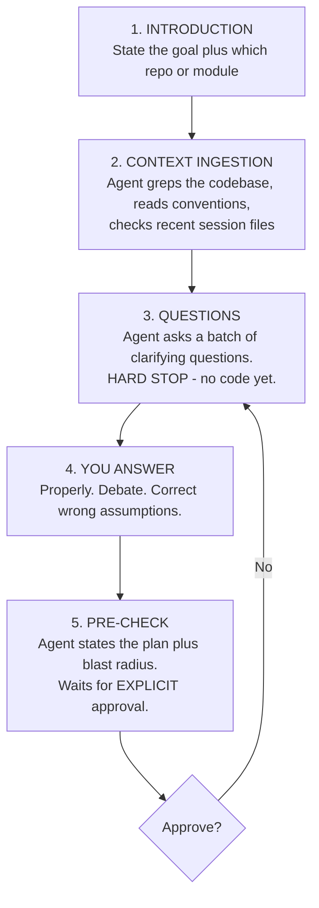
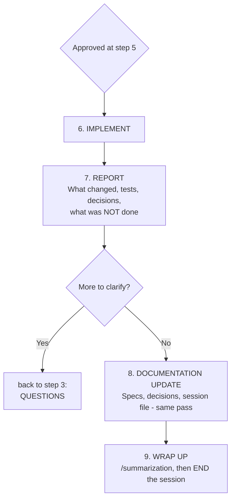

# The AI-First Doctrine, Toolchain & Prompting Standard

> **TrekLink is an AI-first project.** The team's primary development mode is **prompt and code
> review**, not hand-typing implementations. That is a deliberate choice, and it has a hard
> consequence: *the quality of what ships is bounded by the quality of the prompting and the rigour
> of the review.* Guideline adherence is therefore not bureaucracy — it is the difference between
> an agent that delivers and an agent that burns 200k tokens producing plausible garbage.
>
> **Core philosophy: docs first, code later.**

---

## 1. The Doctrine in One Page

| Principle | What it means in practice |
|---|---|
| **Docs first, code later** | The spec is the deliverable that matters. Code is a projection of it. No production code before `requirements.md` → `design.md` → `tasks.md`. |
| **The agent asks; you decide** | An agent that starts implementing without asking questions is misconfigured. Demand the clarification gate. |
| **Never auto-approve** | Read what the agent produced. Disagree with it. Debate it. You are co-authoring, not accepting deliveries. |
| **Ground everything** | No claim without a file reference, a test result, or a cited source. "Seems right" is not evidence. |
| **English out, always** | Prompt in any language. Everything written to the repo is English. |
| **Save tokens** | End sessions early and cleanly. Never extend a session for any reason except finishing the current task. |
| **Persist findings immediately** | Chat context is volatile. If it isn't on disk, it will be re-derived at full price. |

---

## 2. Model Policy (Hard Requirement)

> [!IMPORTANT]
> **Every team member must hold a paid frontier-model plan.** There is no free-tier path to
> delivering this project. Precision-critical work — embedded/IoT integration, wire-format
> handling, the idempotency layer, anything that touches firmware behaviour — does not tolerate a
> weak model, and a wrong answer there costs days.

*Model facts verified 2026-09-13. Re-verify before quoting these in any report.*

### 2.1 Approved for critical coding

| Vendor | Model | Released | API $/MTok in–out | Notes |
|---|---|---|---|---|
| **Anthropic** | **Claude Sonnet 5** | 2026-06-30 | $2 / $10 | The workhorse. Price locked permanently. |
| **Anthropic** | **Claude Opus 5** | 2026-07-24 | $5 / $25 | 1M context, Fast Mode, adaptive thinking. Default on the Max plan. |
| **Anthropic** | **Claude Fable 5.1** | — | frontier tier | *If that member can afford it.* Not expected of anyone. |
| **OpenAI** | **GPT-5.6 Sol** | — | — | Acceptable. Superseded by Astra. |
| **OpenAI** | **GPT-6 Astra** | 2026-09-03 | $10 / $50 | 1.05M context, knowledge cutoff 2026-04-30. |

**Planning, architecture, critical thinking and design work goes to Claude.** That is a
project-level preference, not a per-member choice.

### 2.2 Restricted — never for critical modules

| Vendor | Model | Permitted uses only |
|---|---|---|
| **Google** | **Gemini 3.8 Flash** (2026-09-02, $0.75/$3.75) | Ingestion, subagents, chores, codebase understanding, knowledge ingestion, explanations |
| **Google** | **Gemini 3.1 Pro** | Same |

> [!WARNING]
> **Google models are prohibited from coding important modules.** Ingestion, summarising, chores,
> explaining unfamiliar code, and running as cheap subagents — yes. Authoring the gateway queue,
> the incident FSM, the auth layer, or anything touching firmware — no. **No exceptions.**
>
> **Any other model, however powerful, falls under the same restriction.** The allow-list above is
> exhaustive for critical coding. A model not on it is an ingestion/chore tool, full stop.

> [!NOTE]
> **`gemini-3.1-pro` is the current Pro-tier stable — there is no "3.8 Pro".** Also worth knowing:
> Google's own documentation states 3.8 Flash is built on 3.7 Flash rather than a new base model
> and recommends staying on 3.7 Flash for efficiency-first workloads.

### 2.3 If you cannot afford a plan

**Raise it in the team chat.** There is no silent fallback and no permission to use a weak model
instead.

The sanctioned routes, in order:
1. **ChatGPT Plus free trial** — one month, giving GPT-5.6 Sol / GPT-6 Astra. Switch back to Claude
   when it expires.
2. **The team helps.** Five people, one shared problem. A member blocked on tooling cost is a team
   problem to solve, not an individual embarrassment to hide.

Given both routes, skipping a paid plan should not realistically occur.

### 2.4 Declaring your model

The PR template carries a **mandatory `Model used:` field.**

This is a **guideline backed by self-declaration, not an enforcement mechanism** — nobody can
detect from a diff which model produced it, and pretending otherwise would be theatre. It exists
because:
- it makes the policy visible at the moment of delivery, when it actually matters;
- it gives the reviewer a prior — a subtly wrong async pattern reads differently when the PR says
  "Gemini Flash" than when it says "Opus 5";
- it makes deviation a deliberate written act rather than a drift nobody noticed.

Reviewers should treat a restricted model declared on a critical module as grounds to request
changes on process, independent of whether the code looks correct.

---

## 3. Required Toolchain

### 3.1 prompt-orchestrator — mandatory for everyone

The team's shared agent ruleset: [`github.com/ruskicoder/system-prompts`](https://github.com/ruskicoder/system-prompts),
`prompt-orchestrator/` folder. It installs plain Markdown only — no binaries, no daemons, nothing
that touches your system config.

```bash
git clone https://github.com/ruskicoder/system-prompts.git
cd system-prompts/prompt-orchestrator

# Linux / macOS
bash install/install-all.sh          # every supported agent
bash install/install-claude.sh       # Claude Code only

# Windows (PowerShell)
.\install\install-all.ps1
.\install\install-claude.ps1
```

Works on Linux, macOS and Windows. Installs ~40 skills into `~/.claude/skills/` and merges an
`@AGENTS.md` reference into your personal `~/.claude/CLAUDE.md` without clobbering what's already
there. Per-agent installers exist for Cursor, Codex, Gemini, Windsurf, Antigravity, OpenCode and
OpenClaw.

Verify:
```bash
ls ~/.claude/skills | wc -l          # expect ~40
grep -c "prompt-orchestrator" ~/.claude/CLAUDE.md
```

### 3.2 TrekLink custom skills — mandatory for everyone

Project-specific skills that encode *this* project's workflow, shipped in this repo and installed
the same way:

```bash
cd treklink-docs/skills
bash install/install-all.sh          # Linux / macOS
.\install\install-all.ps1            # Windows
```

See [`../../skills/README.md`](../../skills/README.md). The headline skill is **`/treklink-session`**,
which drives the mandatory session workflow in §5 as a single command.

### 3.3 Marketplace skills & MCP connectors — install from the Claude store

Open **Explore Skills** in Claude and install these yourself. They are not vendored here because
they update independently.

| Bundle | Why you need it |
|---|---|
| **Development** skillsets | Debugging, testing strategy, code review, refactoring |
| **Design** skillsets | `design-critique`, `design-system`, `accessibility-review`, `ux-copy` |
| **PR** skillsets | `review-pull-request`, diff triage, structured review submission |
| **Jira** MCP | Read and move cards without leaving the agent session |
| **Neon** MCP | Query and inspect the shared Postgres (see D-010) |
| **Utilities** | `search`, `documentation`, `docs-coauthoring`, `system-design` |

> [!NOTE]
> Jira and Neon are **MCP connectors**, not Markdown skills. Each member installs and authorises
> them under their own account — credentials are personal and never committed. If a connector shows
> as unauthorised, run the OAuth flow from an interactive session; it cannot be done headlessly.

### 3.4 Per-member skill loadout

Everyone installs prompt-orchestrator, the TrekLink skills, and the PR + utilities bundles. Beyond
that, install what matches your lane (derived from the charter skill matrix):

| Member | Lane | Install additionally |
|---|---|---|
| **Đỗ Đăng Khoa** (KhoaDD) — Leader / PO | Backend architecture, review, all cross-cutting decisions | `architecture`, `system-design`, `review-software-architecture`, `review-pull-request`, `security-audit-codebase`, **Jira MCP**, **Neon MCP** |
| **Lâm Phi Long** (LongLP) | Gateway Bridge (Node.js), data-heavy backend | `debug`, `testing-strategy`, `api-integration`, `code-quality-testing`, **Neon MCP** |
| **Trần Khải Hoàng** (HoangTK) | Frontend | `design-critique`, `design-system`, `ux-copy`, `accessibility-review`, `design-handoff` |
| **Nguyễn Ngọc Long** (LongNN) | Backend CRUD modules (Spring Boot → NestJS transfer) | `codebase-understanding`, `documentation`, `code-quality-testing`, `debug` |
| **Nguyễn Bá Tân** (TanNB) | Reporting / DB, monitoring frontend | `data-analysis`, `sql-queries`, `design-critique`, **Neon MCP** |

### 3.5 Personal SSOT scaffold in `/ignore` — mandatory

> [!IMPORTANT]
> Previously "recommended". **Now required** — you will use it every session regardless, and an
> agent that finds no personal scaffold cannot resume your context.

Scaffold your own garden inside each repo you work in:

```
ignore/{your_name}/
├── docs/
│   ├── 00-index.md
│   ├── current-progress.md          # rolling POINTER to the latest session file
│   ├── sessions/                    # one file per session instance
│   │   └── YYYY-MM-DD-HHMM-topic.md
│   ├── diagrams/                    # .mmd
│   └── flows/                       # .mmd
├── scripts/                         # local tooling, scratch scripts
└── envs/                            # .env templates — never committed
```

Install it:
```bash
cd treklink-docs/skills
bash install/scaffold-garden.sh {your_name} /path/to/repo
```

The full convention is [`09-doc-driven-scaffold-and-ssot-conventions.md`](09-doc-driven-scaffold-and-ssot-conventions.md).

**Recommended**: `git init` inside `ignore/{your_name}/` as its own private repository and push it
to a **private** GitHub repo. You get versioned notes without dirtying the project repo. The parent
repo git-ignores `ignore/` entirely, so this is safe.

---

## 4. Agent Auto-Steering

Every repository carries an identical `AGENTS.md` (and `CLAUDE.md` pointing at it). Combined with
prompt-orchestrator, **the agent reads the conventions itself, at session start, with no input from
you.** You should never have to tell an agent "follow our conventions" — if you do, the setup is
broken; fix the setup rather than repeating yourself every session.

The `capstone/` parent folder carries one too, so an agent opened on the parent (the recommended
setup) sees all three repos plus `Documents/` at once.

**Open `capstone/`, not a single repo.** Cross-repo work — a spec in `treklink-docs`, a wire format
in `treklink-firmware`, the code in `treklink-web` — is the normal case on this project, and an
agent scoped to one repo will guess at the other two.

---

## 5. The Mandatory Session Workflow

> [!IMPORTANT]
> **Every session on any TrekLink repo follows this shape.** Run `/treklink-session` to have the
> agent drive it, or follow it manually. Skipping the questions step is the single most common
> cause of wasted tokens on this project.

See **Figure 1**.



***Figure 1*** — The AI session workflow, steps 1 to 5 — introduction through the pre-check approval gate. The hard stop at step 3 is what prevents an agent guessing at the domain. Placement: inline, 49.6 x 266.0 mm, labels at 9.27 pt.

See **Figure 2**.



***Figure 2*** — The AI session workflow, steps 6 to 9 — implement, report, document in the same pass, then end the session cleanly. Placement: inline, 88.5 x 266.0 mm, labels at 10.44 pt.

### 5.1 Step 1 — the read-context prompt

Always open a session by orienting the agent. Never start with the task.

### 5.2 Step 3 — the questions step is not optional

> [!WARNING]
> **Tell the agent to ask you a lot of questions.** An agent that goes straight to implementing is
> guessing at your domain, and you will pay for those guesses in review cycles.
>
> **You must review what the agent returns.** Do not assume. Do not auto-approve. Do not let it
> self-advance through the gate. Apply critical thinking, argue back, and co-author the result.
> The agent is a very fast colleague with no context, not an oracle.

### 5.3 Step 8 — document in the same pass

Deferred documentation is a **banned pattern** on this project. The instant you confirm a fact,
resolve a risk, or change something a document governs, edit that document *now* — not at session
end. Rationale and the full rule: [`08-ai-agent-steering-and-discipline.md`](08-ai-agent-steering-and-discipline.md) Stage 2.5.

### 5.4 Step 9 — end sessions early and cleanly

> [!IMPORTANT]
> **Do not extend a session for any reason other than completing the current task.** When the task
> is done, wrap up and close. "While you're here, can you also…" is how a 40k-token session becomes
> a 300k-token session with degraded reasoning in its final third.

---

## 6. Token & Context Discipline

### 6.1 The hard rule

> **Maximum 80% context window per session.** Crossing it triggers `/summarization` immediately,
> then a fresh session with the resulting handoff prompt.

Past roughly 70–80% of context, reasoning fidelity measurably drops: citations get looser, caveats
get dropped, earlier decisions get paraphrased into something subtly different. Claude and ChatGPT
both expose context/usage inspection — use it rather than guessing.

### 6.2 Session size is the agent's call, not a quota

A session may legitimately run anywhere from **20k to 500k tokens**. There is no per-task budget to
hit.

The rule is proportionality, and the **agent determines it**:
- **Heavy work** — a new module, a cross-cutting refactor, a gateway design pass — *should* consume
  a lot. Do not artificially constrain it; a truncated architecture pass is worse than an expensive
  one.
- **Light work** — a chore, a cleanup, a doc typo, a one-line config change — should consume as
  little as possible while still being correct. Cheapness never justifies an unverified answer.

### 6.3 Practical savings

| Habit | Why |
|---|---|
| Grep for the error; don't dump the whole log | Logs are mostly noise |
| Read targeted line ranges on large files | A 3000-line file read in full crowds out reasoning |
| Check `docs/sessions/` and `ignore/*/docs/sessions/` first | A teammate's agent may have already derived what you're about to re-derive. Reading a 20-line session file is orders of magnitude cheaper. |
| Write findings to disk at the moment of discovery | Re-derivation is the most expensive thing an agent does |
| Batch independent tool calls | One round trip instead of five |
| One session, one task | Context pollution degrades everything after it |

---

## 7. How to Prompt Well

The gap between a good and a bad prompt on the same task is routinely 5× in tokens and 2× in review
cycles. This is a learnable skill and it is the highest-leverage one on an AI-first team.

### 7.1 Principles

1. **State the goal, not the steps.** The agent can plan; let it. Prescribing the method throws away
   its ability to spot a better one.
2. **Give it the map.** Name the repo, module, spec, and any related decision (`D-005`). Context you
   supply is context it doesn't have to find.
3. **Say what "done" means.** "Tests pass and `specs/devices/requirements.md` AC-03 is satisfied"
   beats "make it work".
4. **Name the constraints up front.** "Don't touch the gateway package", "Prisma only, no raw SQL",
   "must not break the response envelope".
5. **Ask for questions explicitly.** "Ask me everything ambiguous before writing code" is the single
   highest-value sentence you can add.
6. **Demand evidence.** "Cite file:line for every claim" turns confident guesses into checkable
   statements.
7. **Be specific about scope.** Vague scope is how a one-file fix becomes a twelve-file refactor.

### 7.2 Anti-patterns

| Don't | Why |
|---|---|
| "Fix the bug" | Which bug? What's the symptom? What have you already ruled out? |
| "Make it better" | Unbounded. The agent invents a definition and optimises for it. |
| "Do whatever you think is best" | Abdication. You own the decision; the agent owns the execution. |
| Approving a plan you skim-read | You will find out what it actually said during review, expensively. |
| Pasting a stack trace with no context | It will fix the symptom at the throw site, not the cause. |
| Continuing a session past its task | Degraded reasoning + polluted context, for no benefit. |

---

## 8. Starter Prompts

Copy, paste, append your specifics. These are deliberately generic — the value is in the shape.

### 8.1 Session opener — read context

```text
You are working on the TrekLink capstone (FA26SE159). The workspace root is `capstone/`,
containing treklink-docs (SSOT), treklink-web (the build), treklink-firmware (inherited),
and Documents/ (graded reports).

Before doing anything:
1. Read treklink-docs/_docs/01-conventions/ — especially 07 (git), 10 (Jira), 11 (AI-first).
2. Read treklink-docs/_docs/00-project-context/03-decisions-and-risk-register.md and tell me
   if anything marked OPEN blocks what I'm about to ask.
3. Check docs/sessions/ and ignore/*/docs/sessions/ for anything from the last 24h touching
   the same area — do not re-derive what a recent session already found.
4. Tell me which sprint and roadmap week we're in.

Then stop and confirm you have context. Do not start work yet.
```

### 8.2 Feature request

```text
I want to implement {WHAT} in the {MODULE} module of treklink-web.

Backlog story: US-0nn / Jira: TK-nn
Spec: treklink-web/specs/{module}/

Constraints:
- Spec-before-code: if requirements.md/design.md/tasks.md don't cover this, we write those first.
- Response envelope { result, isSuccess, statusCode, message } is non-negotiable.
- Prisma only. Module isolation: no cross-module repository access.
- Unit tests required. They must pass before we open a PR.

Before writing anything, ask me every clarifying question you have — domain edge cases,
authorization rules, error conditions, anything ambiguous. Batch them. Then STOP and wait.
```

### 8.3 The questions prompt (use when the agent skips the gate)

```text
Stop. Before you implement anything, ask me a comprehensive batch of clarifying questions.

Cover at minimum:
- Domain edge cases and failure modes
- Authorization: which of Admin/Staff/Guide/Customer, and what ownership checks
- Error conditions and what the system should do for each
- Anything in the spec that is ambiguous, contradictory, or missing
- Anything you are about to assume

State your assumptions explicitly so I can correct them. Do not write code until I answer.
```

### 8.4 Pre-implementation approval gate

```text
Before you touch any file:
1. List every file you will create or modify, and why.
2. State the blast radius — what else depends on these, what could break.
3. State what you are deliberately NOT doing.
4. Flag anything you're under 80% confident about.

Then wait for my explicit approval. Do not proceed on silence.
```

### 8.5 Debugging

```text
Symptom: {EXACT ERROR OR OBSERVED BEHAVIOUR}
Expected: {WHAT SHOULD HAPPEN}
Already ruled out: {WHAT YOU'VE CHECKED}
Repro: {STEPS}

Work hypothesis-first: state ONE falsifiable hypothesis, name the exact check that would
confirm or refute it, run that check, state the finding once, move on. Do not guess at causes
without evidence. Cite file:line. When you find it, fix the root cause only — no drive-by
refactors — and add a regression test that fails without the fix.
```

### 8.6 PR review

```text
Review PR #{N} on {REPO}.

gh pr checkout {N}, then run the actual test suites — don't just read the diff.

Check:
- EARS criteria in specs/{module}/requirements.md actually satisfied
- Module boundaries respected, no cross-module repository access
- Response envelope correct on every new/changed endpoint
- Auth guard AND role/CASL policy on every mutating endpoint
- No N+1 queries; indexes match the idempotency/uniqueness requirements
- Tests exist, are meaningful, and pass
- No secrets, debug logs, dead code, or unresolved TODOs

Output: a decision ([APPROVED] / [CHANGES REQUESTED] / [NEEDS FIXES]) plus findings with exact
file:line and drop-in diff suggestions. Severity-tag each: Blocking / Suggestion / Nit / Praise.
```

### 8.7 Spec authoring

```text
Author the spec suite for {MODULE} in treklink-web/specs/{module}/.

Order: requirements.md (EARS) → design.md → tasks.md. Stop for my approval after each one.

requirements.md: EARS syntax — WHEN/THEN, IF/THEN, WHILE/THEN, WHERE, and ubiquitous SHALL.
  Number criteria AC-01, AC-02...
design.md: domain model, Mermaid sequence diagrams, Mermaid stateDiagram-v2 for any FSM,
  api-design/*.md per endpoint with full request/response and a failure-case table.
tasks.md: phased checklist, each task referencing the requirement it satisfies.

Before requirements.md: run the clarification interview. Ask me 5+ questions and WAIT.
```

### 8.8 Wrap-up

```text
We're ending this session. Before you stop:
1. Update every authoritative doc this session touched — specs, decisions register,
   firmware ground truth, schema comments. Not a summary of what to update: actually edit them.
2. Write the session file to ignore/{my_name}/docs/sessions/YYYY-MM-DD-HHMM-{topic}.md and
   update current-progress.md to point at it.
3. Confirm the working tree state and test status.
4. Output a copy-pasteable initialization prompt for the next session.
```

---

## 9. Common Failure Modes

| Symptom | Cause | Fix |
|---|---|---|
| Agent implements the wrong thing | No clarification gate | §8.3. Always. |
| Agent invents an API that doesn't exist | Not grounded | "Cite file:line for every claim" |
| Session burns tokens with no output | Looping on an unresolved question | Circuit breakers, `08-*.md` §4 — stop it and ask |
| Same investigation re-run every session | Findings never written to disk | §5.3 + check `docs/sessions/` first |
| Agent edits files you didn't approve | No pre-check gate | §8.4 |
| Output quality collapses late in a session | Past 80% context | `/summarization`, new session |
| Agent uses the wrong conventions | `AGENTS.md` not installed or repo opened alone | §4 — open `capstone/`, verify AGENTS.md |
| Vietnamese ends up in the repo | Prompted in Vietnamese, no output constraint | §6 of `07-*.md` — output is English regardless of prompt language |

---

## 10. Checklist — New Member Setup

- [ ] Paid frontier plan active (Claude Sonnet 5 / Opus 5, or ChatGPT Plus). §2
- [ ] Clone all three repos as siblings under `capstone/`. Root `README.md` §1
- [ ] `prompt-orchestrator` installed and verified. §3.1
- [ ] TrekLink custom skills installed. §3.2
- [ ] Marketplace skills + Jira and Neon MCP connectors authorised. §3.3
- [ ] Your lane's skill loadout installed. §3.4
- [ ] `ignore/{your_name}/` scaffolded in every repo you work in. §3.5
- [ ] Agent opened on `capstone/`, and it reads the conventions unprompted. §4
- [ ] You have run `/treklink-session` once end to end. §5
- [ ] Jira access to the TK project, and you can move a card. `10-*.md`
- [ ] You are in the Zalo group.
