# Capstone Project Report, Report 3: Software Requirement Specification

> **Status**: **Draft for Review 1 (Week 4)**, revised 2026-09-25. This revision fills the template
> end to end except the Screens Flow and Screen Descriptions (§3.1.2, §3.1.3), which follow the
> screen design work of W5 to W7 and are written for the Final SRS at Review 2 (Week 8).
>
> **Provisional requirements.** Requirements whose source carries **(P)** rest on the leader's
> Recorded answers for modules not yet specified (clarification questions 30 to 73). They are in
> force for this document and are re-confirmed at each module's own specification interview.
>
> Structure follows the SEP490 template `Report3_Software Requirement Specification.docx`.
> Section numbers of the Review 1 draft are kept so later reports can cite them.

**Project code**: FA26SE159 · **Group code**: GFA26SE55 · **Supervisor**: Đặng Ngọc Minh Đức

---

## I. Project Report

### 1. Status Report

| Item | Status on 2026-09-25 |
|---|---|
| This document | Review 1 draft revised: 58 use cases with specifications, 112 functional requirements in EARS, measurable NFRs, 37 business rules, 31 exception scenarios, conceptual ERD and five state machines |
| Main Flow implementation | None of MF-01 to MF-05 is implemented. Every Implementation and Tested cell in §5.1 and §5.2 is therefore empty |
| Specifications | `gateway-sync` has requirements, design and tasks. The other modules are template stubs |
| Screens | No screen design exists yet. Screens Flow and Screen Descriptions are written at W8 |

### 2. Team Involvements

Lanes are the assigned areas of responsibility (roadmap §5.1). This table records assignment for
this document, not a claim of completed work.

| Member | Code | Main Flow owned | SRS areas assigned |
|---|---|---|---|
| Đỗ Đăng Khoa | KhoaDD | MF-02 | Overall structure and review; §3.6 Gateway and Synchronization; §4.1 External Interfaces |
| Nguyễn Bá Tân | TanNB | MF-01 | Document owner; §2 User Requirements; §3.4 Booking and Rental; §3.5 Trips; §5.2 Exception Scenarios |
| Trần Khải Hoàng | HoangTK | MF-03 | §3.7 Incident Management; incident state machine |
| Nguyễn Ngọc Long | LongNN | MF-04 | §3.8 Real-Time Monitoring; §3.1.4 Screen Authorization |
| Lâm Phi Long | LongLP | MF-05 | §3.2 Identity and Access; §3.9 Billing |

### 3. Issues/Suggestions

| # | Issue | Owner | Action |
|---|---|---|---|
| 1 | Map sovereignty acceptance test: the check was done by inspection, but no screenshots are filed. BR-24 and its test stay open | KhoaDD, LongNN | File the screenshots over Hoàng Sa and Trường Sa before Review 1 |
| 2 | Requirements marked (P) rest on Recorded answers | Module owners | Re-confirm at each module's specification interview; update this document |
| 3 | No availability target is set for the platform (§4.2.7) | KhoaDD | Decide before the Final SRS |
| 4 | Report 1 and the PMP still describe a two-stage gateway and four peer roles | KhoaDD | Align them with this document before Review 1 |

---

## II. Software Requirement Specification

### Record of Changes

| Date | A\*<br/>M, D | In charge | Change Description |
|---|---|---|---|
| 2026-09-17 | A | Nguyễn Bá Tân | Initial draft for Review 1: overview, actors, use cases, feature tree, NFRs, business rules |
| 2026-09-25 | M | Đỗ Đăng Khoa, Nguyễn Bá Tân | Template completed: Part I; Level-0 context diagram; actor model with Guest and Staff sub-roles; use case diagrams per Main Flow; UC-27 to UC-58 added and all 58 specified; `include` corrections on UC-11 and UC-13; functional requirements in EARS (§3.2 to §3.10); screen authorization; conceptual ERD; five state machines; external interfaces corrected to the stock MQTT topics; security, availability and notification NFRs; BR-03 and BR-04 revised, BR-25 to BR-37 added; messages, glossary and traceability matrix |

\*A - Added M - Modified D - Deleted

### 1. Product Overview

Vietnamese trekking routes such as Tà Năng to Phan Dũng, Tả Liên Sơn and Bạch Mộc Lương Tử run
through cellular dead zones lasting several days. During Summer 2026 the team built **TrekLink
firmware**, a LoRa mesh for ESP32 devices forked from Meshtastic, in four hardware variants. It
sends device-level SOS by button, gesture or IMU fall detection, followed by a position beacon, and
reports position and telemetry over the mesh. It is inherited and extended, not rebuilt.

Two operational gaps remain, and neither the firmware nor any existing product closes them.

**Field events are lost.** There is no store-and-forward path between the mesh and a backend. The
node's own uplink queue holds 16 events in RAM and discards the oldest first, so during an outage
the single SOS text frame is the first event dropped.

**A device-level SOS triggers nothing beyond a local radio alert.** There is no fleet, rental or
trip management and no structured incident workflow. Agencies coordinate emergency response by
phone and messaging app, with no audit trail, across concurrent trips.

**TrekLink Operations Platform** is a responsive web application and gateway system that closes
both. It delivers every field event from the trail to the cloud exactly once, including events
generated during connectivity loss; it turns each SOS episode into one auditable incident that a
named person owns and closes; and it manages the device fleet, rentals and trips around it.

**A system with platform seams.** TrekLink is built as a single-tenant operations **system** for
one trekking agency. What it offers beyond a single system is a set of extension seams, each
already decided:

| Seam | What it allows | Decision |
|---|---|---|
| Ingress adapters | A new field transport (node MQTT, basecamp bridge, phone app proxy) plugs in without touching ingestion | D-007 |
| Business parameters as configuration | Fees, thresholds, windows and map provider change at run time, without a release | D-015 |
| Stock Meshtastic compatibility | Any stock Meshtastic client and app keeps working with TrekLink devices | D-019 |
| Extensible Staff sub-roles | New staff roles, for example Manager, are added as data | Clarification Q33 |

**What "Smart" refers to** in the registered title: SOS and automatic fall detection, the offline
fallback with its priority queue, the append-only audit logs, and watchdogs such as staleness and
escalation checks. No AI or machine-learning component is claimed.

**Positioning.** Consumer satellite messengers (Garmin inReach, SPOT, Zoleo) solve field
communication but are closed, individual-use, and have no agency-side rental or incident layer.
Generic IoT fleet platforms (AWS IoT Core, Azure IoT Hub, Balena) have no LoRa mesh integration and
no store-and-forward design for intermittent field connectivity. IT incident tools (Jira Service
Management, PagerDuty, Opsgenie) have mature ticket lifecycles but no path from a physical SOS
broadcast to a ticket.

**Target users**: trekking agencies operating in areas without cellular coverage: their operators,
field guides, administrators and customers.

#### 1.1 Context Diagram

The system is one process. Around it are its five human actors, the TrekLink devices on the mesh,
and three external services. See **Figure 1**. The Gateway Bridge is inside the boundary: the
team builds it, and it is part of process 0. Payment is an internal sandbox module and therefore not
an external entity. Each arrow label reads "into the system / out of the system"; the table after
the figure lists every flow in full.

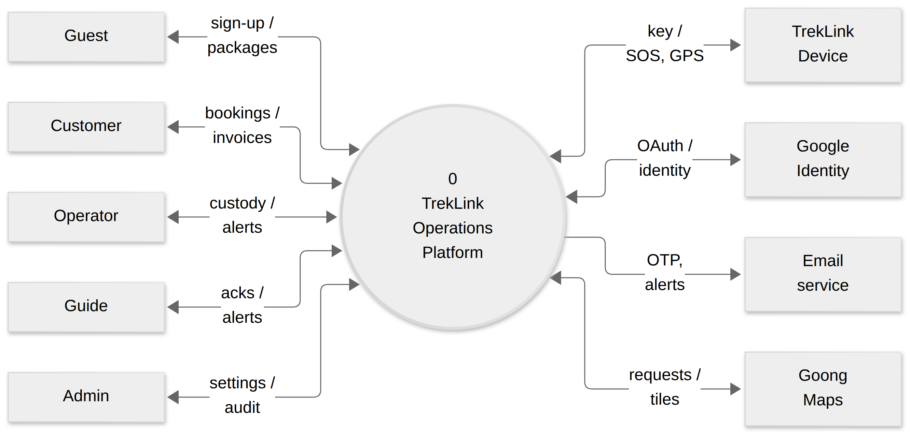{ width=159.0mm height=74.9mm }

***Figure 1***: Context Diagram, drawn as a Level-0 data flow diagram: the system as one process, every external entity, and the data each flow carries. Placement: inline, 159.0 x 74.9 mm, labels at 8.01 pt.


| External entity | Flow into the system | Flow out of the system |
|---|---|---|
| Guest | Package queries, sign-up details | Package list, OTP prompt |
| Customer | Bookings, payments, cancellations, agreement signatures | Confirmations, agreement PDF, invoices, refunds |
| Operator | Confirmations, allocations, provisioning, check-out and check-in, inspections, incident actions | Booking queue, fleet state, live map, incident alerts, reports |
| Guide | Handover confirmation, trip start and end, missing-device reports, acknowledgements, notes | Assigned trips, own-trip map, incident alerts |
| Admin | Accounts and roles, business parameters, pricing, device catalogue | Audit logs, system health |
| TrekLink Device | SOS, position and telemetry packets over the mesh | Fleet channel key at provisioning |
| Google Identity | Identity assertion | OAuth request |
| Email service | (none) | OTP, password reset and incident email |
| Goong Maps | Vector tiles and style | Tile requests, from the browser |

#### 1.2 The five Main Flows

The product is built, tested and demonstrated as five Main Flows fixed with the supervisor
(D-016). Their swimlane diagrams are in §3.1.1.

| MF | Name | Owner | Priority | What it delivers |
|---|---|---|---|---|
| MF-01 | Booking → Rental → Trip Preparation | TanNB | High | A customer's booking becomes a provisioned device in a Guide's hands |
| MF-02 | Field Data → Offline Gateway → Cloud Synchronization | KhoaDD | Highest | Every field event reaches the cloud exactly once, in priority order |
| MF-03 | SOS → Incident → Emergency Response | HoangTK | Highest | One SOS episode becomes one owned, audited incident |
| MF-04 | Real-Time Trip Monitoring | LongNN | High | One live picture of trips, devices and incidents, scoped by role |
| MF-05 | Return → Inspection → Billing → Maintenance | LongLP | Medium | The rental closes, the money settles, the device returns to service or leaves it |

E7 (DevOps) and E8 (Research and Evaluation) are cross-cutting epics and are deliberately not Main
Flows.

#### 1.3 Delivery stages of MF-02

MF-02's offline guarantee is delivered in three stages, all in permanent scope (D-005, D-018,
D-020). The MF-02 swimlane (Figure 17) draws the buffer in the gateway lane; the
stages below state where each buffer actually sits.

| Stage | Where the buffer is | What it covers |
|---|---|---|
| A | None: the node publishes straight to MQTT over its own Wi-Fi | The first increment. No offline guarantee |
| B | On the device: a durable, priority-ordered queue in the firmware | Survives outages and reboots for that node's own events. Built first |
| C | At basecamp: the Gateway Bridge's SQLite queue, fed by a tethered node | Aggregates the whole local mesh. Browser-first form (D-020) |

---

### 2. User Requirements

#### 2.1 Actors

| # | Actor | Type | Description | Main Flows |
|---|---|---|---|---|
| 1 | Guest | Primary, human | Anonymous visitor. Browses packages, registers | MF-01 |
| 2 | Customer | Primary, human | Books packages, pays, signs the agreement, views own history. Never returns devices directly | MF-01, MF-05 |
| 3 | Staff | Abstract, human | Generalizes Operator, Guide and Admin. Sub-roles are data and can be extended | all |
| 4 | Operator | Primary, human (Staff) | Bookings, allocation, provisioning, agreements, check-out and check-in, inspection, billing, incident coordination | MF-01, MF-03, MF-04, MF-05 |
| 5 | Guide | Primary, human (Staff) | Leads the trek, confirms handover, starts and ends the trip, collects devices, acknowledges and reports in the field. Sees only assigned trips | MF-01, MF-03, MF-04, MF-05 |
| 6 | Admin | Primary, human (Staff) | Accounts and roles, device catalogue, pricing, business parameters, audit logs, system health. Holds every Operator permission | all |
| 7 | TrekLink Device | Secondary, system | ESP32 LoRa node on inherited firmware. Emits SOS, position and telemetry | MF-02, MF-03, MF-04 |
| 8 | Gateway Bridge | Secondary, system (inside the boundary) | Normalizes mesh packets, buffers them, publishes to MQTT | MF-02, MF-03, MF-04 |
| 9 | Scheduler | Secondary, system | Time-triggered checks: hold expiry, staleness, escalation | MF-01, MF-03, MF-04, MF-05 |
| 10 | Google Identity | External system | OAuth sign-in for Customers | MF-01 |
| 11 | Email service | External system | OTP, password reset and incident email | MF-01, MF-03 |
| 12 | Goong Maps | External system | Vector tiles and styles for the live map (D-012) | MF-04 |

**Role generalization.** Operator, Guide and Admin specialize Staff. Admin is Staff with
privileges and holds every Operator permission. The Guide's reads are limited to assigned trips on
the server. See **Figure 2**.

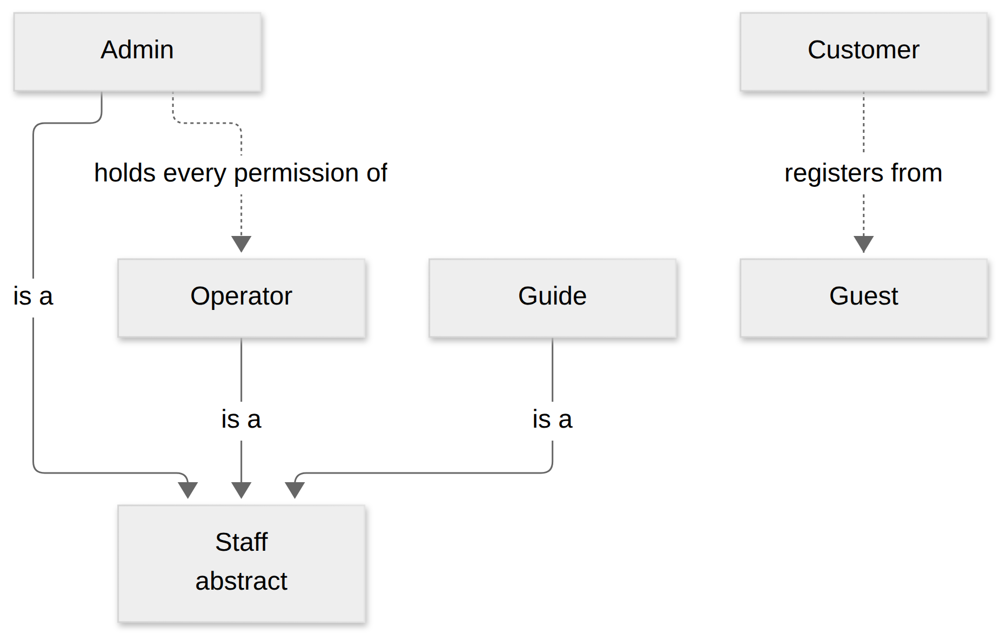{ width=159.0mm height=106.7mm }

***Figure 2***: Actor generalization. Operator, Guide and Admin specialize the abstract Staff actor; Admin also holds every Operator permission. Placement: inline, 159.0 x 106.7 mm, labels at 11.64 pt.


#### 2.2 Use Cases

##### 2.2.1 Diagram(s)

One diagram per Main Flow, with MF-01, MF-03 and MF-05 each split in two for legibility, plus one diagram for the
administration and access use cases every flow shares. See **Figure 3**, **Figure 4**,
**Figure 5**, **Figure 6**, **Figure 7**, **Figure 8**, **Figure 9**, **Figure 10** and **Figure 11**.

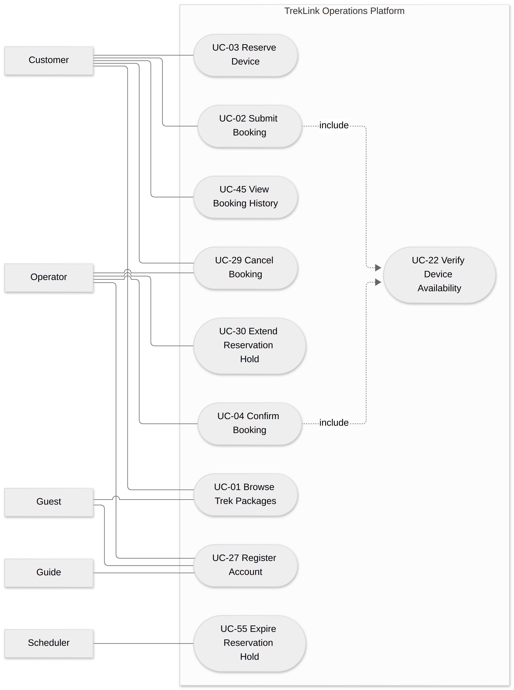{ width=156.6mm height=225.0mm }

***Figure 3***: MF-01 use cases, part 1 of 2: browsing, booking and holds. Placement: inline, 156.6 x 225.0 mm, labels at 7.95 pt.

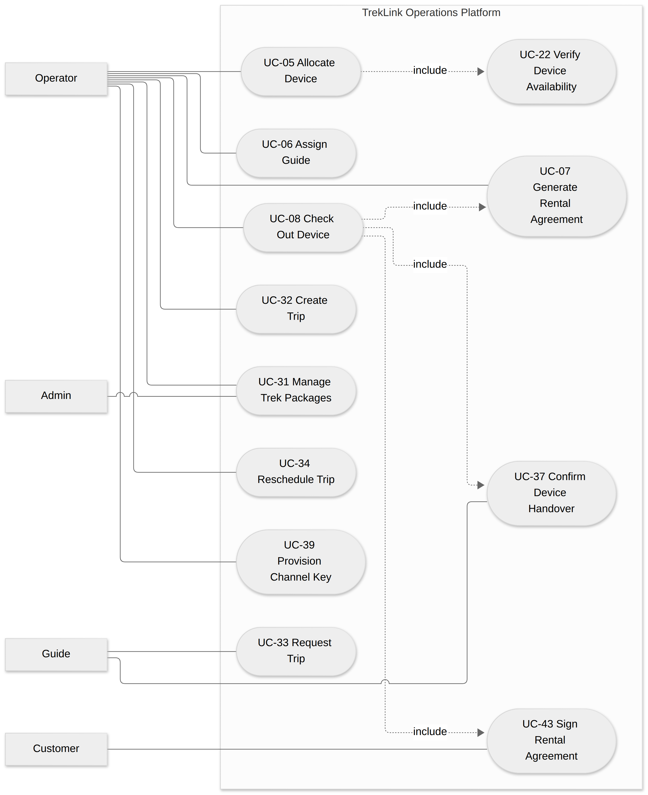{ width=159.0mm height=203.9mm }

***Figure 4***: MF-01 use cases, part 2 of 2: trip set-up, allocation, agreement and check-out. Placement: inline, 159.0 x 203.9 mm, labels at 7.38 pt.

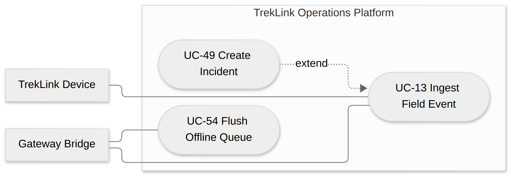{ width=159.0mm height=54.2mm }

***Figure 5***: MF-02 use cases: ingestion, offline flush and the extension point into incident creation. Placement: inline, 159.0 x 54.2 mm, labels at 9.46 pt.

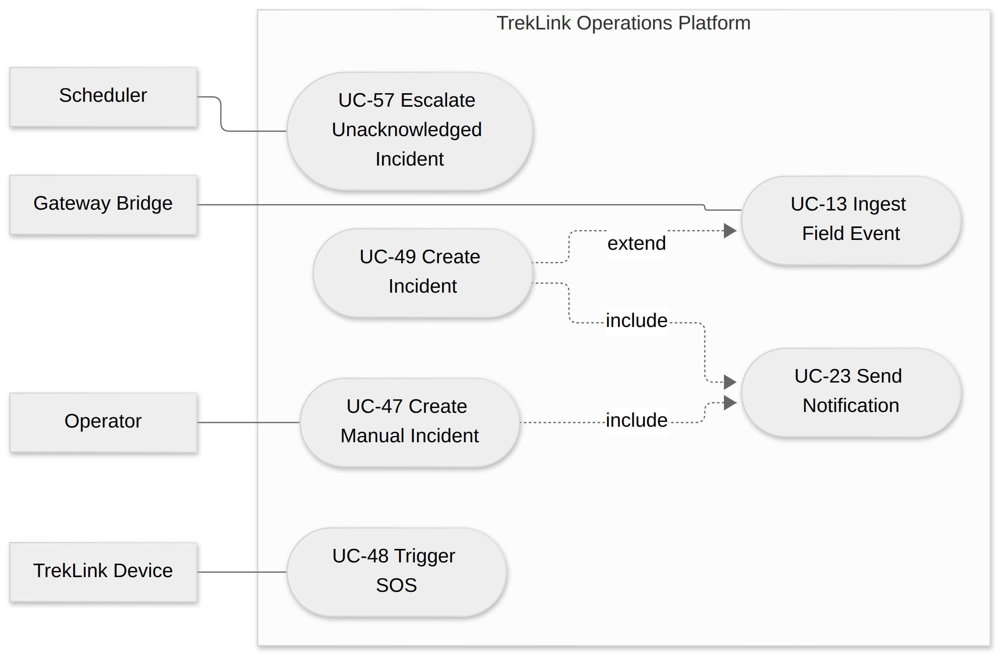{ width=159.0mm height=106.1mm }

***Figure 6***: MF-03 use cases, part 1 of 2: SOS, incident creation, manual incidents and escalation. Placement: inline, 159.0 x 106.1 mm, labels at 8.61 pt.

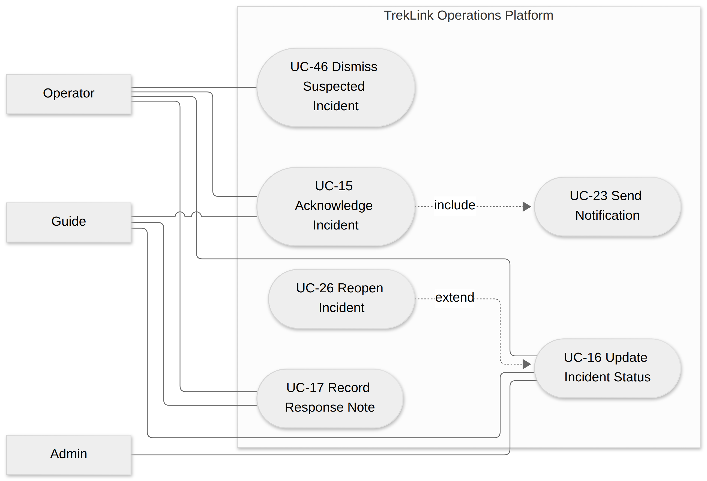{ width=159.0mm height=109.1mm }

***Figure 7***: MF-03 use cases, part 2 of 2: acknowledgement, status updates, notes, reopen and dismissal. Placement: inline, 159.0 x 109.1 mm, labels at 8.01 pt.

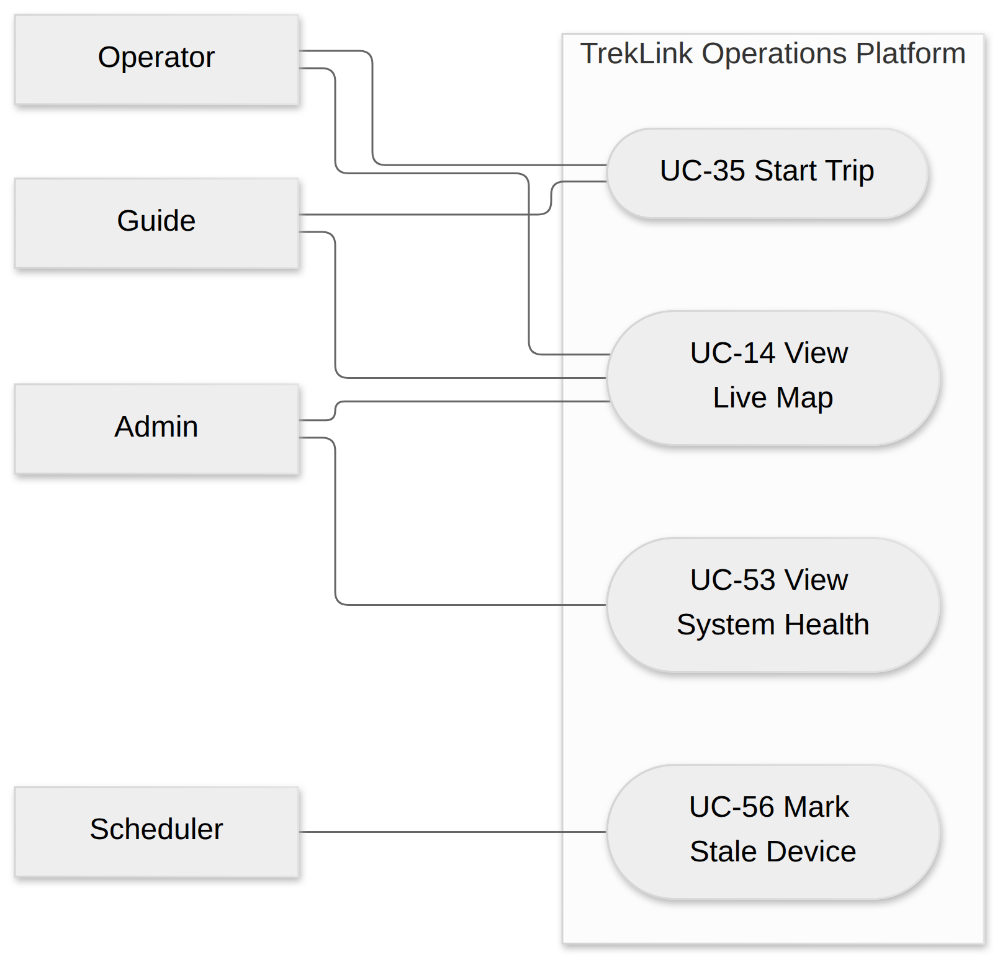{ width=159.0mm height=158.1mm }

***Figure 8***: MF-04 use cases: live monitoring, trip start, staleness and system health. Placement: inline, 159.0 x 158.1 mm, labels at 13.45 pt.

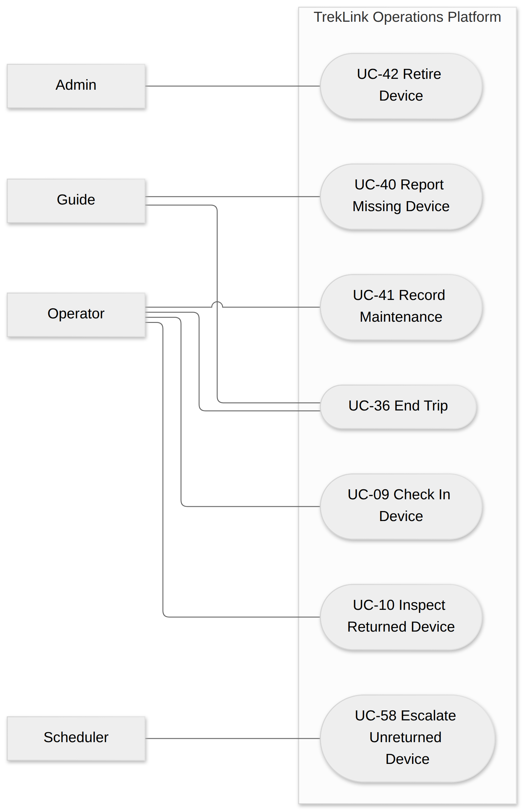{ width=141.7mm height=225.0mm }

***Figure 9***: MF-05 use cases, part 1 of 2: trip end, return, inspection and device disposition. Placement: inline, 141.7 x 225.0 mm, labels at 10.82 pt.

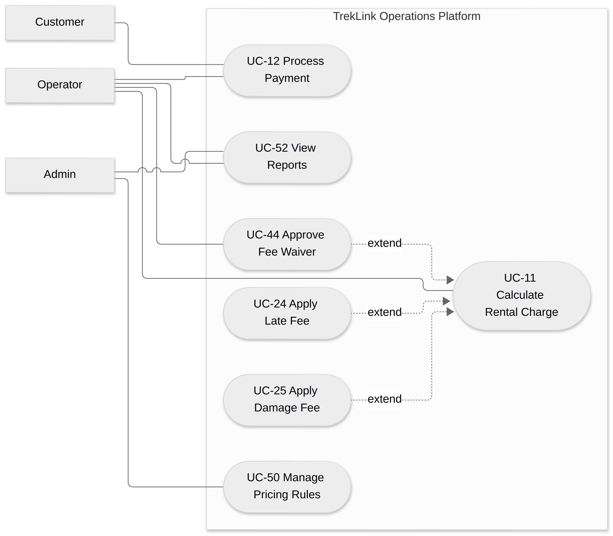{ width=159.0mm height=144.2mm }

***Figure 10***: MF-05 use cases, part 2 of 2: charging, fees, waiver, payment and reports. Placement: inline, 159.0 x 144.2 mm, labels at 8.17 pt.

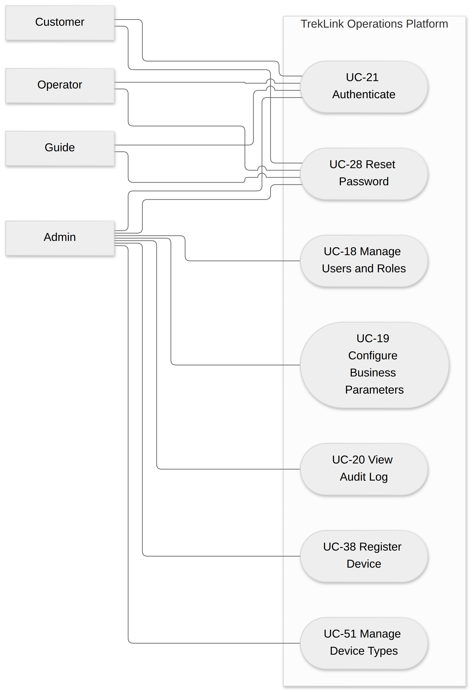{ width=143.0mm height=225.0mm }

***Figure 11***: Administration and access use cases, shared across all Main Flows. Placement: inline, 143.0 x 225.0 mm, labels at 9.80 pt.


**How `include` and `extend` are used.** An included use case **always** runs as part of its base:
Submit Booking, Confirm Booking and Allocate Device always verify availability; Check Out Device
always generates the agreement, captures the signature and takes the Guide's handover
confirmation; Create Incident always sends the notification, and Acknowledge Incident always
pushes the acknowledgement to the other responders. An extending use case runs **only
when its condition holds**: Apply Late Fee when the device came back late, Apply Damage Fee when the
inspection recorded damage, Approve Fee Waiver when a waiver above the threshold is requested,
Reopen Incident when beacons arrive after resolution, and Create Incident when an ingested event is
an SOS or crosses the cadence threshold. Two relationships of the Review 1 draft were inverted and
are corrected here: Ingest Field Event no longer includes Send Notification, because most field
events notify nobody; Calculate Rental Charge no longer includes Inspect Returned Device, because
inspection is the Operator's own use case and precedes the charge. Generalization is used only
between actors.

##### 2.2.2 Descriptions

UC-01 to UC-26 keep the Review 1 numbering. UC-27 to UC-58 are added in this revision.

| ID | Use Case | Actors | Main Flow | Use Case Description |
|---|---|---|---|---|
| UC-01 | Browse Trek Packages | Guest, Customer | MF-01 | List active trek packages with route, duration and price, filterable, without an account. |
| UC-02 | Submit Booking | Customer | MF-01 | Request a trip on a package for chosen dates and group size; the booking enters review. |
| UC-03 | Reserve Device | Customer | MF-01 | Hold a device for the booking while the form is completed; the hold expires if unused. |
| UC-04 | Confirm Booking | Operator | MF-01 | Review a submitted booking and confirm or reject it, seeing device and guide conflicts first. |
| UC-05 | Allocate Device | Operator | MF-01 | Bind specific physical devices to a confirmed booking or rental for the trip's time window. |
| UC-06 | Assign Guide | Operator | MF-01 | Assign one or more Guides to a trip whose dates do not overlap their other assignments. |
| UC-07 | Generate Rental Agreement | Operator | MF-01 | Produce the rental agreement PDF from the booking, allocation and pricing data. |
| UC-08 | Check Out Device | Operator | MF-01 | Hand the allocated devices to the Guide; the rental becomes Active and devices Rented. |
| UC-09 | Check In Device | Operator | MF-05 | Receive devices back from the Guide at trip end; returned devices become Returned. |
| UC-10 | Inspect Returned Device | Operator | MF-05 | Record condition, accessories and battery of a returned device, with any damage report. |
| UC-11 | Calculate Rental Charge | Operator | MF-05 | Compute base charge, late fee and damage fee, apply the deposit, and issue the invoice. |
| UC-12 | Process Payment | Customer, Operator | MF-01, MF-05 | Pay into sandbox escrow at confirmation, then settle the balance or refund at return. |
| UC-13 | Ingest Field Event | Gateway Bridge | MF-02 | Accept a normalized mesh event, deduplicate it by eventId, persist it and route it by kind. |
| UC-14 | View Live Map | Operator, Guide, Admin | MF-04 | See live device positions, battery, last-seen and incidents, scoped by role on the server. |
| UC-15 | Acknowledge Incident | Operator, Guide | MF-03 | Take ownership of a Detected incident; the first acknowledgement fixes the MTTA timestamp. |
| UC-16 | Update Incident Status | Operator, Admin, Guide | MF-03 | Move an incident through In Progress, Resolved and Closed with a note on each step. |
| UC-17 | Record Response Note | Guide, Operator | MF-03 | Append a field or coordination note to an incident's audit trail. |
| UC-18 | Manage Users and Roles | Admin | cross-cutting | Create, deactivate and assign roles to accounts; maintain the Staff sub-role list. |
| UC-19 | Configure Business Parameters | Admin | cross-cutting | Change a registered business parameter at run time and see the change take effect. |
| UC-20 | View Audit Log | Admin | cross-cutting | Read the append-only authentication, device, incident and configuration audit trails. |
| UC-21 | Authenticate | Customer, Operator, Guide, Admin | cross-cutting | Log in, renew the session silently and log out. |
| UC-22 | Verify Device Availability | (included) | MF-01 | Check that enough allocatable devices exist for the requested window, under a row lock. |
| UC-23 | Send Notification | (included) | MF-03 | Push an incident alert or acknowledgement over WebSocket, and alerts by email, to the Guide and online Staff. |
| UC-24 | Apply Late Fee | (extends UC-11) | MF-05 | Add an itemized late fee when check-in is after the agreed return time plus grace. |
| UC-25 | Apply Damage Fee | (extends UC-11) | MF-05 | Add an itemized damage fee derived from the inspection's damage report. |
| UC-26 | Reopen Incident | (extends UC-16) | MF-03 | Return a Resolved incident to In Progress when new beacons arrive from the same episode. |
| UC-27 | Register Account | Guest, Operator, Guide | MF-01 | Create a Customer account by Google OAuth or email OTP, or on the customer's behalf. |
| UC-28 | Reset Password | Customer, Operator, Guide, Admin | cross-cutting | Reset a forgotten password by email OTP; an Operator may trigger it without seeing it. |
| UC-29 | Cancel Booking | Customer, Operator | MF-01 | Cancel a booking before check-out, releasing devices and applying the cancellation policy. |
| UC-30 | Extend Reservation Hold | Operator | MF-01 | Extend or disable the device hold on a Staff or Guide booking. |
| UC-31 | Manage Trek Packages | Operator, Admin | MF-01 | Create, edit and deactivate trek packages without changing confirmed bookings. |
| UC-32 | Create Trip | Operator | MF-01 | Create a dated trip from a package and prepare it for booking and provisioning. |
| UC-33 | Request Trip | Guide | MF-01 | Ask Staff to author a trip; the request becomes a Draft trip for an Operator. |
| UC-34 | Reschedule Trip | Operator | MF-01 | Move or cancel a trip before it starts, revalidating allocations and assignments. |
| UC-35 | Start Trip | Operator, Guide | MF-04 | Mark the group departed; the trip becomes Ongoing and its devices In-Field. |
| UC-36 | End Trip | Operator, Guide | MF-05 | Mark the trip Finished after the Guide has collected every device from the customers. |
| UC-37 | Confirm Device Handover | Guide | MF-01 | Complete the readiness checklist and confirm the devices received at check-out. |
| UC-38 | Register Device | Admin | cross-cutting | Enter a new physical device with its hardware version and firmware version. |
| UC-39 | Provision Channel Key | Operator | MF-01 | Load the fleet's custom LoRa channel key onto a device before its first check-out. |
| UC-40 | Report Missing Device | Guide | MF-05 | Report a device the Guide could not collect back from a customer. |
| UC-41 | Record Maintenance | Operator | MF-05 | Move a device into Maintenance with a reason, and back to Available when repaired. |
| UC-42 | Retire Device | Admin | MF-05 | Take a device permanently out of service, keeping its full history. |
| UC-43 | Sign Rental Agreement | Customer | MF-01 | Sign the agreement on the web; the signature is stamped into the PDF. |
| UC-44 | Approve Fee Waiver | Operator | MF-05 | Approve a fee waiver above the threshold, as a staff member other than the inspector. |
| UC-45 | View Booking History | Customer | MF-01, MF-05 | See own bookings, rentals, agreements, deposits, invoices and payment status. |
| UC-46 | Dismiss Suspected Incident | Operator | MF-03 | Close a cadence-inferred incident judged a false alarm, with a dismissal reason. |
| UC-47 | Create Manual Incident | Operator | MF-03 | Open an incident for an emergency reported by phone or message, with no device SOS. |
| UC-48 | Trigger SOS | TrekLink Device | MF-03 | Broadcast an SOS by button, gesture or fall detection, followed by a position beacon. |
| UC-49 | Create Incident | (extends UC-13) | MF-03 | Open one Incident for a new SOS episode or a cadence anomaly, or append to the open one. |
| UC-50 | Manage Pricing Rules | Admin | MF-05 | Define base rates, deposit tiers, late-fee and damage-fee schedules for new agreements. |
| UC-51 | Manage Device Types | Admin | cross-cutting | Maintain the catalogue of device types, hardware versions and firmware versions. |
| UC-52 | View Reports | Admin, Operator | MF-03, MF-05 | View and export device utilization and incident response-performance reports. |
| UC-53 | View System Health | Admin | MF-04 | See gateway connectivity, queue depth per tier and audit-log volume across the system. |
| UC-54 | Flush Offline Queue | Gateway Bridge | MF-02 | On reconnection, publish buffered events in strict priority order, resuming after a drop. |
| UC-55 | Expire Reservation Hold | Scheduler | MF-01 | Release a device hold that lapsed before the booking was submitted. |
| UC-56 | Mark Stale Device | Scheduler | MF-04 | Flag a device or gateway silent beyond its threshold as stale. |
| UC-57 | Escalate Unacknowledged Incident | Scheduler | MF-03 | Re-notify when an incident stays Detected beyond the auto-escalation timeout. |
| UC-58 | Escalate Unreturned Device | Scheduler | MF-05 | Escalate a rental whose device is still out past the non-return grace period. |


##### 2.2.3 Use Case Specifications

Message codes (MSGnn) refer to §5.3; rule codes (BR-nn) to §5.1; exception codes (Enn-n) to §5.2.

###### UC-01 Browse Trek Packages

| Field | Content |
|---|---|
| Actors | Guest, Customer |
| Main Flow | MF-01 |
| Description | List active trek packages with route, duration and price, filterable, without an account. |
| Trigger | Guest or Customer opens the package catalogue |
| Precondition | At least one package is active |
| Postcondition | None; read-only |
| Normal flow | 1. The actor opens the catalogue.<br/>2. The system lists active packages with route, duration and base price.<br/>3. The actor filters by route, duration or price range and opens a package. |
| Alternatives and exceptions | - No package matches the filter: MSG01.<br/>- Inactive packages are never listed (US-024). |
| Requirements | FR-AUTH-14 |

###### UC-02 Submit Booking

| Field | Content |
|---|---|
| Actors | Customer |
| Main Flow | MF-01 |
| Description | Request a trip on a package for chosen dates and group size; the booking enters review. |
| Trigger | Customer selects Book on a package |
| Precondition | Customer is authenticated; package active |
| Postcondition | Booking in `Sent`; hold converted into a pending reservation |
| Normal flow | 1. The system creates the booking in `Start` and starts the device hold (UC-03).<br/>2. The Customer enters dates and group size, at most 6 fields per step.<br/>3. The system validates dates, group size and device availability (UC-22).<br/>4. The Customer submits; the booking moves to `Sent` for Operator review. |
| Alternatives and exceptions | - Hold lapses before submit: booking `Expired` (UC-55), MSG14.<br/>- Dates overlap an existing allocation: rejected with the conflict named (E01-5), MSG12.<br/>- Group size outside package limits: MSG02. |
| Relationships | include UC-22 |
| Business rules | BR-01, BR-25, BR-26 |
| Requirements | FR-AUTH-14, FR-BOOK-01, FR-BOOK-15 |

###### UC-03 Reserve Device

| Field | Content |
|---|---|
| Actors | Customer |
| Main Flow | MF-01 |
| Description | Hold a device for the booking while the form is completed; the hold expires if unused. |
| Trigger | Booking created in `Start` |
| Precondition | An allocatable device exists for the window |
| Postcondition | One device held for the Customer for the hold duration |
| Normal flow | 1. The system reserves one device count for the booking under a row lock.<br/>2. The hold timer starts at the configured duration. |
| Alternatives and exceptions | - Last device taken concurrently: the loser sees MSG11 and the booking stays without a device (E01-1).<br/>- A Customer booking requests more than one device: rejected, MSG13. |
| Business rules | BR-01, BR-26, BR-27 |
| Requirements | FR-BOOK-02, FR-BOOK-03, FR-BOOK-05 |

###### UC-04 Confirm Booking

| Field | Content |
|---|---|
| Actors | Operator |
| Main Flow | MF-01 |
| Description | Review a submitted booking and confirm or reject it, seeing device and guide conflicts first. |
| Trigger | Operator opens a `Sent` booking |
| Precondition | Booking in `Sent` |
| Postcondition | Booking `Pending` (confirmed) or `Rejected` |
| Normal flow | 1. The system shows the booking with device availability (UC-22) and eligible Guides for the dates.<br/>2. The Operator confirms; the booking moves to `Pending` and the Customer is notified. |
| Alternatives and exceptions | - No eligible Guide or too few devices: conflict shown before confirm, confirm disabled (E01-4).<br/>- Operator rejects with a mandatory reason: booking `Rejected`, reservation released, MSG16. |
| Relationships | include UC-22 |
| Business rules | BR-02 |
| Requirements | FR-BOOK-04, FR-BOOK-06, FR-BOOK-15 |

###### UC-05 Allocate Device

| Field | Content |
|---|---|
| Actors | Operator |
| Main Flow | MF-01 |
| Description | Bind specific physical devices to a confirmed booking or rental for the trip's time window. |
| Trigger | Operator allocates devices to a confirmed booking or a rental |
| Precondition | Booking `Pending`, or rental `Created` without a booking |
| Postcondition | Allocation records for each device; devices `Reserved` when the window is the next one |
| Normal flow | 1. The Operator selects devices from the allocatable list.<br/>2. The system checks state, hardware version accepted by the trip, and window overlap in one transaction.<br/>3. The system shows the battery advisory or warning where it applies.<br/>4. The system saves the allocations. |
| Alternatives and exceptions | - Device in `Maintenance` or `Retired`: MSG17 (US-014).<br/>- Window overlaps another allocation of the same device: MSG12.<br/>- Hardware version not accepted by the trip: MSG18.<br/>- Battery below the advisory or warning level: MSG19 or MSG20; allocation still allowed. |
| Relationships | include UC-22 |
| Business rules | BR-01, BR-04, BR-05, BR-28, BR-29 |
| Requirements | FR-DEV-01, FR-DEV-04, FR-DEV-05, FR-DEV-06, FR-DEV-07, FR-BOOK-02, FR-BOOK-08 |

###### UC-06 Assign Guide

| Field | Content |
|---|---|
| Actors | Operator |
| Main Flow | MF-01 |
| Description | Assign one or more Guides to a trip whose dates do not overlap their other assignments. |
| Trigger | Operator assigns Guides to a trip |
| Precondition | Trip in `On Prepare` or `On Booking` |
| Postcondition | Guide assignments saved and visible on each Guide's view |
| Normal flow | 1. The Operator selects users holding the Guide sub-role.<br/>2. The system checks each Guide has no overlapping trip and saves the assignment. |
| Alternatives and exceptions | - Selected user is not a Guide: MSG21.<br/>- Guide already assigned to an overlapping trip: MSG12. |
| Business rules | BR-02 |
| Requirements | FR-TRIP-04 |

###### UC-07 Generate Rental Agreement

| Field | Content |
|---|---|
| Actors | Operator |
| Main Flow | MF-01 |
| Description | Produce the rental agreement PDF from the booking, allocation and pricing data. |
| Trigger | Operator generates the agreement for a confirmed, allocated booking or rental |
| Precondition | Allocations exist; pricing rule in force |
| Postcondition | Rental `Created` with an unsigned agreement PDF |
| Normal flow | 1. The system composes the agreement from booking, allocation and pricing data.<br/>2. The system renders the PDF and records the generation in the audit log. |
| Alternatives and exceptions | - Agreement already signed: changes create an addendum, never an edit (US-030). |
| Business rules | BR-30 |
| Requirements | FR-BOOK-08, FR-BOOK-09, FR-BOOK-16, FR-BILL-10 |

###### UC-08 Check Out Device

| Field | Content |
|---|---|
| Actors | Operator |
| Main Flow | MF-01 |
| Description | Hand the allocated devices to the Guide; the rental becomes Active and devices Rented. |
| Trigger | Operator starts check-out with the Guide present |
| Precondition | Agreement signed (UC-43); deposit paid (UC-12); each device provisioned (UC-39) |
| Postcondition | Rental `Active`; devices `Rented`; booking `Completed`; trip `On Start` when all rentals are out |
| Normal flow | 1. The system verifies signature, deposit and provisioning.<br/>2. The Guide confirms the device list and checklist (UC-37).<br/>3. The system moves each device `Reserved` to `Rented` through the FSM guard. |
| Alternatives and exceptions | - Deposit not paid: MSG22.<br/>- Agreement unsigned: MSG23.<br/>- Device not provisioned with the fleet key: MSG24.<br/>- Guide's confirmed list differs: mismatch flagged for the Operator (US-033). |
| Relationships | include UC-07, include UC-43, include UC-37 |
| Business rules | BR-05, BR-30, BR-31 |
| Requirements | FR-DEV-01, FR-DEV-05, FR-DEV-13, FR-BOOK-08, FR-BOOK-11, FR-BOOK-16 |

###### UC-09 Check In Device

| Field | Content |
|---|---|
| Actors | Operator |
| Main Flow | MF-05 |
| Description | Receive devices back from the Guide at trip end; returned devices become Returned. |
| Trigger | Guide brings the devices back |
| Precondition | Rental `Active` or `Escalated`; trip `Finished` or ending |
| Postcondition | Returned devices `Returned`; check-in timestamp recorded; rental `Returned` when all are back |
| Normal flow | 1. The Operator scans or selects each device presented by the Guide.<br/>2. The system records the check-in time and moves each device to `Returned`. |
| Alternatives and exceptions | - A device is missing: it stays `In-Field` and flagged; the Guide reports it (UC-40).<br/>- A customer tries to return a device directly: refused, devices return only through the Guide (Q71). |
| Business rules | BR-05, BR-32 |
| Requirements | FR-DEV-01, FR-BOOK-13, FR-BOOK-16 |

###### UC-10 Inspect Returned Device

| Field | Content |
|---|---|
| Actors | Operator |
| Main Flow | MF-05 |
| Description | Record condition, accessories and battery of a returned device, with any damage report. |
| Trigger | Operator inspects a `Returned` device |
| Precondition | Device `Returned` |
| Postcondition | Inspection result saved; damage report attached when damaged |
| Normal flow | 1. The Operator records condition, accessories and battery.<br/>2. Where damaged, the Operator attaches a damage report with severity and evidence.<br/>3. The Operator marks the device serviceable or not. |
| Alternatives and exceptions | - Device fails inspection without any incident on the trip: still sent to `Maintenance` (E05-6). |
| Business rules | BR-33 |
| Requirements | FR-DEV-14 |

###### UC-11 Calculate Rental Charge

| Field | Content |
|---|---|
| Actors | Operator |
| Main Flow | MF-05 |
| Description | Compute base charge, late fee and damage fee, apply the deposit, and issue the invoice. |
| Trigger | All devices of a rental are inspected |
| Precondition | Rental `Returned`; inspections complete |
| Postcondition | One immutable invoice itemizing base, late and damage charges |
| Normal flow | 1. The system computes the base charge from the agreement's pricing terms.<br/>2. Late fee (UC-24) and damage fee (UC-25) are added when their conditions hold.<br/>3. The deposit is applied first; the balance or refund is computed.<br/>4. The system issues the invoice once per rental. |
| Alternatives and exceptions | - Damage fee exceeds the deposit: deposit consumed, balance invoiced, never a negative refund (E05-5).<br/>- Fee waiver requested above the threshold: requires UC-44. |
| Business rules | BR-17, BR-20, BR-21 |
| Requirements | FR-BOOK-16, FR-BILL-01, FR-BILL-04, FR-BILL-05, FR-BILL-06 |

###### UC-12 Process Payment

| Field | Content |
|---|---|
| Actors | Customer, Operator |
| Main Flow | MF-01, MF-05 |
| Description | Pay into sandbox escrow at confirmation, then settle the balance or refund at return. |
| Trigger | Customer pays at confirmation, or balance or refund is due at return |
| Precondition | Booking `Pending`, or invoice issued |
| Postcondition | Payment `Paid` or `Failed` with the sandbox flag set |
| Normal flow | 1. The system creates a sandbox payment in `Pending`.<br/>2. The Customer completes the mock payment; an Operator records it for a rental without a booking.<br/>3. The system moves the payment to `Paid` and updates the booking or rental. |
| Alternatives and exceptions | - Payment fails: `Failed`, balance stays outstanding and visible, rental not closed (E05-4), MSG25. |
| Business rules | BR-19, BR-34 |
| Requirements | FR-BILL-05, FR-BILL-07, FR-BILL-09, FR-BILL-10, FR-BILL-12 |

###### UC-13 Ingest Field Event

| Field | Content |
|---|---|
| Actors | Gateway Bridge |
| Main Flow | MF-02 |
| Description | Accept a normalized mesh event, deduplicate it by eventId, persist it and route it by kind. |
| Trigger | A normalized event reaches the backend over MQTT |
| Precondition | Gateway Bridge or node uplink connected to the broker |
| Postcondition | Event persisted exactly once and routed, or discarded as a duplicate |
| Normal flow | 1. The ingress adapter decodes the stock Meshtastic topic payload into the canonical envelope.<br/>2. The system derives `eventId = sha256(nodeNum : packetId)`.<br/>3. Inside one transaction the system inserts the event under a unique index on `eventId`.<br/>4. The system routes the event: SOS and cadence anomalies to UC-49, positions and telemetry to monitoring. |
| Alternatives and exceptions | - Duplicate `eventId`: no-op, audit row marks it duplicate (E02-2).<br/>- Malformed payload: logged raw, counted, dropped; the loop continues (E02-4). |
| Business rules | BR-06 |
| Requirements | FR-DEV-08, FR-EVT-01, FR-EVT-02, FR-EVT-07, FR-EVT-10, FR-EVT-11, FR-EVT-12, FR-EVT-13, FR-EVT-15, FR-MON-05 |

###### UC-14 View Live Map

| Field | Content |
|---|---|
| Actors | Operator, Guide, Admin |
| Main Flow | MF-04 |
| Description | See live device positions, battery, last-seen and incidents, scoped by role on the server. |
| Trigger | Operator, Guide or Admin opens the monitoring dashboard |
| Precondition | Actor authenticated |
| Postcondition | None; read-only live view |
| Normal flow | 1. The system opens one authenticated WebSocket connection.<br/>2. The server subscribes the connection only to the trips the role may see.<br/>3. The map renders markers by status with battery and last-seen, beside the incident queue. |
| Alternatives and exceptions | - Guide requests another Guide's trip: denied on the server (E04-5), MSG26.<br/>- WebSocket drops: visible reconnecting state, resync on reopen (E04-3).<br/>- Map provider unreachable: map error state, device and incident panels keep working (E04-6). |
| Business rules | BR-13, BR-15, BR-16, BR-24 |
| Requirements | FR-AUTH-03, FR-TRIP-12, FR-MON-01, FR-MON-02, FR-MON-03, FR-MON-04, FR-MON-05, FR-MON-06, FR-MON-07, FR-MON-08, FR-MON-09, FR-CFG-03 |

###### UC-15 Acknowledge Incident

| Field | Content |
|---|---|
| Actors | Operator, Guide |
| Main Flow | MF-03 |
| Description | Take ownership of a Detected incident; the first acknowledgement fixes the MTTA timestamp. |
| Trigger | Actor selects Acknowledge on a Detected incident |
| Precondition | Incident `Detected`; actor is an Operator or the trip's assigned Guide |
| Postcondition | Incident `Acknowledged`; MTTA timestamp fixed by the server |
| Normal flow | 1. The actor presses Acknowledge, optionally adding a note: one step, at most 2 fields.<br/>2. The system performs `Detected` to `Acknowledged` and records actor, role, time and note. |
| Alternatives and exceptions | - Two actors acknowledge at once: first write wins; the second sees the state and who acknowledged (E03-3), MSG27.<br/>- The other party acknowledges later: recorded in the audit trail without a transition. |
| Relationships | include UC-23 |
| Business rules | BR-10, BR-11 |
| Requirements | FR-AUTH-03, FR-INC-02, FR-INC-03, FR-INC-05 |

###### UC-16 Update Incident Status

| Field | Content |
|---|---|
| Actors | Operator, Admin, Guide |
| Main Flow | MF-03 |
| Description | Move an incident through In Progress, Resolved and Closed with a note on each step. |
| Trigger | Actor changes an incident's status |
| Precondition | Incident not `Closed` |
| Postcondition | Incident in the new state, one audit row per transition |
| Normal flow | 1. The actor selects the next state and enters the required note.<br/>2. The system checks the transition table and the actor's authority and saves the transition. |
| Alternatives and exceptions | - Illegal transition: MSG28.<br/>- Guide attempts `Resolved` or `Closed`: denied, MSG26.<br/>- New beacons arrive after `Resolved`: UC-26 applies. |
| Business rules | BR-10, BR-11, BR-12 |
| Requirements | FR-AUTH-03, FR-AUTH-15, FR-TRIP-08, FR-INC-02, FR-INC-07, FR-INC-08 |

###### UC-17 Record Response Note

| Field | Content |
|---|---|
| Actors | Guide, Operator |
| Main Flow | MF-03 |
| Description | Append a field or coordination note to an incident's audit trail. |
| Trigger | Actor adds a note to an incident |
| Precondition | Incident exists and is not `Closed` |
| Postcondition | Note appended to the audit trail, attributed by role |
| Normal flow | 1. The actor writes the note.<br/>2. The system appends it with actor, role and server time. |
| Alternatives and exceptions | - Attempt to edit or delete an earlier entry: no such operation exists (BR-11). |
| Business rules | BR-11 |
| Requirements | FR-INC-04, FR-INC-13 |

###### UC-18 Manage Users and Roles

| Field | Content |
|---|---|
| Actors | Admin |
| Main Flow | cross-cutting |
| Description | Create, deactivate and assign roles to accounts; maintain the Staff sub-role list. |
| Trigger | Admin opens account management |
| Precondition | Admin authenticated |
| Postcondition | Account created, deactivated or re-roled; change audited |
| Normal flow | 1. The Admin lists accounts by role and active flag.<br/>2. The Admin creates a Staff account, changes a sub-role, or deactivates an account.<br/>3. Deactivation revokes the account's refresh tokens immediately. |
| Alternatives and exceptions | - Non-Admin attempts a role change: MSG26. |
| Business rules | BR-14, BR-35 |
| Requirements | FR-AUTH-09, FR-AUTH-10, FR-AUTH-13, FR-AUTH-15 |

###### UC-19 Configure Business Parameters

| Field | Content |
|---|---|
| Actors | Admin |
| Main Flow | cross-cutting |
| Description | Change a registered business parameter at run time and see the change take effect. |
| Trigger | Admin edits a business parameter |
| Precondition | Parameter registered in the Configuration Matrix |
| Postcondition | New value in force without a redeploy; change audited |
| Normal flow | 1. The Admin selects a parameter and enters a new value.<br/>2. The system validates type and range, saves it and records the change.<br/>3. Dependent behaviour uses the new value from the next evaluation. |
| Alternatives and exceptions | - Value out of range: MSG02. |
| Business rules | BR-23 |
| Requirements | FR-CFG-01, FR-CFG-02, FR-CFG-03 |

###### UC-20 View Audit Log

| Field | Content |
|---|---|
| Actors | Admin |
| Main Flow | cross-cutting |
| Description | Read the append-only authentication, device, incident and configuration audit trails. |
| Trigger | Admin opens the audit log |
| Precondition | Admin authenticated |
| Postcondition | None; read-only |
| Normal flow | 1. The Admin filters by trail, actor and date range.<br/>2. The system lists entries; no edit or delete exists. |
| Business rules | BR-11 |
| Requirements | FR-AUTH-11, FR-INC-04, FR-CFG-02 |

###### UC-21 Authenticate

| Field | Content |
|---|---|
| Actors | Customer, Operator, Guide, Admin |
| Main Flow | cross-cutting |
| Description | Log in, renew the session silently and log out. |
| Trigger | User opens the sign-in page, or a token expires |
| Precondition | Account active |
| Postcondition | Session with an access token and a rotating refresh token, or signed out |
| Normal flow | 1. The user signs in with username or linked email and password, or with Google.<br/>2. The system issues a short-lived access token and a refresh token.<br/>3. The client renews silently; logout revokes the refresh token. |
| Alternatives and exceptions | - Invalid credentials: MSG09, without saying which field was wrong.<br/>- Refresh token reused after rotation: whole token family revoked, re-login forced. |
| Business rules | BR-14 |
| Requirements | FR-AUTH-01, FR-AUTH-05, FR-AUTH-06, FR-AUTH-07, FR-AUTH-11 |

###### UC-22 Verify Device Availability

| Field | Content |
|---|---|
| Actors | (included) |
| Main Flow | MF-01 |
| Description | Check that enough allocatable devices exist for the requested window, under a row lock. |
| Trigger | Included by UC-02, UC-04 and UC-05 |
| Normal flow | 1. The system counts allocatable devices for the window, excluding `Maintenance`, `Retired` and overlapping allocations, under a row lock. |
| Business rules | BR-01 |
| Requirements | FR-BOOK-02 |

###### UC-23 Send Notification

| Field | Content |
|---|---|
| Actors | (included) |
| Main Flow | MF-03 |
| Description | Push an incident alert or acknowledgement over WebSocket, and alerts by email, to the Guide and online Staff. |
| Trigger | Included by UC-49, UC-47 and UC-15 |
| Normal flow | 1. The system persists the incident first, then pushes over WebSocket to the assigned Guide and all online Operators and Admins, and sends email.<br/>2. Clients offline at the time reconcile on reconnect (E03-7). |
| Requirements | FR-INC-11 |

###### UC-24 Apply Late Fee

| Field | Content |
|---|---|
| Actors | (extends UC-11) |
| Main Flow | MF-05 |
| Description | Add an itemized late fee when check-in is after the agreed return time plus grace. |
| Trigger | Extends UC-11 when check-in is later than the agreed return time plus grace |
| Normal flow | 1. The system computes the late fee from the configured rate and adds it as its own invoice line (E05-1). |
| Relationships | extend UC-11 |
| Business rules | BR-18 |
| Requirements | FR-BILL-02 |

###### UC-25 Apply Damage Fee

| Field | Content |
|---|---|
| Actors | (extends UC-11) |
| Main Flow | MF-05 |
| Description | Add an itemized damage fee derived from the inspection's damage report. |
| Trigger | Extends UC-11 when an inspection carries a damage report |
| Normal flow | 1. The system computes the damage fee from the damage-fee schedule and links it to the damage report (E05-2). |
| Relationships | extend UC-11 |
| Business rules | BR-17 |
| Requirements | FR-BILL-03 |

###### UC-26 Reopen Incident

| Field | Content |
|---|---|
| Actors | (extends UC-16) |
| Main Flow | MF-03 |
| Description | Return a Resolved incident to In Progress when new beacons arrive from the same episode. |
| Trigger | Extends UC-16 when beacons of the same episode arrive after `Resolved` |
| Normal flow | 1. The system moves the incident `Resolved` to `In Progress`, records the reopen with its cause, and notifies (E03-6). |
| Relationships | extend UC-16 |
| Business rules | BR-12 |
| Requirements | FR-INC-06 |

###### UC-27 Register Account

| Field | Content |
|---|---|
| Actors | Guest, Operator, Guide |
| Main Flow | MF-01 |
| Description | Create a Customer account by Google OAuth or email OTP, or on the customer's behalf. |
| Trigger | Guest selects Register, or an Operator or Guide creates an account for a customer |
| Precondition | Email not already registered |
| Postcondition | Active Customer account |
| Normal flow | 1. The Guest signs up with Google OAuth, or with an email verified by OTP.<br/>2. The system derives the username from the email local part and creates the Customer account.<br/>3. Alternative flow: a Guide verifies the customer by phone or message, then an Operator or Guide creates the account. |
| Alternatives and exceptions | - Email already registered: MSG10.<br/>- OTP expired or wrong: MSG08.<br/>- Derived username taken: the system appends a numeric suffix. |
| Business rules | BR-35, BR-36 |
| Requirements | FR-AUTH-02, FR-AUTH-04 |

###### UC-28 Reset Password

| Field | Content |
|---|---|
| Actors | Customer, Operator, Guide, Admin |
| Main Flow | cross-cutting |
| Description | Reset a forgotten password by email OTP; an Operator may trigger it without seeing it. |
| Trigger | User selects Forgot password, or an Operator triggers a reset for a verified customer |
| Precondition | Account exists |
| Postcondition | Password changed; reset token consumed |
| Normal flow | 1. The system sends a single-use, time-limited OTP to the registered email.<br/>2. The user enters the OTP and a new password; the system stores only its hash. |
| Alternatives and exceptions | - Unknown email: the same response as a known one, revealing nothing.<br/>- Expired or used token: MSG08, nothing changes.<br/>- An Operator never sees or sets the password; the reset goes to the registered email only. |
| Business rules | BR-36 |
| Requirements | FR-AUTH-08 |

###### UC-29 Cancel Booking

| Field | Content |
|---|---|
| Actors | Customer, Operator |
| Main Flow | MF-01 |
| Description | Cancel a booking before check-out, releasing devices and applying the cancellation policy. |
| Trigger | Customer or Operator cancels a booking |
| Precondition | Booking in `Start`, `Sent` or `Pending` |
| Postcondition | Booking `Cancelled`; devices released; refund or fee applied |
| Normal flow | 1. The actor requests cancellation.<br/>2. The system computes the cancellation fee: none within the free window after payment, otherwise the configured percentage of the rental fee.<br/>3. The system refunds the escrow minus the fee and releases the allocations. |
| Alternatives and exceptions | - After check-out: cancellation not offered; the trip-end flow applies. |
| Business rules | BR-03 |
| Requirements | FR-BOOK-07, FR-BOOK-14, FR-BOOK-15 |

###### UC-30 Extend Reservation Hold

| Field | Content |
|---|---|
| Actors | Operator |
| Main Flow | MF-01 |
| Description | Extend or disable the device hold on a Staff or Guide booking. |
| Trigger | Operator edits the hold on a Staff or Guide booking |
| Precondition | Booking in `Start` |
| Postcondition | Hold extended or disabled |
| Normal flow | 1. The Operator extends the hold by a duration or disables it.<br/>2. The system records the change. |
| Alternatives and exceptions | - Customer booking: extension not available (Q59). |
| Business rules | BR-27 |
| Requirements | FR-BOOK-05 |

###### UC-31 Manage Trek Packages

| Field | Content |
|---|---|
| Actors | Operator, Admin |
| Main Flow | MF-01 |
| Description | Create, edit and deactivate trek packages without changing confirmed bookings. |
| Trigger | Operator or Admin edits the package catalogue |
| Precondition | Actor authorized |
| Postcondition | Package saved; confirmed bookings keep their agreed terms |
| Normal flow | 1. The actor enters route, duration, base price, device requirements and limits.<br/>2. The system saves the package with an active flag. |
| Alternatives and exceptions | - Editing a package with confirmed bookings: those bookings keep their terms (US-023). |
| Business rules | BR-30 |
| Requirements | FR-TRIP-11 |

###### UC-32 Create Trip

| Field | Content |
|---|---|
| Actors | Operator |
| Main Flow | MF-01 |
| Description | Create a dated trip from a package and prepare it for booking and provisioning. |
| Trigger | Operator creates a trip, or opens a Guide's trip request |
| Precondition | Package exists |
| Postcondition | Trip in `Draft` |
| Normal flow | 1. The Operator selects a package and dates and sets guides-per-trip and accepted hardware versions.<br/>2. The system creates the trip in `Draft`, then `On Prepare` when the Operator starts provisioning. |
| Business rules | BR-28 |
| Requirements | FR-DEV-04, FR-TRIP-01, FR-TRIP-03, FR-TRIP-10 |

###### UC-33 Request Trip

| Field | Content |
|---|---|
| Actors | Guide |
| Main Flow | MF-01 |
| Description | Ask Staff to author a trip; the request becomes a Draft trip for an Operator. |
| Trigger | Guide requests a trip |
| Precondition | Guide authenticated |
| Postcondition | Trip request visible to Operators |
| Normal flow | 1. The Guide enters package, dates and group details.<br/>2. The system records the request for an Operator (UC-32). |
| Requirements | FR-TRIP-02 |

###### UC-34 Reschedule Trip

| Field | Content |
|---|---|
| Actors | Operator |
| Main Flow | MF-01 |
| Description | Move or cancel a trip before it starts, revalidating allocations and assignments. |
| Trigger | Operator reschedules or cancels a trip |
| Precondition | Trip in any state before `Ongoing` |
| Postcondition | Trip dates changed with allocations revalidated, or trip `Cancelled` with bookings refunded per policy |
| Normal flow | 1. The Operator enters new dates.<br/>2. The system revalidates device allocations and Guide assignments for the new window. |
| Alternatives and exceptions | - A device or Guide conflicts in the new window: listed for the Operator to resolve.<br/>- Trip cancelled: bookings cancelled and refunded per BR-03; allocations released. |
| Business rules | BR-01, BR-03 |
| Requirements | FR-BOOK-07, FR-TRIP-03, FR-TRIP-05 |

###### UC-35 Start Trip

| Field | Content |
|---|---|
| Actors | Operator, Guide |
| Main Flow | MF-04 |
| Description | Mark the group departed; the trip becomes Ongoing and its devices In-Field. |
| Trigger | Operator or assigned Guide starts the trip |
| Precondition | Trip `On Start`; all rentals `Active` |
| Postcondition | Trip `Ongoing`; its devices `In-Field` |
| Normal flow | 1. The actor selects Start Trip.<br/>2. The system moves the trip to `Ongoing` and each device `Rented` to `In-Field`. |
| Business rules | BR-05 |
| Requirements | FR-DEV-01, FR-TRIP-03, FR-TRIP-06 |

###### UC-36 End Trip

| Field | Content |
|---|---|
| Actors | Operator, Guide |
| Main Flow | MF-05 |
| Description | Mark the trip Finished after the Guide has collected every device from the customers. |
| Trigger | Operator or Guide ends the trip |
| Precondition | Trip `Ongoing` or `Emergency` |
| Postcondition | Trip `Finished`; missing devices listed |
| Normal flow | 1. The Guide collects every device from the customers.<br/>2. The actor selects End Trip; the system moves the trip to `Finished`. |
| Alternatives and exceptions | - Devices missing: the Guide reports them (UC-40) before or after ending. |
| Business rules | BR-32 |
| Requirements | FR-TRIP-03, FR-TRIP-07 |

###### UC-37 Confirm Device Handover

| Field | Content |
|---|---|
| Actors | Guide |
| Main Flow | MF-01 |
| Description | Complete the readiness checklist and confirm the devices received at check-out. |
| Trigger | Guide opens the handover step at check-out |
| Precondition | Check-out in progress |
| Postcondition | Guide confirmation recorded with time and account |
| Normal flow | 1. The system shows the allocated devices, battery advisories and the readiness checklist.<br/>2. The Guide verifies each device and confirms. |
| Alternatives and exceptions | - Device fails the Guide's check: handover rejected for that device, device to `Maintenance`, Operator re-allocates (E01-3).<br/>- Battery below the warning level: the Guide must confirm manual verification (BR-04). |
| Business rules | BR-04, BR-31 |
| Requirements | FR-DEV-05, FR-BOOK-11, FR-BOOK-12, FR-TRIP-09 |

###### UC-38 Register Device

| Field | Content |
|---|---|
| Actors | Admin |
| Main Flow | cross-cutting |
| Description | Enter a new physical device with its hardware version and firmware version. |
| Trigger | Admin registers a new unit |
| Precondition | Device type exists in the catalogue |
| Postcondition | Device `Available` |
| Normal flow | 1. The Admin enters device ID, device type, hardware version and firmware version.<br/>2. The system creates the device in `Available` with empty telemetry. |
| Alternatives and exceptions | - Device ID exists: MSG10. |
| Business rules | BR-05 |
| Requirements | FR-DEV-02 |

###### UC-39 Provision Channel Key

| Field | Content |
|---|---|
| Actors | Operator |
| Main Flow | MF-01 |
| Description | Load the fleet's custom LoRa channel key onto a device before its first check-out. |
| Trigger | Operator provisions a device |
| Precondition | Device registered |
| Postcondition | Device marked provisioned with the fleet channel key |
| Normal flow | 1. The Operator loads the fleet key onto the device using the provisioning tool.<br/>2. The system records that the device is provisioned; the key itself is never shown again or logged. |
| Business rules | BR-31 |
| Requirements | FR-DEV-13 |

###### UC-40 Report Missing Device

| Field | Content |
|---|---|
| Actors | Guide |
| Main Flow | MF-05 |
| Description | Report a device the Guide could not collect back from a customer. |
| Trigger | Guide reports a device not recovered |
| Precondition | Device allocated to the Guide's trip |
| Postcondition | Missing report open; rental flagged |
| Normal flow | 1. The Guide selects the device and describes the circumstances.<br/>2. The system flags the rental and notifies Operators. |
| Alternatives and exceptions | - Device found later: the Operator checks it in normally (UC-09). |
| Business rules | BR-22 |
| Requirements | FR-DEV-09 |

###### UC-41 Record Maintenance

| Field | Content |
|---|---|
| Actors | Operator |
| Main Flow | MF-05 |
| Description | Move a device into Maintenance with a reason, and back to Available when repaired. |
| Trigger | Operator moves a device to or from Maintenance |
| Precondition | Device `Available` or `Returned` (to enter); `Maintenance` (to leave) |
| Postcondition | Device `Maintenance` with a record, or back to `Available` |
| Normal flow | 1. The Operator enters a reason and an optional expected return date.<br/>2. When repaired, the Operator returns the device to `Available`. |
| Alternatives and exceptions | - Unrepairable: the Admin retires it (UC-42). |
| Business rules | BR-05, BR-33 |
| Requirements | FR-DEV-01, FR-DEV-10 |

###### UC-42 Retire Device

| Field | Content |
|---|---|
| Actors | Admin |
| Main Flow | MF-05 |
| Description | Take a device permanently out of service, keeping its full history. |
| Trigger | Admin retires a device |
| Precondition | Device not on an active allocation |
| Postcondition | Device `Retired`, terminal; history retained |
| Normal flow | 1. The Admin selects Retire and a reason.<br/>2. The system moves the device to `Retired`. |
| Alternatives and exceptions | - Active allocation exists: MSG29. |
| Business rules | BR-05, BR-22 |
| Requirements | FR-DEV-01, FR-DEV-09, FR-DEV-11, FR-DEV-12 |

###### UC-43 Sign Rental Agreement

| Field | Content |
|---|---|
| Actors | Customer |
| Main Flow | MF-01 |
| Description | Sign the agreement on the web; the signature is stamped into the PDF. |
| Trigger | Customer opens the agreement at check-out |
| Precondition | Agreement generated |
| Postcondition | Agreement signed; signature stamped into the PDF |
| Normal flow | 1. The Customer reviews the PDF and draws a signature.<br/>2. The system stamps the signature into the PDF and records the signing. |
| Alternatives and exceptions | - Customer without an account: the Operator or Guide captures the signature on the staff device (S9-Q21). |
| Business rules | BR-30 |
| Requirements | FR-BOOK-10 |

###### UC-44 Approve Fee Waiver

| Field | Content |
|---|---|
| Actors | Operator |
| Main Flow | MF-05 |
| Description | Approve a fee waiver above the threshold, as a staff member other than the inspector. |
| Trigger | A waiver above the threshold is requested |
| Precondition | Invoice pending; waiver requested |
| Postcondition | Waiver approved or refused |
| Normal flow | 1. An Operator who did not inspect the device reviews and approves or refuses the waiver. |
| Alternatives and exceptions | - Approver is the inspector: refused, MSG30 (E05-7). |
| Relationships | extend UC-11 |
| Business rules | BR-21 |
| Requirements | FR-BILL-08 |

###### UC-45 View Booking History

| Field | Content |
|---|---|
| Actors | Customer |
| Main Flow | MF-01, MF-05 |
| Description | See own bookings, rentals, agreements, deposits, invoices and payment status. |
| Trigger | Customer opens My bookings |
| Precondition | Customer authenticated |
| Postcondition | None; read-only |
| Normal flow | 1. The system lists the Customer's own bookings and rentals in reverse order, with agreement, deposit, invoice and payment status. |
| Alternatives and exceptions | - A Customer requests another customer's record: MSG26. |
| Business rules | BR-37 |
| Requirements | FR-AUTH-12 |

###### UC-46 Dismiss Suspected Incident

| Field | Content |
|---|---|
| Actors | Operator |
| Main Flow | MF-03 |
| Description | Close a cadence-inferred incident judged a false alarm, with a dismissal reason. |
| Trigger | Operator dismisses a Suspected incident |
| Precondition | Incident `Detected` with confidence `Suspected` |
| Postcondition | Incident `Closed` with the dismissal recorded |
| Normal flow | 1. The Operator selects Dismiss and a dismissal reason, one step.<br/>2. The system performs `Detected` to `Closed` and writes the audit row. |
| Alternatives and exceptions | - The SOS text frame arrives late: the incident is upgraded to `Confirmed` in place and dismissal is no longer offered (US-088). |
| Business rules | BR-09, BR-11 |
| Requirements | FR-INC-02, FR-INC-09 |

###### UC-47 Create Manual Incident

| Field | Content |
|---|---|
| Actors | Operator |
| Main Flow | MF-03 |
| Description | Open an incident for an emergency reported by phone or message, with no device SOS. |
| Trigger | Operator opens an incident by hand |
| Precondition | Operator authenticated |
| Postcondition | Incident `Detected`, marked Staff-initiated |
| Normal flow | 1. The Operator enters the report, optionally linking a device or trip.<br/>2. The system creates the incident and notifies (UC-23). |
| Relationships | include UC-23 |
| Business rules | BR-10 |
| Requirements | FR-INC-10 |

###### UC-48 Trigger SOS

| Field | Content |
|---|---|
| Actors | TrekLink Device |
| Main Flow | MF-03 |
| Description | Broadcast an SOS by button, gesture or fall detection, followed by a position beacon. |
| Trigger | Button, 3-second gesture, or fall detection after its pre-alarm countdown |
| Precondition | Device powered, on the mesh |
| Postcondition | SOS position and text packets broadcast; beacon running |
| Normal flow | 1. The device sends a position packet, then the `SOS - ...` text once.<br/>2. The device beacons its position every 5 s for the first minute, then every 30 s (FGT §2). |
| Alternatives and exceptions | - Text frame lost over RF: the backend infers a Suspected episode from beacon cadence (E03-1).<br/>- Cancel on the device: stops the local alarm only; nothing is transmitted (FGT §2). |
| Business rules | BR-08, BR-09 |

###### UC-49 Create Incident

| Field | Content |
|---|---|
| Actors | (extends UC-13) |
| Main Flow | MF-03 |
| Description | Open one Incident for a new SOS episode or a cadence anomaly, or append to the open one. |
| Trigger | Extends UC-13 when an event is an SOS text or crosses the cadence threshold |
| Normal flow | 1. If an open incident exists for that device within the correlation window, the system appends the event to it.<br/>2. Otherwise it creates one Incident in `Detected` with confidence `Confirmed` (SOS text) or `Suspected` (cadence), linked to device, trip and eventId, and includes UC-23.<br/>3. An SOS from a device with no active trip still creates the incident, flagged unassigned (E03-4). |
| Relationships | include UC-23, extend UC-13 |
| Business rules | BR-08, BR-09 |
| Requirements | FR-EVT-05, FR-EVT-06, FR-EVT-11, FR-EVT-16, FR-INC-01 |

###### UC-50 Manage Pricing Rules

| Field | Content |
|---|---|
| Actors | Admin |
| Main Flow | MF-05 |
| Description | Define base rates, deposit tiers, late-fee and damage-fee schedules for new agreements. |
| Trigger | Admin edits pricing |
| Precondition | Admin authenticated |
| Postcondition | Rule saved; applies to new agreements only |
| Normal flow | 1. The Admin sets base rates per package, device type or pack, deposit tiers, late-fee and damage-fee schedules. |
| Alternatives and exceptions | - Rule change never alters a signed agreement (US-067). |
| Business rules | BR-17, BR-18, BR-23 |
| Requirements | FR-BILL-11 |

###### UC-51 Manage Device Types

| Field | Content |
|---|---|
| Actors | Admin |
| Main Flow | cross-cutting |
| Description | Maintain the catalogue of device types, hardware versions and firmware versions. |
| Trigger | Admin edits the device type catalogue |
| Precondition | Admin authenticated |
| Postcondition | Catalogue updated |
| Normal flow | 1. The Admin adds or edits a device type with hardware version and firmware version. |
| Alternatives and exceptions | - Deleting a type that has devices: refused, MSG29. |
| Requirements | FR-DEV-03 |

###### UC-52 View Reports

| Field | Content |
|---|---|
| Actors | Admin, Operator |
| Main Flow | MF-03, MF-05 |
| Description | View and export device utilization and incident response-performance reports. |
| Trigger | Admin or Operator opens Reports |
| Precondition | Actor authorized |
| Postcondition | None; read-only, CSV export available |
| Normal flow | 1. The actor chooses a report and date range.<br/>2. The system derives it from rental, device and incident audit data. |
| Requirements | FR-BILL-13 |

###### UC-53 View System Health

| Field | Content |
|---|---|
| Actors | Admin |
| Main Flow | MF-04 |
| Description | See gateway connectivity, queue depth per tier and audit-log volume across the system. |
| Trigger | Admin opens System Health |
| Precondition | Admin authenticated |
| Postcondition | None; read-only |
| Normal flow | 1. The system shows each gateway's last sync, queue depth per tier and retry count, and audit-log volume. |
| Business rules | BR-15 |
| Requirements | FR-EVT-14, FR-MON-04, FR-MON-10 |

###### UC-54 Flush Offline Queue

| Field | Content |
|---|---|
| Actors | Gateway Bridge |
| Main Flow | MF-02 |
| Description | On reconnection, publish buffered events in strict priority order, resuming after a drop. |
| Trigger | Uplink returns after an outage |
| Precondition | Queue holds unsent events |
| Postcondition | Every queued event published once, in order |
| Normal flow | 1. The gateway publishes events ordered by priority tier, then by queue sequence.<br/>2. A row is marked flushed only after the broker acknowledges it. |
| Alternatives and exceptions | - Uplink drops mid-flush: unacknowledged rows stay queued; flush resumes from the head (E02-1).<br/>- Queue reached its bound during the outage: P3 shed first, never P0, and logged (E02-5). |
| Business rules | BR-07 |
| Requirements | FR-EVT-02, FR-EVT-03, FR-EVT-04, FR-EVT-08, FR-EVT-09, FR-EVT-10 |

###### UC-55 Expire Reservation Hold

| Field | Content |
|---|---|
| Actors | Scheduler |
| Main Flow | MF-01 |
| Description | Release a device hold that lapsed before the booking was submitted. |
| Trigger | Hold timer lapses |
| Precondition | Booking in `Start` |
| Postcondition | Booking `Expired`; device released |
| Normal flow | 1. The system releases the held device and moves the booking to `Expired`. |
| Business rules | BR-27 |
| Requirements | FR-BOOK-05, FR-BOOK-15 |

###### UC-56 Mark Stale Device

| Field | Content |
|---|---|
| Actors | Scheduler |
| Main Flow | MF-04 |
| Description | Flag a device or gateway silent beyond its threshold as stale. |
| Trigger | Scheduled check |
| Precondition | Device or gateway has reported before |
| Postcondition | Stale flag set; markers age visibly |
| Normal flow | 1. The system flags each device and gateway silent beyond its configured threshold, keeping last-seen visible. |
| Business rules | BR-15 |
| Requirements | FR-MON-03, FR-MON-04 |

###### UC-57 Escalate Unacknowledged Incident

| Field | Content |
|---|---|
| Actors | Scheduler |
| Main Flow | MF-03 |
| Description | Re-notify when an incident stays Detected beyond the auto-escalation timeout. |
| Trigger | Scheduled check |
| Precondition | Incident `Detected` |
| Postcondition | Escalation notification sent |
| Normal flow | 1. The system re-notifies Operators and Admins when an incident stays `Detected` past the auto-escalation timeout. |
| Requirements | FR-INC-12 |

###### UC-58 Escalate Unreturned Device

| Field | Content |
|---|---|
| Actors | Scheduler |
| Main Flow | MF-05 |
| Description | Escalate a rental whose device is still out past the non-return grace period. |
| Trigger | Scheduled check |
| Precondition | Rental `Active` past the agreed return time |
| Postcondition | Rental `Escalated` |
| Normal flow | 1. When a device is still out past the non-return grace period, the system moves the rental to `Escalated` and notifies Operators.<br/>2. After the Operator records the loss, the device is retired with a loss record and the rental can close. |
| Business rules | BR-22 |
| Requirements | FR-DEV-09, FR-BOOK-16 |


---

### 3. Functional Requirements

#### 3.1 System Functional Overview

The functional scope, decomposed as a feature tree in four parts for legibility. See
**Figure 12**, **Figure 13**, **Figure 14** and **Figure 15**.

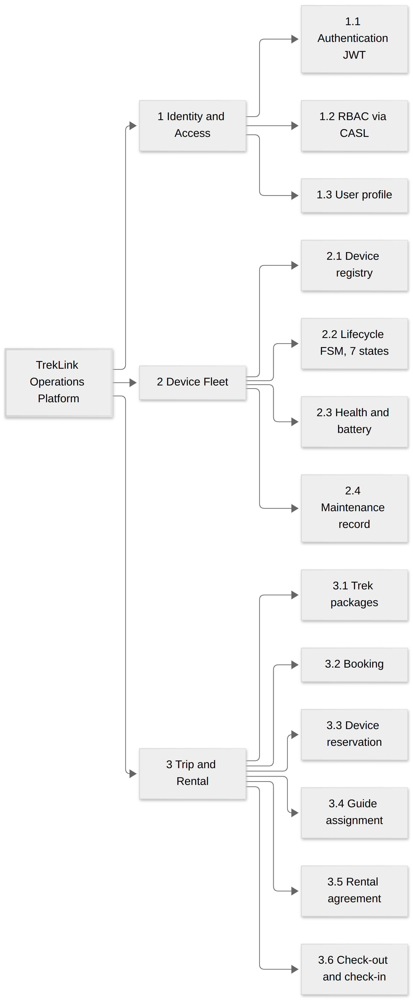{ width=91.9mm height=225.0mm }

***Figure 12***: Feature Tree, part 1 of 4: Identity and Access, Device Fleet, Trip and Rental. Placement: inline, 91.9 x 225.0 mm, labels at 7.01 pt.

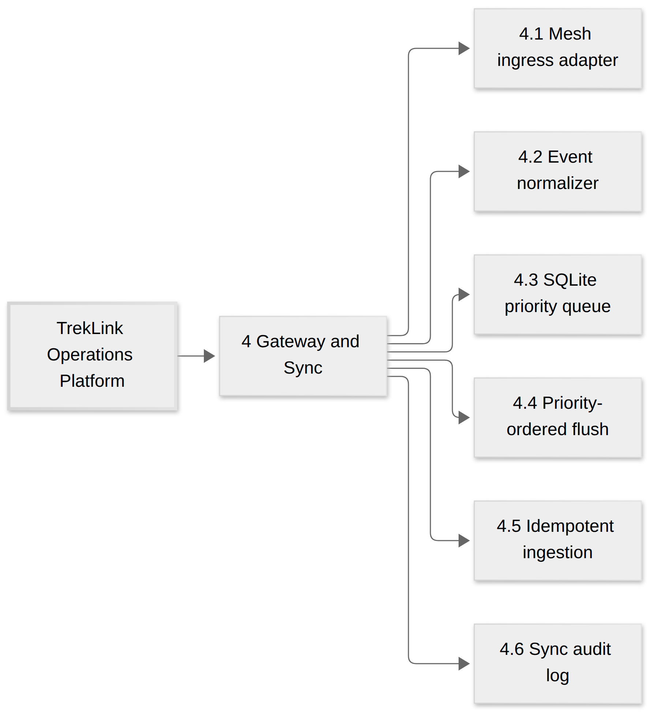{ width=159.0mm height=186.9mm }

***Figure 13***: Feature Tree, part 2 of 4: Gateway and Sync. Placement: inline, 159.0 x 186.9 mm, labels at 12.18 pt.

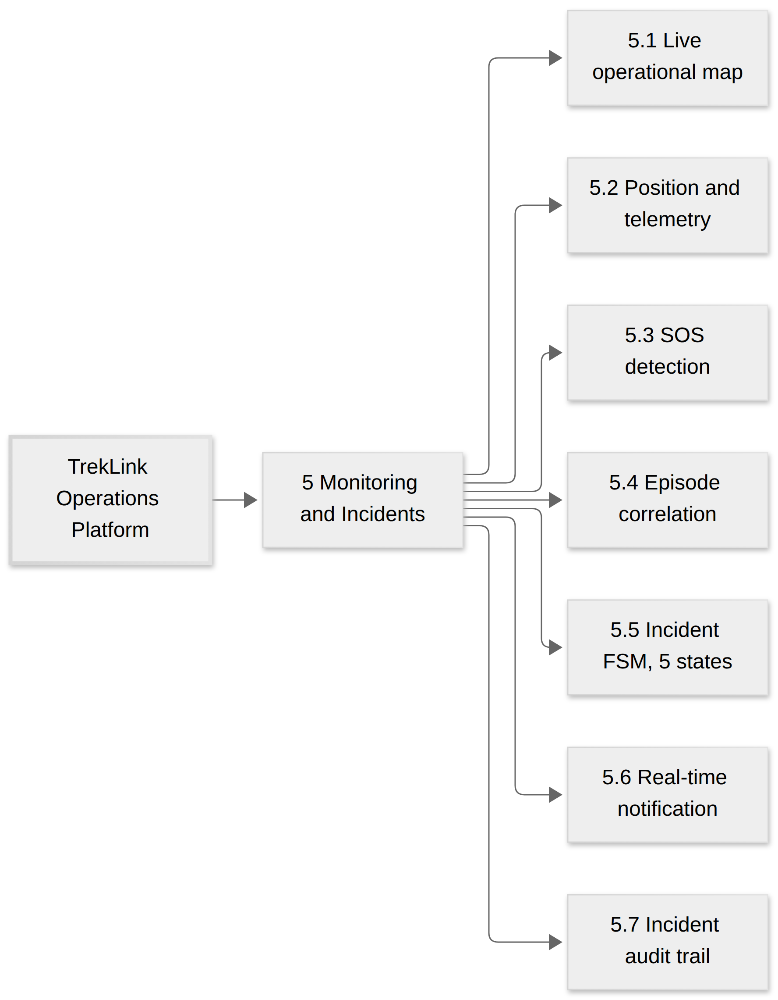{ width=159.0mm height=210.6mm }

***Figure 14***: Feature Tree, part 3 of 4: Monitoring and Incidents. Placement: inline, 159.0 x 210.6 mm, labels at 12.18 pt.

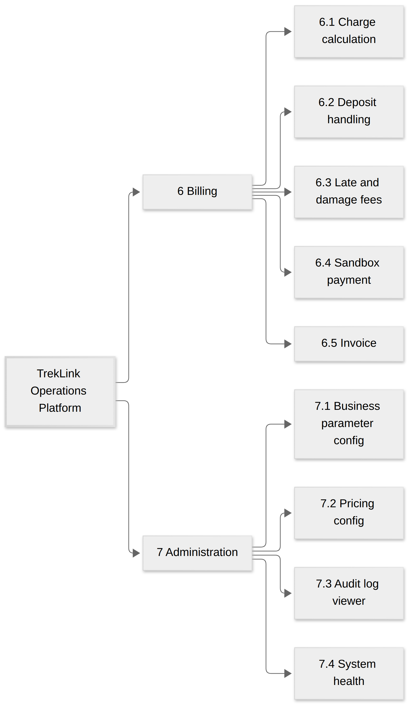{ width=130.8mm height=225.0mm }

***Figure 15***: Feature Tree, part 4 of 4: Billing and Administration. Placement: inline, 130.8 x 225.0 mm, labels at 10.37 pt.


##### 3.1.1 Main Flows

Each Main Flow is a swimlane, one lane per actor, with the flow running down the page. The lanes
say "Staff" where this document says Operator. See **Figure 16**, **Figure 17**, **Figure 18**,
**Figure 19** and **Figure 20**.

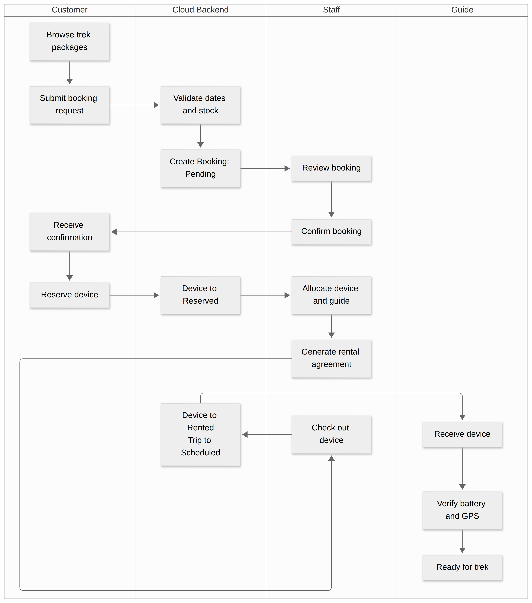{ width=159.0mm height=195.0mm }

***Figure 16***: MF-01 Booking to Rental to Trip Preparation. Lanes are actors; the flow runs top to bottom. Placement: inline, 159.0 x 195.0 mm, labels at 7.04 pt.

```{=openxml}
<w:p><w:r><w:br w:type="page"/></w:r></w:p>
```

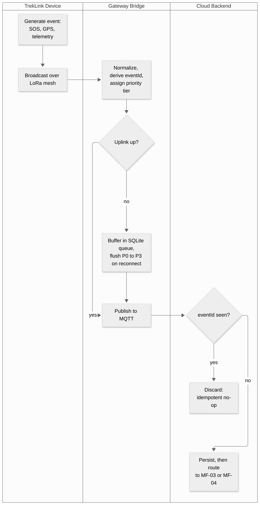{ width=117.5mm height=235.0mm }

***Figure 17***: MF-02 Field Data to Offline Gateway to Cloud Synchronization. The buffer sits on the no branch: events generated while the uplink is down are held and flushed in priority order. Placement: full-page plate, 117.5 x 235.0 mm, labels at 6.53 pt.

```{=openxml}
<w:p><w:r><w:br w:type="page"/></w:r></w:p>
```

```{=openxml}
<w:p><w:r><w:br w:type="page"/></w:r></w:p>
```

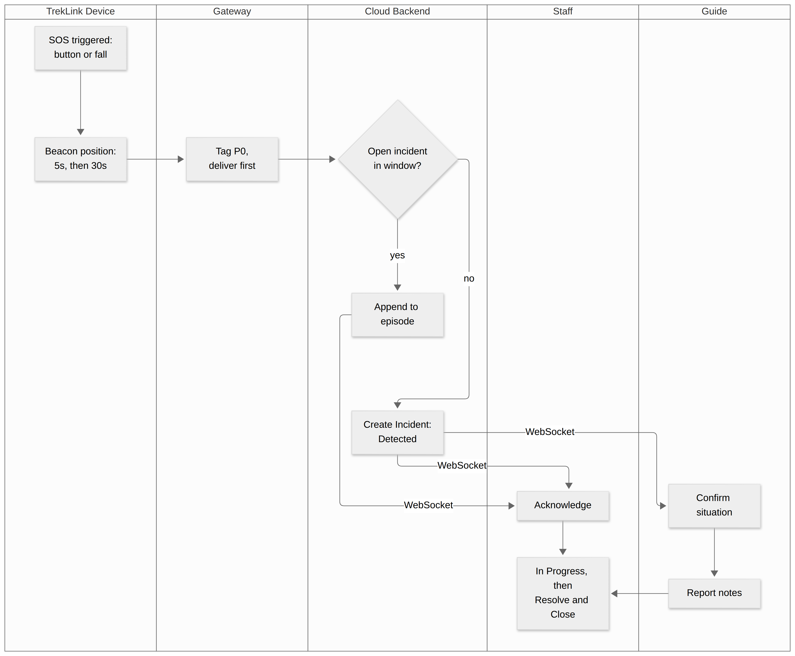{ width=159.0mm height=134.2mm }

***Figure 18***: MF-03 SOS to Incident to Emergency Response. The decision node is what makes one SOS episode produce exactly one Incident. Placement: full-page plate, 159.0 x 134.2 mm, labels at 5.45 pt.

```{=openxml}
<w:p><w:r><w:br w:type="page"/></w:r></w:p>
```

```{=openxml}
<w:p><w:r><w:br w:type="page"/></w:r></w:p>
```

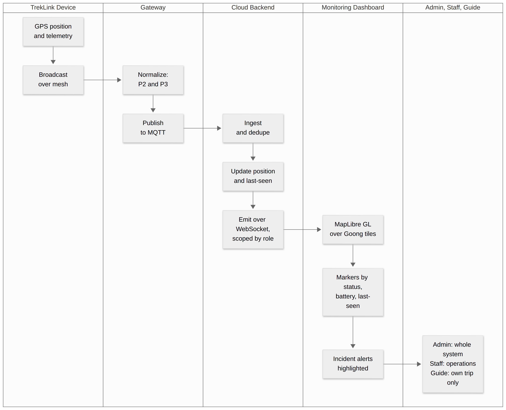{ width=159.0mm height=135.1mm }

***Figure 19***: MF-04 Real-Time Trip Monitoring. Role scoping is applied server-side at the WebSocket emit, not in the browser. Placement: full-page plate, 159.0 x 135.1 mm, labels at 5.65 pt.

```{=openxml}
<w:p><w:r><w:br w:type="page"/></w:r></w:p>
```

```{=openxml}
<w:p><w:r><w:br w:type="page"/></w:r></w:p>
```

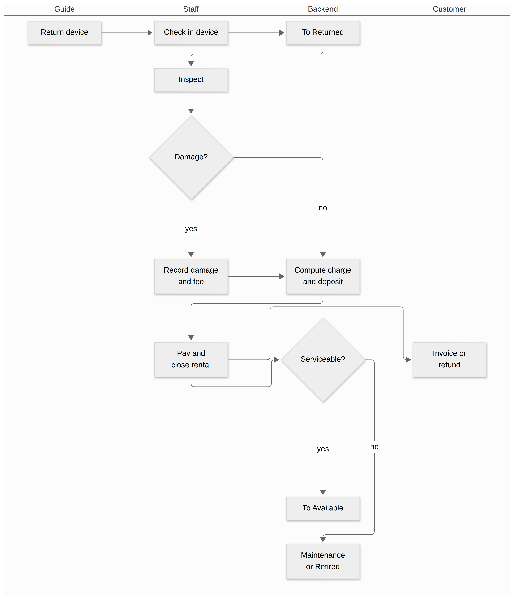{ width=159.0mm height=192.6mm }

***Figure 20***: MF-05 Return to Inspection to Billing to Maintenance. Placement: full-page plate, 159.0 x 192.6 mm, labels at 6.75 pt.

```{=openxml}
<w:p><w:r><w:br w:type="page"/></w:r></w:p>
```


##### 3.1.2 Screens Flow

**Deferred to the Final SRS (Review 2, Week 8).** No screen design exists yet; a screens flow
written now would describe screens the software later contradicts.

##### 3.1.3 Screen Descriptions

**Deferred to the Final SRS (Review 2, Week 8)**, for the same reason as §3.1.2.

##### 3.1.4 Screen Authorization

Functions rather than screens, because screens are designed at W5 to W7. An **X** grants the
function; **own** limits it to the actor's own records; **assigned** limits it to trips the Guide
is assigned to. Every row is enforced on the server (FR-AUTH-01, NFR-SEC-03).

| Function | Guest | Customer | Operator | Guide | Admin |
|---|---|---|---|---|---|
| Browse packages (UC-01) | X | X | X | X | X |
| Register account (UC-27) | X | | X | X | X |
| Submit booking, reserve device (UC-02, UC-03) | | X | X | X | X |
| Cancel booking (UC-29) | | own | X | | X |
| Confirm or reject booking (UC-04) | | | X | | X |
| Manage packages (UC-31) | | | X | | X |
| Create, reschedule, cancel trip (UC-32, UC-34) | | | X | | X |
| Request trip (UC-33) | | | | X | |
| Allocate device, assign Guide (UC-05, UC-06) | | | X | | X |
| Provision channel key (UC-39) | | | X | | X |
| Generate agreement, check out, check in (UC-07, UC-08, UC-09) | | | X | | X |
| Sign agreement (UC-43) | | own | capture | capture | |
| Confirm handover, report missing device (UC-37, UC-40) | | | | assigned | |
| Start and end trip (UC-35, UC-36) | | | X | assigned | X |
| Inspect, record maintenance (UC-10, UC-41) | | | X | | X |
| Approve fee waiver (UC-44) | | | X, not the inspector | | X, not the inspector |
| Pay (UC-12) | | own | record | | record |
| View bookings, invoices (UC-45) | | own | X | | X |
| View live map (UC-14) | | | X | assigned | X |
| Acknowledge incident (UC-15) | | | X | assigned | X |
| Move incident to In Progress (UC-16) | | | X | assigned | X |
| Resolve or close incident (UC-16) | | | X | | X |
| Dismiss suspected, create manual incident (UC-46, UC-47) | | | X | | X |
| Record response note (UC-17) | | | X | assigned | X |
| Register and retire device, manage types (UC-38, UC-42, UC-51) | | | | | X |
| Manage users and roles (UC-18) | | | | | X |
| Configure parameters, pricing (UC-19, UC-50) | | | | | X |
| View audit log, system health (UC-20, UC-53) | | | | | X |
| View reports (UC-52) | | | X | | X |

##### 3.1.5 Non-Screen Functions

Functions with no user interface, driven by ingestion or by time.

| # | Feature | System Function | Description |
|---|---|---|---|
| 1 | Gateway and Sync | Event ingestion (UC-13) | Decode stock topic payloads, derive `eventId`, deduplicate, persist, route by kind |
| 2 | Gateway and Sync | Local queueing | Classify P0 to P3 and persist before any network attempt; bounded, sheds P3 first |
| 3 | Gateway and Sync | Priority-ordered flush (UC-54) | On reconnect, publish by tier then queue sequence; mark flushed on broker acknowledgement |
| 4 | Gateway and Sync | Gateway health reporting | Queue depth per tier, last sync time, oldest retry count |
| 5 | Incidents | Episode correlation (UC-49) | Append an SOS event to the open incident inside the correlation window, or create one |
| 6 | Incidents | Cadence-anomaly detection (UC-49) | Raise a `Suspected` incident when N positions arrive within window W |
| 7 | Incidents | Notification fan-out (UC-23) | WebSocket and email to the Guide and online Staff after the incident is persisted |
| 8 | Incidents | Auto-escalation (UC-57) | Re-notify when an incident stays `Detected` past the timeout |
| 9 | Monitoring | Staleness marking (UC-56) | Flag devices and gateways silent beyond their thresholds |
| 10 | Monitoring | Role-scoped push | Emit position, telemetry and incident updates only to subscribers allowed to read them |
| 11 | Booking | Hold expiry (UC-55) | Release a lapsed device hold; booking to `Expired` |
| 12 | Billing | Non-return escalation (UC-58) | Move a rental to `Escalated` after the non-return grace period |
| 13 | Billing | Invoice generation | One immutable, itemized invoice per rental once inspections complete |
| 14 | Device (firmware) | On-device durable queue (Stage B) | Hold the node's own events in priority order across outages and reboots; see §4.1.4 |

##### 3.1.6 Entity Relationship Diagram

A conceptual model of the eight core entities, in two parts that share Device and Trip. The
diagrams show keys and cardinality; the entity table lists the other attributes the requirements
depend on. The physical schema follows in the SDD. See **Figure 21** and **Figure 22**.

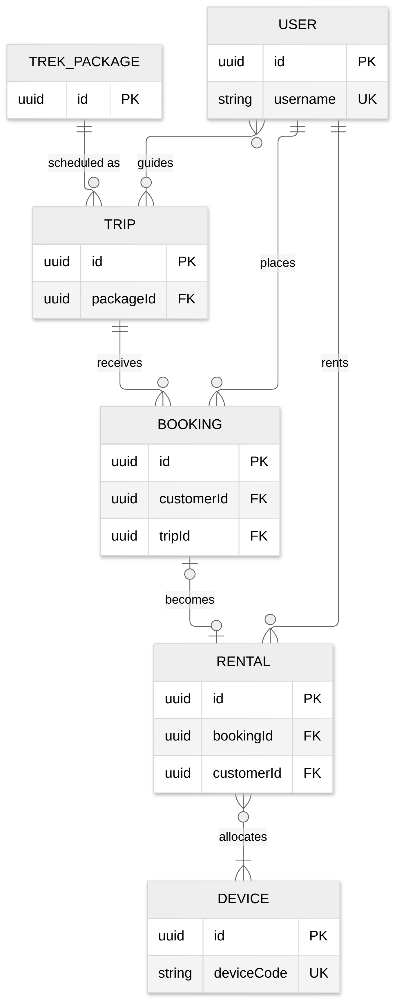{ width=92.1mm height=225.0mm }

***Figure 21***: Conceptual ERD, part 1 of 2: accounts, packages, trips, bookings, rentals and devices, with primary, unique and foreign keys and cardinality. Placement: inline, 92.1 x 225.0 mm, labels at 7.79 pt.

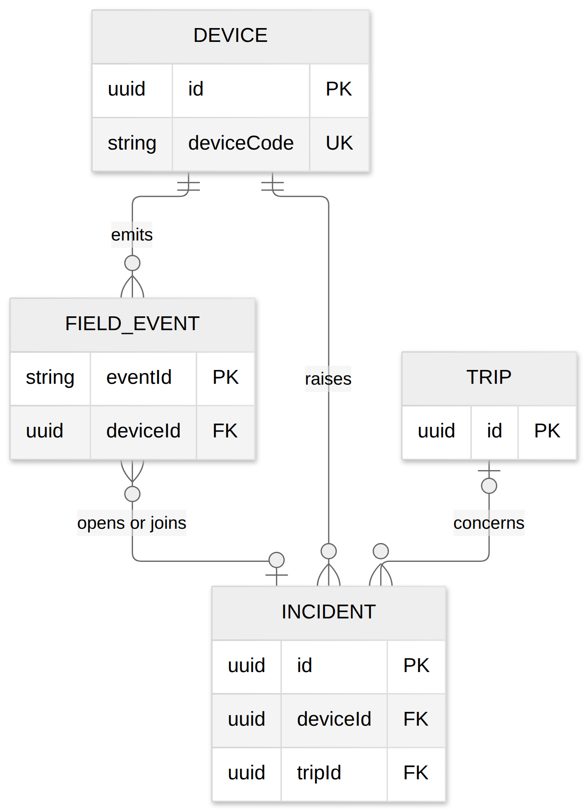{ width=159.0mm height=209.2mm }

***Figure 22***: Conceptual ERD, part 2 of 2: devices, field events, incidents and trips. Placement: inline, 159.0 x 209.2 mm, labels at 12.86 pt.


**Entities Description**

| # | Entity | Description |
|---|---|---|
| 1 | User | Any account. Username is the login key; `subRole` is Customer or a Staff sub-role (Operator, Guide, Admin, extensible); soft-deleted, `isActive` flag |
| 2 | Trek Package | A sellable route with duration, base price, device requirements and an active flag |
| 3 | Trip | A dated run of a package, with its state, guides-per-trip setting and accepted hardware versions |
| 4 | Booking | A Customer's request on a trip, with its state and device hold expiry |
| 5 | Rental | The agreement and custody record from check-out to settlement. Exists with or without a booking |
| 6 | Device | A physical TrekLink unit, with its physical state, hardware version, provisioning flag, battery and last-seen time |
| 7 | Field Event | One ingested mesh event keyed by `eventId`, with kind and priority tier |
| 8 | Incident | One SOS episode or manual report, with state, detection confidence and the timestamps behind MTTA and MTTR |

Supporting entities, not drawn: **Allocation** (device, rental and time window; resolves the
Rental to Device many-to-many), **Trip Guide** (trip to Guide assignment), **Incident Transition**
(append-only audit of incident state changes), **Device Transition**, **Damage Report**,
**Maintenance Record**, **Payment**, **Invoice**, **Pricing Rule**, **Gateway**, **Configuration
Parameter**, **Role** and **Permission**, and the authentication and synchronization audit logs.

##### 3.1.7 State Machines

Five entities have lifecycles. The device and incident machines are named graded deliverables.
See **Figure 23**, **Figure 24**, **Figure 25**, **Figure 26** and
**Figure 27**. State names with a space (`In-Field`, `In Progress`, `On Prepare`) are drawn
with an underscore.

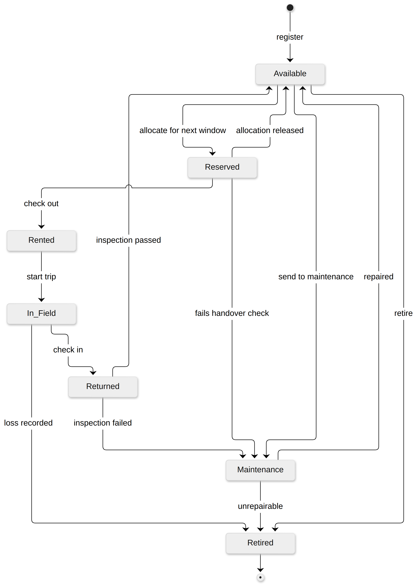{ width=159.0mm height=202.5mm }

***Figure 23***: Device lifecycle state machine, seven states. The state is the device's physical condition; future commitments are Allocation records. Placement: inline, 159.0 x 202.5 mm, labels at 7.97 pt.


A device can be allocated to a future trip while it is still `In-Field` on the current one: the
future commitment is an Allocation record with a non-overlapping window, and the device enters
`Reserved` only when that window is next.

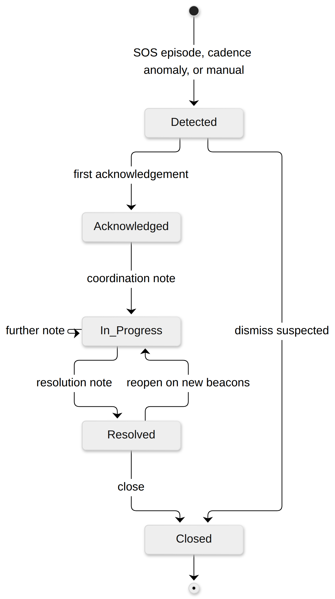{ width=137.0mm height=225.0mm }

***Figure 24***: Incident lifecycle state machine, five states, with the reopen and suspected-dismissal transitions. Placement: inline, 137.0 x 225.0 mm, labels at 12.32 pt.


Detection confidence (`Confirmed`, `Suspected`) is an attribute of the incident. A late SOS text
frame upgrades a `Suspected` incident to `Confirmed` in place.

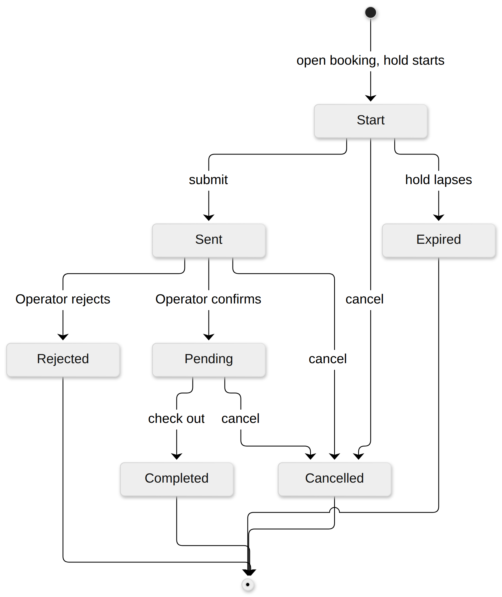{ width=159.0mm height=194.2mm }

***Figure 25***: Booking state machine. Placement: inline, 159.0 x 194.2 mm, labels at 11.84 pt.

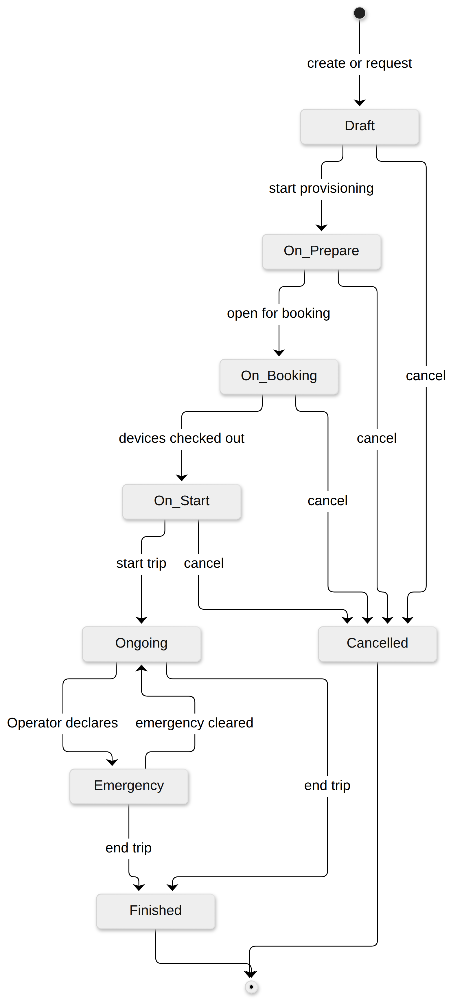{ width=110.5mm height=225.0mm }

***Figure 26***: Trip state machine. Placement: inline, 110.5 x 225.0 mm, labels at 8.86 pt.

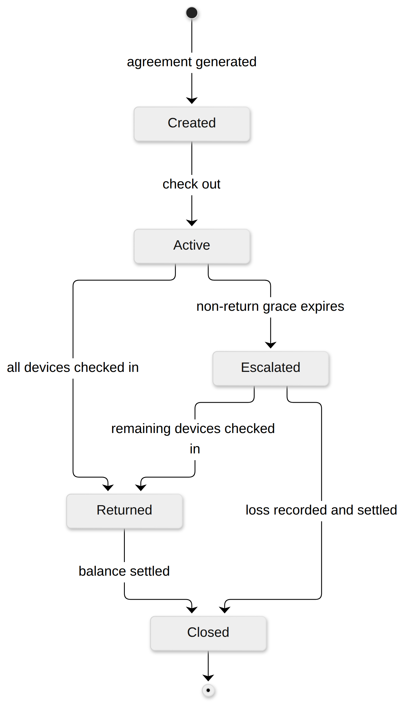{ width=136.5mm height=225.0mm }

***Figure 27***: Rental state machine. Placement: inline, 136.5 x 225.0 mm, labels at 12.21 pt.


#### 3.2 Identity and Access

Accounts, sessions, roles and the server-side scoping every other feature relies on.

| ID | Requirement (EARS) | Use Cases | Main Flow | Source |
|---|---|---|---|---|
| FR-AUTH-01 | WHEN a mutating request is received, the system SHALL require both a valid JWT and a CASL policy that permits the action, and SHALL return 401 or 403 in the standard envelope otherwise. | UC-21 | cross-cutting | US-008, BR-14 |
| FR-AUTH-02 | WHEN a Guest registers with Google OAuth or with an email verified by OTP, the system SHALL create an active Customer account whose username is the email local part, with a numeric suffix where that username is taken. | UC-27 | MF-01 | Q31, Q41 (P) |
| FR-AUTH-03 | WHILE a Guide is authenticated, the system SHALL restrict every read of trips, devices, positions and incidents, over REST and WebSocket, to trips assigned to that Guide. | UC-14, UC-15, UC-16 | MF-03, MF-04 | US-037, US-038, E04-5 |
| FR-AUTH-04 | WHERE a customer has no account, the system SHALL let an Operator or a Guide create the Customer account on the customer's behalf after identity verification. | UC-27 | MF-01 | Q31 (P) |
| FR-AUTH-05 | WHEN valid credentials are submitted, the system SHALL issue a short-lived access token and a refresh token; IF credentials are invalid, THEN the system SHALL return 401 without revealing which field was wrong. | UC-21 | cross-cutting | US-003 |
| FR-AUTH-06 | WHEN a valid refresh token is presented, the system SHALL issue a new access token and rotate the refresh token; IF a rotated refresh token is reused, THEN the system SHALL revoke the whole token family. | UC-21 | cross-cutting | US-005 |
| FR-AUTH-07 | WHEN a user logs out, the system SHALL revoke the presented refresh token immediately. | UC-21 | cross-cutting | US-006 |
| FR-AUTH-08 | WHEN a password reset is requested, the system SHALL send a single-use, time-limited OTP to the registered email only and SHALL respond identically for unknown emails; an Operator SHALL be able to trigger a reset and SHALL NOT be able to view or set the password. | UC-28 | cross-cutting | US-007, Q35 (P) |
| FR-AUTH-09 | The system SHALL store roles, Staff sub-roles and permissions as data, and a permission change SHALL take effect on the next request without a redeploy. | UC-18 | cross-cutting | US-001, Q33 (P), S9-Q2 |
| FR-AUTH-10 | WHEN an Admin deactivates an account, the system SHALL set `isActive` to false and reject that account's refresh tokens immediately. | UC-18 | cross-cutting | US-009, Q45 (P) |
| FR-AUTH-11 | The system SHALL record every authentication event (login, logout, failed attempt, reset) with actor, event type, IP and UTC timestamp, append-only, and SHALL NOT store an attempted password in any form. | UC-20, UC-21 | cross-cutting | US-004, Q46 (P) |
| FR-AUTH-12 | WHILE a Customer is authenticated, the system SHALL restrict that Customer's reads of bookings, rentals, agreements and invoices to records the Customer owns. | UC-45 | MF-01, MF-05 | US-039, US-070 |
| FR-AUTH-13 | WHEN a record is deleted, the system SHALL mark it deleted and retain it, except where hard deletion is specified for that record type. | UC-18 | cross-cutting | Q36 (P) |
| FR-AUTH-14 | The system SHALL let a Guest browse active packages without an account, and SHALL require an account to submit a booking. | UC-01, UC-02 | MF-01 | Q30 (P) |
| FR-AUTH-15 | The system SHALL grant an Admin every permission of an Operator in addition to the administration functions. | UC-16, UC-18 | cross-cutting | S9-Q2 |

#### 3.3 Device Fleet

Registration, the device lifecycle, allocation windows, provisioning and maintenance.

| ID | Requirement (EARS) | Use Cases | Main Flow | Source |
|---|---|---|---|---|
| FR-DEV-01 | The system SHALL change device state only through the transition table of the 7-state device FSM, SHALL reject any other change with 409, and SHALL write an append-only audit row for each transition. | UC-05, UC-08, UC-09, UC-35, UC-41, UC-42 | MF-01, MF-05 | US-013, BR-05 |
| FR-DEV-02 | WHEN an Admin registers a device with a unique device ID, a device type, a hardware version and a firmware version, the system SHALL create it in `Available`; IF the device ID exists, THEN the system SHALL reject it with 409. | UC-38 | cross-cutting | US-012, Q49 (P) |
| FR-DEV-03 | The system SHALL let an Admin maintain device types with hardware and firmware versions, and SHALL refuse to delete a type that has registered devices. | UC-51 | cross-cutting | US-011 |
| FR-DEV-04 | WHERE a trip restricts accepted hardware versions, the system SHALL reject allocation of a device whose hardware version the trip does not accept. | UC-05, UC-32 | MF-01 | Q50 (P) |
| FR-DEV-05 | WHEN a device below the advisory battery level is allocated or checked out, the system SHALL show a charge-before-departure advisory; IF the level is below the warning level, THEN the system SHALL require the Operator or Guide to confirm manual verification. The system SHALL NOT block allocation or check-out on battery level. | UC-05, UC-08, UC-37 | MF-01 | Q52 (P), S9-Q28, BR-04 |
| FR-DEV-06 | WHILE a device is in `Maintenance` or `Retired`, the system SHALL reject any allocation referencing it, inside the same transaction as the allocation write. | UC-05 | MF-01 | US-014 |
| FR-DEV-07 | The system SHALL allow one device to hold several allocations whose time windows do not overlap, and SHALL reject an allocation whose window overlaps an existing one for that device. | UC-05 | MF-01 | Q53 (P), S9-Q4, E01-5 |
| FR-DEV-08 | WHEN a telemetry or position event is ingested, the system SHALL update the device's battery, last-seen time and last position, and SHALL discard a reading older than the stored last-seen time. | UC-13 | MF-02, MF-04 | US-017 |
| FR-DEV-09 | IF a device remains unreturned beyond the non-return grace period, THEN the system SHALL move its rental to `Escalated`, and WHEN an Operator records the loss, the system SHALL move the device to `Retired` with a loss record. | UC-58, UC-40, UC-42 | MF-05 | BR-22, E05-3, S9-Q27 |
| FR-DEV-10 | WHEN an Operator moves a device to `Maintenance`, the system SHALL require a reason, accept an optional expected return date, and keep the device unallocatable until it is moved back to `Available`. | UC-41 | MF-05 | US-018 |
| FR-DEV-11 | WHEN an Admin retires a device, the system SHALL set the terminal state `Retired` without deleting the device or its history; IF the device has an active allocation, THEN the system SHALL reject the retirement. | UC-42 | MF-05 | US-020 |
| FR-DEV-12 | The system SHALL present a read-only chronological history per device of allocations, rentals, incidents, damage and maintenance, each entry with actor, event type and UTC time. | UC-42 | MF-05 | US-022, Q54 (P) |
| FR-DEV-13 | The system SHALL block check-out of a device not yet provisioned with the fleet channel key, and SHALL never display, return or log the key after it is entered. | UC-39, UC-08 | MF-01 | D-021, Q51 (P) |
| FR-DEV-14 | WHEN an Operator attaches a damage report to a `Returned` device, the system SHALL store description, severity and evidence reference permanently and SHALL leave the device state unchanged. | UC-10 | MF-05 | US-019 |

#### 3.4 Booking and Rental

From a Customer's booking through the agreement, check-out and check-in.

| ID | Requirement (EARS) | Use Cases | Main Flow | Source |
|---|---|---|---|---|
| FR-BOOK-01 | WHEN a Customer submits a booking, the system SHALL validate package, dates and group size against the package limits and SHALL move the booking from `Start` to `Sent`. | UC-02 | MF-01 | US-025, S9-Q25 |
| FR-BOOK-02 | The system SHALL let a device be committed to at most one booking or rental for any overlapping time window, using a row-level lock, and the losing request SHALL receive an unavailable result without an oversell. | UC-03, UC-05, UC-22 | MF-01 | BR-01, E01-1, Q58 (P) |
| FR-BOOK-03 | WHEN a Customer creates a booking, the system SHALL reserve exactly one device; WHERE the booking is made by a Guide or an Operator, the system SHALL allow several devices up to the package limit. | UC-03 | MF-01 | US-026, Q57 (P) |
| FR-BOOK-04 | The system SHALL allow an Operator to confirm a booking only when enough allocatable devices and an eligible Guide exist for its dates, and SHALL show any conflict before confirmation. | UC-04 | MF-01 | BR-02, E01-4 |
| FR-BOOK-05 | WHEN a Customer booking enters `Start`, the system SHALL hold its device for the configured hold duration and SHALL move the booking to `Expired` and release the device when the hold lapses; WHERE the booking is a Staff or Guide booking, an Operator SHALL be able to extend or disable the hold. | UC-03, UC-30, UC-55 | MF-01 | Q59 (P), S9-Q25 |
| FR-BOOK-06 | WHEN an Operator rejects a booking, the system SHALL require a reason, move the booking to `Rejected` and release its reservation. | UC-04 | MF-01 | US-027 |
| FR-BOOK-07 | WHEN a booking is cancelled, the system SHALL refund the escrow in full within the configured free-cancellation window after payment, and otherwise SHALL retain the configured percentage of the rental fee, not of the trip fee; the booking SHALL move to `Cancelled` and its devices SHALL be released. | UC-29, UC-34 | MF-01 | BR-03, Q60 (P), E01-2 |
| FR-BOOK-08 | The system SHALL let an Operator or Guide create a rental without a booking for a customer provisioned by Staff or a Guide. | UC-05, UC-07, UC-08 | MF-01 | Q55 (P) |
| FR-BOOK-09 | WHEN an Operator generates a rental agreement, the system SHALL compose it from booking, allocation and pricing data as a PDF, and SHALL make it immutable once check-out begins, recording later changes as an addendum. | UC-07 | MF-01 | US-030, Q62 (P) |
| FR-BOOK-10 | WHEN a rental agreement is signed, the system SHALL stamp the drawn signature into the PDF, record the signing in the audit log and mark the agreement signed. | UC-43 | MF-01 | Q62 (P), S9-Q21 |
| FR-BOOK-11 | WHEN check-out completes, the system SHALL require a signed agreement, a paid deposit, provisioned devices and the Guide's handover confirmation, SHALL move each device `Reserved` to `Rented`, the rental to `Active` and the booking to `Completed`. | UC-08, UC-37 | MF-01 | US-031, US-032, US-033, S9-Q25, S9-Q27 |
| FR-BOOK-12 | IF the Guide's confirmed device list differs from the allocated list, THEN the system SHALL flag the mismatch and hold check-out until an Operator resolves it. | UC-37 | MF-01 | US-033 |
| FR-BOOK-13 | WHEN check-in completes, the system SHALL record the check-in time, move each presented device to `Returned`, keep any device not presented `In-Field` and flagged, and accept devices only from the Guide or an Operator. | UC-09 | MF-05 | US-034, Q71 (P) |
| FR-BOOK-14 | The system SHALL let an Operator disable a Customer booking or transfer it to Guide provisioning when the Customer breaches the terms. | UC-29 | MF-01 | Q59 (P) |
| FR-BOOK-15 | The system SHALL change booking state only through the booking FSM (`Start`, `Sent`, `Pending`, `Completed`, `Expired`, `Rejected`, `Cancelled`) and SHALL reject any other change. | UC-02, UC-04, UC-29, UC-55 | MF-01 | Q56 (P), S9-Q25 |
| FR-BOOK-16 | The system SHALL change rental state only through the rental FSM (`Created`, `Active`, `Returned`, `Closed`, `Escalated`) and SHALL reject any other change. | UC-07, UC-08, UC-09, UC-11, UC-58 | MF-01, MF-05 | S9-Q27 |

#### 3.5 Trips and Packages

The trip lifecycle, Guide assignment and the package catalogue.

| ID | Requirement (EARS) | Use Cases | Main Flow | Source |
|---|---|---|---|---|
| FR-TRIP-01 | WHEN an Operator creates a trip from a package and dates, the system SHALL create it in `Draft` with its guides-per-trip setting and accepted hardware versions. | UC-32 | MF-01 | Q65, Q68 (P) |
| FR-TRIP-02 | WHEN a Guide requests a trip, the system SHALL record the request for an Operator to author as a trip. | UC-33 | MF-01 | Q65 (P) |
| FR-TRIP-03 | The system SHALL change trip state only through the trip FSM (`Draft`, `On Prepare`, `On Booking`, `On Start`, `Ongoing`, `Finished`, `Cancelled`, `Emergency`) and SHALL reject any other change. | UC-32, UC-34, UC-35, UC-36 | MF-01, MF-04, MF-05 | Q66 (P), S9-Q5, S9-Q26 |
| FR-TRIP-04 | WHEN an Operator assigns a Guide, the system SHALL accept only users holding the Guide sub-role and SHALL reject an assignment that overlaps another trip of that Guide. | UC-06 | MF-01 | US-029, Q44 (P) |
| FR-TRIP-05 | WHEN a trip is rescheduled before `Ongoing`, the system SHALL revalidate its allocations and Guide assignments for the new window and list every conflict; WHEN it is cancelled, the system SHALL cancel its bookings under FR-BOOK-07 and release its allocations. | UC-34 | MF-01 | Q72 (P) |
| FR-TRIP-06 | WHEN an Operator or the assigned Guide starts a trip in `On Start`, the system SHALL move it to `Ongoing` and each of its devices `Rented` to `In-Field`. | UC-35 | MF-04 | S9-Q4, S9-Q26, US-032 |
| FR-TRIP-07 | WHEN an Operator or Guide ends a trip, the system SHALL move it to `Finished` and list every device not yet checked in. | UC-36 | MF-05 | Q71 (P) |
| FR-TRIP-08 | The system SHALL let only an Operator move an `Ongoing` trip to `Emergency`, and SHALL flag, without transition, a trip that has an open incident. | UC-16 | MF-03 | S9-Q5 |
| FR-TRIP-09 | The system SHALL require the assigned Guide to complete the configured readiness checklist before check-out completes. | UC-37 | MF-01 | Q73 (P) |
| FR-TRIP-10 | The system SHALL track each trip participant by device, by customer account or by booking. | UC-32 | MF-01 | Q69 (P) |
| FR-TRIP-11 | WHEN a trek package is created or edited, the system SHALL store route, duration, base price, device requirements and an active flag, and SHALL leave confirmed bookings on their agreed terms. | UC-31 | MF-01 | US-023, Q70 (P) |
| FR-TRIP-12 | WHILE a Guide is authenticated, the system SHALL show that Guide's assigned trips with roster and allocated devices. | UC-14 | MF-01, MF-04 | US-037, US-010 |

#### 3.6 Gateway and Synchronization

Getting every field event to the cloud exactly once and in priority order.

| ID | Requirement (EARS) | Use Cases | Main Flow | Source |
|---|---|---|---|---|
| FR-EVT-01 | WHEN a field event is ingested, the system SHALL derive `eventId = sha256(nodeNum : packetId)`, insert it under a database unique index inside the same transaction as its side effects, and treat a repeated `eventId` as a no-op. | UC-13 | MF-02 | BR-06, US-050, D-006, E02-2 |
| FR-EVT-02 | WHEN the gateway parses a mesh event, it SHALL classify it P0 (SOS), P1 (incident location), P2 (GPS) or P3 (telemetry) and persist it to its local queue before any network attempt. | UC-13, UC-54 | MF-02 | US-044, US-043 |
| FR-EVT-03 | WHEN the uplink is restored, the gateway SHALL flush queued events ordered by priority tier and then by queue sequence, so that every P0 event is sent before any P1, P2 or P3 event. | UC-54 | MF-02 | BR-07, US-048 |
| FR-EVT-04 | The gateway SHALL mark a queued event flushed only after the broker acknowledges it; IF the uplink drops mid-flush, THEN unacknowledged events SHALL stay queued and the flush SHALL resume from the queue head. | UC-54 | MF-02 | US-047, E02-1 |
| FR-EVT-05 | WHEN an SOS event arrives for a device with an open incident inside the correlation window, the system SHALL append it to that incident; otherwise the system SHALL create exactly one new incident. | UC-49 | MF-03 | BR-08, E03-2, E03-5 |
| FR-EVT-06 | WHEN a device's position events reach the configured count N within window W, the system SHALL raise a `Suspected` incident at lower confidence. | UC-49 | MF-03 | BR-09, E03-1, D-007 |
| FR-EVT-07 | IF a payload cannot be decoded, THEN the system SHALL log it raw, count it, drop it and continue without blocking the queue head. | UC-13 | MF-02 | E02-4 |
| FR-EVT-08 | WHILE the gateway queue is at its configured bound, the gateway SHALL shed P3 events first and SHALL never shed P0, logging every shed event. | UC-54 | MF-02 | E02-5 |
| FR-EVT-09 | WHEN the gateway restarts with a non-empty queue, it SHALL retain every queued event and SHALL NOT mint a new `eventId` for any of them. | UC-54 | MF-02 | E02-3 |
| FR-EVT-10 | The system SHALL order events by queue sequence and priority, never by wall-clock comparison across hosts, and SHALL treat a device `rx_time` of 0 as unknown. | UC-13, UC-54 | MF-02 | E02-6, FGT §3 |
| FR-EVT-11 | WHEN a text event is decoded, the system SHALL test the `SOS - FALL DETECTED` prefix before the `SOS - ` prefix and SHALL classify both as SOS. | UC-13, UC-49 | MF-02, MF-03 | FGT §2 |
| FR-EVT-12 | The system SHALL accept events from the stock Meshtastic MQTT topics `<root>/2/json/...` and `<root>/2/e/...` through ingress adapters that produce one canonical event envelope. | UC-13 | MF-02 | D-007, D-019, FGT §4 |
| FR-EVT-13 | The system SHALL write one append-only synchronization audit row per ingestion attempt, recording acceptance or duplicate rejection. | UC-13 | MF-02 | US-051 |
| FR-EVT-14 | The system SHALL report per gateway the queue depth for each tier, the last sync time and the retry count of the oldest queued event. | UC-53 | MF-02, MF-04 | US-049 |
| FR-EVT-15 | IF an incoming `eventId` is already queued or flushed at the gateway, THEN the gateway SHALL discard it without re-inserting. | UC-13 | MF-02 | US-045 |
| FR-EVT-16 | WHEN a late SOS text frame matches an open `Suspected` incident, the system SHALL upgrade that incident to `Confirmed` in place. | UC-49 | MF-03 | US-088 |

#### 3.7 Incident Management

Turning an SOS episode into one owned, audited incident.

| ID | Requirement (EARS) | Use Cases | Main Flow | Source |
|---|---|---|---|---|
| FR-INC-01 | WHEN an incident is created, the system SHALL link it to the originating device, trip and `eventId`; IF the device has no active trip, THEN the system SHALL still create it and flag it unassigned. | UC-49 | MF-03 | US-057, E03-4 |
| FR-INC-02 | The system SHALL change incident state only through the 5-state incident FSM, and each transition SHALL record actor ID and role, UTC server time and note. | UC-15, UC-16, UC-46 | MF-03 | BR-10, US-054 |
| FR-INC-03 | WHEN an Operator or the trip's assigned Guide acknowledges a `Detected` incident, the system SHALL perform `Detected` to `Acknowledged` with the server timestamp used for MTTA; a later acknowledgement by the other party SHALL be recorded without a transition. | UC-15 | MF-03 | US-060, US-063, S9-Q7 |
| FR-INC-04 | The system SHALL keep the incident audit trail append-only and SHALL expose no operation that edits or deletes an entry. | UC-17, UC-20 | MF-03 | BR-11, US-059 |
| FR-INC-05 | IF two actors acknowledge the same incident concurrently, THEN the first write SHALL win and the second actor SHALL be shown the current state and the acknowledging actor. | UC-15 | MF-03 | E03-3 |
| FR-INC-06 | WHEN beacons of the same episode arrive after `Resolved`, the system SHALL move the incident back to `In Progress` and record the reopen; WHEN they arrive after `Closed`, the system SHALL open a new incident. | UC-26 | MF-03 | BR-12, E03-6, S9-Q6 |
| FR-INC-07 | WHEN an incident moves to `In Progress`, the system SHALL require a non-empty note and SHALL accept the change only from an Operator, an Admin or the assigned Guide. | UC-16 | MF-03 | US-061, S9-Q7 |
| FR-INC-08 | WHEN an incident moves to `Resolved` or `Closed`, the system SHALL require a resolution note for `Resolved`, accept the change only from an Operator or Admin, and use the `Resolved` timestamp for MTTR. | UC-16 | MF-03 | US-062, S9-Q7 |
| FR-INC-09 | WHEN an Operator dismisses a `Suspected` incident, the system SHALL perform `Detected` to `Closed` in one step with a dismissal reason and write an audit row marking a false positive. | UC-46 | MF-03 | US-088, S9-Q6 |
| FR-INC-10 | WHEN an Operator creates an incident by hand, the system SHALL create it in `Detected`, optionally linked to a device or trip, and mark it Staff-initiated. | UC-47 | MF-03 | US-064 |
| FR-INC-11 | WHEN an incident is created, the system SHALL persist it first and then push a notification over WebSocket to the assigned Guide and all online Operators and Admins within 2 seconds, and send an email; clients offline at that time SHALL reconcile on reconnect. | UC-23 | MF-03 | US-058, E03-7, S9-Q9 |
| FR-INC-12 | IF an incident stays `Detected` beyond the configured auto-escalation timeout, THEN the system SHALL send an escalation notification to Operators and Admins. | UC-57 | MF-03 | 05-main-flows MF-03 parameters |
| FR-INC-13 | WHEN a Guide or Operator submits a response note, the system SHALL append it to the incident's audit trail attributed by role. | UC-17 | MF-03 | US-063 |

#### 3.8 Real-Time Monitoring

The live operational picture and its failure states.

| ID | Requirement (EARS) | Use Cases | Main Flow | Source |
|---|---|---|---|---|
| FR-MON-01 | The system SHALL render the live map with MapLibre GL over the configured Goong Maps style, with markers styled by device status. | UC-14 | MF-04 | US-055, D-012 |
| FR-MON-02 | The system SHALL deliver live position, telemetry and incident updates over one authenticated WebSocket connection per client, subscribed on the server only to the trips the caller's role may read. | UC-14 | MF-04 | US-053, 05-main-flows MF-04 |
| FR-MON-03 | WHILE a device has been silent beyond the configured stale threshold, the system SHALL display it as stale with its last-seen time. | UC-14, UC-56 | MF-04 | BR-15, E04-1, US-056 |
| FR-MON-04 | WHILE a gateway has not synced beyond the configured gateway-stale threshold, the system SHALL show its connectivity indicator as stale on the main dashboard. | UC-14, UC-53, UC-56 | MF-04 | US-065, E04-2 |
| FR-MON-05 | IF a position lies outside the configured bounds or implies an implausible jump, THEN the system SHALL reject it, log it and not plot it. | UC-13, UC-14 | MF-04 | BR-16, E04-4 |
| FR-MON-06 | WHEN the browser loses the WebSocket, the system SHALL show a reconnecting indicator, reconnect automatically and resynchronize state on reopen. | UC-14 | MF-04 | E04-3 |
| FR-MON-07 | IF the map provider is unreachable or rejects the key, THEN the system SHALL show a map error state and keep the device and incident panels working. | UC-14 | MF-04 | E04-6 |
| FR-MON-08 | The system SHALL show battery percentage and relative last-seen time on each device marker. | UC-14 | MF-04 | US-056 |
| FR-MON-09 | The system SHALL show active incidents in a panel beside the map, filterable by status, highlighting non-closed incidents, with `Suspected` ones visually distinct. | UC-14 | MF-03, MF-04 | US-066, US-088 |
| FR-MON-10 | The system SHALL show Admins a system health view of every gateway's connectivity and audit-log volume by trail. | UC-53 | MF-04 | US-073 |

#### 3.9 Billing

Charges, deposits, sandbox payment and invoices.

| ID | Requirement (EARS) | Use Cases | Main Flow | Source |
|---|---|---|---|---|
| FR-BILL-01 | WHEN a rental's inspections complete, the system SHALL compute the charge as base rate plus late fee plus damage fee minus deposit, applying the deposit before any balance is charged. | UC-11 | MF-05 | BR-17 |
| FR-BILL-02 | WHEN check-in is later than the agreed return time plus the configured grace period, the system SHALL compute a late fee at the configured rate as its own invoice line. | UC-24 | MF-05 | BR-18, US-035, E05-1 |
| FR-BILL-03 | WHEN an inspection carries a damage report, the system SHALL compute a damage fee from the configured damage-fee schedule and link it to that report. | UC-25 | MF-05 | US-036, E05-2 |
| FR-BILL-04 | WHEN charges are computed, the system SHALL issue exactly one immutable invoice per rental itemizing base, late and damage charges, with corrections only as documented adjustments. | UC-11 | MF-05 | US-068 |
| FR-BILL-05 | The system SHALL refuse to move a rental to `Closed` while a payment balance is outstanding. | UC-11, UC-12 | MF-05 | BR-19, E05-4 |
| FR-BILL-06 | IF the damage fee exceeds the deposit, THEN the system SHALL consume the deposit and invoice the remainder, and SHALL never produce a negative refund. | UC-11 | MF-05 | BR-20, E05-5 |
| FR-BILL-07 | The system SHALL process payments through an internal sandbox with states `Pending`, `Paid` and `Failed`, mark every transaction `sandbox: true`, label it as sandbox in the API and the UI, and let only the billing module change payment state. | UC-12 | MF-01, MF-05 | US-069, S9-Q22 |
| FR-BILL-08 | WHEN a fee waiver above the configured threshold is requested, the system SHALL require approval by a staff member other than the inspector of that device. | UC-44 | MF-05 | BR-21, E05-7 |
| FR-BILL-09 | WHEN a Customer booking is confirmed, the system SHALL collect rental fee and deposit into sandbox escrow; WHERE a rental has no booking, an Operator SHALL record the payment. | UC-12 | MF-01 | S9-Q8, Q60 (P) |
| FR-BILL-10 | The system SHALL compute the deposit from the configured tier for the plan, pack, device quantity and device version. | UC-07, UC-12 | MF-01 | Q61 (P) |
| FR-BILL-11 | The system SHALL let an Admin configure base rates per package, device type and pack, discounts, deposit tiers and fee schedules, and SHALL apply a change only to agreements generated after it. | UC-50 | MF-05 | US-067, Q63 (P) |
| FR-BILL-12 | IF a payment fails, THEN the system SHALL keep the balance outstanding and visible to the Customer and Operators and SHALL write no partial settlement state. | UC-12 | MF-05 | E05-4 |
| FR-BILL-13 | The system SHALL provide device-utilization and incident response-performance reports over a selectable date range, derived from existing records and exportable as CSV, with MTTA and MTTR computed from the incident audit trail. | UC-52 | MF-03, MF-05 | US-071, US-072 |

#### 3.10 Configuration

Business parameters held as configuration (D-015).

| ID | Requirement (EARS) | Use Cases | Main Flow | Source |
|---|---|---|---|---|
| FR-CFG-01 | The system SHALL read every business parameter registered in the Configuration Matrix from configuration, and a change SHALL take effect without a redeploy. | UC-19 | cross-cutting | D-015, BR-23 |
| FR-CFG-02 | WHEN a business parameter changes, the system SHALL record the old value, new value, actor and UTC time in an append-only audit trail. | UC-19, UC-20 | cross-cutting | Q46 (P) |
| FR-CFG-03 | The system SHALL hold the map provider, style URL, key and default viewport in configuration. | UC-19, UC-14 | MF-04 | D-012, D-015 |

---

### 4. Non-Functional Requirements

#### 4.1 External Interfaces

##### 4.1.1 User interfaces

| ID | Requirement |
|---|---|
| NFR-UI-01 | The web client SHALL be responsive and usable on a mobile browser, because Guides work from a phone at the trailhead |
| NFR-UI-02 | Every API response SHALL use the envelope `{ result, isSuccess, statusCode, message }` (D-002), and the client SHALL show `message` rather than a raw error |
| NFR-UI-03 | Sandbox payments SHALL be labelled as sandbox wherever they appear |

##### 4.1.2 Hardware interfaces

| Interface | Direction | Protocol | Notes |
|---|---|---|---|
| Device to device | Both | LoRa, Meshtastic packet format | Inherited firmware. SOS rides stock `TEXT_MESSAGE_APP` and `POSITION_APP`; no custom PortNum exists (FGT §1, §6) |
| Device to basecamp host (Stage C) | Device to host | Web Serial or Web Bluetooth, Chromium browsers only | D-020. iOS has no browser path; an iPhone Guide uses the stock Meshtastic app path |
| Device to phone app | Both | Bluetooth LE, stock Meshtastic app with MQTT proxy | Must keep working unmodified (D-019) |

##### 4.1.3 Software and communication interfaces

| Interface | Direction | Protocol | Notes |
|---|---|---|---|
| Node or Gateway Bridge to broker | Outbound | MQTT, QoS 1 | Stock topics `<root>/2/e/<channelId>/<nodeId>` (ServiceEnvelope) and `<root>/2/json/...` (JSON). The JSON envelope carries no packet priority, so the platform does not rely on it (FGT §4, D-019) |
| Broker to backend | Inbound | MQTT over TLS, per-gateway API key | At-least-once delivery; duplicates removed by `eventId` (D-021) |
| Backend to web client | Both | HTTPS REST and Socket.io WebSocket | One authenticated socket per client; subscriptions scoped by role on the server |
| Browser to map provider | Outbound | HTTPS | Goong Maps tiles and style, fetched by the browser. The key is browser-visible and restricted by referer allowlist and rate limit (D-012) |
| Backend to Google Identity | Both | OAuth 2.0 over HTTPS | Customer sign-in |
| Backend to email service | Outbound | SMTP or HTTPS API | OTP, reset and incident email |

##### 4.1.4 Interface requirements on the device firmware

The platform depends on the following behaviour of the TrekLink firmware. They are requirements on
the firmware work in scope under D-008 and D-019, specified in `treklink-firmware/specs/onboard-queue/`.

| ID | Requirement |
|---|---|
| NFR-IF-01 | The device SHALL hold its own events in a durable, priority-ordered queue that survives an uplink outage and a reboot, and SHALL shed routine telemetry before any SOS event (Stage B, D-018) |
| NFR-IF-02 | Firmware changes SHALL keep the stock publish topics and payload shapes and SHALL keep stock Meshtastic app pairing working (D-019) |
| NFR-IF-03 | Each device SHALL use the fleet's custom channel key on its primary channel, replacing the published default key (D-021) |

#### 4.2 Quality Attributes

##### 4.2.1 Reliability

| ID | Requirement |
|---|---|
| NFR-REL-01 | WHEN the uplink is available, the system SHALL deliver a field event from gateway to cloud within **5 seconds** |
| NFR-REL-02 | WHEN connectivity is restored after a loss of 30 seconds to 30 minutes, the system SHALL deliver at least **99 %** of events generated during the loss, measured over at least 20 trials per condition |
| NFR-REL-03 | WHEN the same event is delivered repeatedly, the system SHALL create **exactly one** Incident and **exactly one** notification. Verified by a 10× replay producing **0** duplicates |
| NFR-REL-04 | WHEN a queued backlog is flushed on reconnection, the system SHALL flush all P0 events before any P2 or P3 event, with at least **99 %** ordering compliance |
| NFR-REL-05 | WHILE the uplink is unavailable, queued events SHALL survive a restart of the process or device holding them: the device queue (Stage B) and the basecamp queue (Stage C) |
| NFR-REL-06 | IF a malformed packet is received, THEN the system SHALL log it, count it, and continue processing without interrupting the ingestion loop |

##### 4.2.2 Performance

| ID | Requirement |
|---|---|
| NFR-PERF-01 | The system SHALL respond to at least **95 %** of API requests within **300 ms** at 50 concurrent users |
| NFR-PERF-02 | The system SHALL accept at least **20 simultaneous** gateway submissions with **0** loss and **0** duplication |
| NFR-PERF-03 | The system SHALL support at least **50 devices** across concurrent trips without architectural change |
| NFR-PERF-04 | WHEN an incident is created, the system SHALL push its notification to connected clients within **2 seconds** under normal load (US-058) |

##### 4.2.3 Security

| ID | Requirement |
|---|---|
| NFR-SEC-01 | Every mutating endpoint SHALL require both an authenticated session and an authorization policy check |
| NFR-SEC-02 | Passwords SHALL be stored only as bcrypt hashes; plaintext SHALL never be persisted or logged, and no staff member SHALL be able to view a password |
| NFR-SEC-03 | Authorization SHALL be enforced server-side. Hiding a control in the user interface SHALL NOT be treated as access control |
| NFR-SEC-04 | The incident, device, authentication and configuration audit trails SHALL be append-only; no entry may be edited or deleted |
| NFR-SEC-05 | No credential or secret SHALL appear in source. Where a credential is necessarily exposed to the browser, it SHALL be restricted by referer allowlist and rate limit |
| NFR-SEC-06 | The broker hop SHALL be protected by TLS and a per-gateway API key (D-021) |
| NFR-SEC-07 | The fleet channel key SHALL be treated as a recovery-critical secret: never committed, never printed in a document or log, with an escrowed copy (D-021) |
| NFR-SEC-08 | Records SHALL be soft-deleted, except where hard deletion is specified for a record type (Q36, provisional) |

##### 4.2.4 Usability

| ID | Requirement |
|---|---|
| NFR-USE-01 | Any multi-step flow SHALL complete in at most **4 steps**, with at most **6 fields** per step (`06-frontend-conventions.md` §3) |
| NFR-USE-02 | Incident acknowledgement SHALL be a **single step with at most 2 fields**, because every added step adds seconds to the mean time to acknowledge (`06-frontend-conventions.md` §3) |
| NFR-USE-03 | The interface SHALL meet **WCAG 2.1 AA**: logical tab order, visible focus indication, keyboard operation of every interactive control |
| NFR-USE-04 | The interface SHALL be usable on a mobile browser |
| NFR-USE-05 | A device that has not reported recently SHALL be displayed as stale with its last-seen time, never as a marker frozen at an old position with no indication |
| NFR-USE-06 | Times SHALL be shown in the viewer's timezone, defaulting to UTC+7 (Q37, provisional) |

##### 4.2.5 Maintainability and Configurability

| ID | Requirement |
|---|---|
| NFR-CFG-01 | No business parameter SHALL appear as a literal in source. Each SHALL be configurable and SHALL be demonstrable as changeable at run time |
| NFR-CFG-02 | Every configurable parameter SHALL be registered in the Configuration Matrix with its current value, location and demonstration path |
| NFR-MNT-01 | Backend modules SHALL NOT access another module's repositories or entities directly |

##### 4.2.6 Legal and Compliance

| ID | Requirement |
|---|---|
| NFR-LEG-01 | Map imagery SHALL fully and correctly depict Vietnamese national sovereignty, including the Hoàng Sa and Trường Sa archipelagos. Publishing a map that does not is prohibited by **Nghị định 174/2026/NĐ-CP, Điều 93 khoản 3 điểm a** |
| NFR-LEG-02 | The system SHALL collect only personal data it uses operationally. Identity documents SHALL NOT be collected |
| NFR-LEG-03 | Third-party data sources SHALL be attributed: Goong Maps (IMAP JSC) for tiles, Meshtastic (GPL-3.0) for the firmware base |
| NFR-LEG-04 | The product SHALL state that it is an operations and coordination tool and does not replace official search-and-rescue channels |

##### 4.2.7 Availability

| ID | Requirement |
|---|---|
| NFR-AVL-01 | (needs check) No availability target has been set for the hosted platform. It is decided before the Final SRS; see Part I, issue 3 |
| NFR-AVL-02 | A backend or uplink outage SHALL NOT lose field events buffered on devices or at basecamp; delivery resumes on recovery (NFR-REL-02, NFR-REL-05) |

---

### 5. Requirement Appendix

#### 5.1 Business Rules

Each rule names the requirement that states it, where it is implemented and how it is tested.
Implementation has not begun, so the module column states the planned home and no rule is marked
implemented.

| BR ID | Business Rule | Requirement | Implementation | Test Case |
|---|---|---|---|---|
| BR-01 | A device may be committed to at most one booking or rental for any overlapping time window | FR-BOOK-02 | `rentals`, transactional reserve with row lock | TC-01 concurrent reserve |
| BR-02 | A booking cannot be confirmed without enough allocatable devices and an eligible Guide | FR-BOOK-04 | `rentals`, `trips` | TC-02 |
| BR-03 | Cancellation is free within the configured window after payment (default 10 minutes), with instant escrow refund; after it, the configured percentage of the rental fee (default 5 %) is retained, never a share of the trip fee (provisional) | FR-BOOK-07 | `billing`, config-driven | TC-03 |
| BR-04 | Battery level never blocks allocation or check-out. Below the advisory level (default 90 %) the system advises charging; below the warning level (default 50 %) the Operator or Guide confirms manual verification. The Guide is responsible for the manual check and for charging | FR-DEV-05 | `devices` | TC-04 |
| BR-05 | Device state transitions follow the 7-state FSM; no transition may be skipped | FR-DEV-01 | `devices`, FSM guard | TC-05 state matrix |
| BR-06 | Every field event is persisted at most once, keyed on `eventId` | FR-EVT-01 | `gateway-sync`, unique index | **TC-06 10× replay ⇒ 0 duplicates** |
| BR-07 | On reconnection, all P0 events flush before any P1, P2 or P3 | FR-EVT-03 | `gateway` queue ordering | TC-07 ordering compliance ≥99 % |
| BR-08 | An SOS episode from one device within the correlation window yields exactly one Incident | FR-EVT-05 | `incidents`, episode correlation | TC-08 beacon storm |
| BR-09 | Beacon cadence above the configured threshold raises a `Suspected` incident | FR-EVT-06 | `incidents`, cadence anomaly | TC-09 discriminator loss |
| BR-10 | Incident transitions follow the 5-state FSM; each records actor, timestamp and note | FR-INC-02 | `incidents`, FSM and audit | TC-10 |
| BR-11 | The incident audit trail is append-only; no entry may be edited or deleted | FR-INC-04 | `incidents`, DB constraint | TC-11 |
| BR-12 | Beacons after resolution reopen the Incident; beacons after closure open a new one | FR-INC-06 | `incidents` | TC-12 |
| BR-13 | A Guide may read only their assigned trips' devices, positions and incidents | FR-AUTH-03 | `auth`, CASL policy, server-side | TC-13 cross-trip access denied |
| BR-14 | Every mutating endpoint requires both a JWT guard and a policy check | FR-AUTH-01 | `auth` | TC-14 |
| BR-15 | A device silent beyond the stale threshold is displayed as stale with its last-seen time | FR-MON-03 | `monitoring` | TC-15 |
| BR-16 | Positions outside plausible bounds or with implausible jumps are rejected and logged | FR-MON-05 | `monitoring`, validation | TC-16 |
| BR-17 | Rental charge = base rate + late fee + damage fee − deposit; the deposit applies before any balance | FR-BILL-01 | `billing` | TC-17 |
| BR-18 | Late fee accrues at the configured rate after the configured grace period | FR-BILL-02 | `billing`, config-driven | TC-18 |
| BR-19 | A rental may not be closed while a payment balance is outstanding | FR-BILL-05 | `billing` | TC-19 payment failure |
| BR-20 | Damage fee above the deposit produces an invoiced balance, never a negative refund | FR-BILL-06 | `billing` | TC-20 |
| BR-21 | A fee waiver above the configured threshold must be approved by someone other than the inspector | FR-BILL-08 | `billing`, separation of duty | TC-21 |
| BR-22 | A device not returned within the configured grace period escalates the rental and, once the loss is recorded, is retired with a loss record | FR-DEV-09 | `devices`, `rentals` | TC-22 |
| BR-23 | No business parameter is a source literal; each is configurable and demonstrable | NFR-CFG-01, FR-CFG-01 | all modules and the Configuration Matrix | TC-23 live change demo |
| BR-24 | Map tiles come from a provider that correctly depicts Vietnamese sovereignty | NFR-LEG-01 | `frontend`, config-driven provider | TC-24 sovereignty screenshot check. **Open: no screenshots filed yet** |
| BR-25 | Browsing needs no account; submitting a booking does (provisional) | FR-AUTH-14 | `auth`, `trips` | TC-25 |
| BR-26 | A Customer booking reserves exactly one device; a Guide or Operator booking may hold several (provisional) | FR-BOOK-03 | `rentals` | TC-26 |
| BR-27 | A Customer's device hold lasts the configured duration (default 10 minutes); only Staff or Guide bookings may have the hold extended or disabled (provisional) | FR-BOOK-05 | `rentals`, scheduler | TC-27 hold expiry |
| BR-28 | A trip may restrict the hardware versions it accepts; every version, v1 included, is registrable (provisional) | FR-DEV-04 | `devices`, `trips` | TC-28 |
| BR-29 | One device may hold several allocations whose windows do not overlap (provisional) | FR-DEV-07 | `devices`, `rentals` | TC-29 overlap rejected |
| BR-30 | An agreement is generated from recorded data, is immutable once check-out begins, and a pricing or package change never alters a signed agreement | FR-BOOK-09, FR-BILL-11, FR-TRIP-11 | `rentals`, `billing` | TC-30 |
| BR-31 | A device must carry the fleet channel key before its first check-out, and the Guide must confirm handover | FR-DEV-13, FR-BOOK-11 | `devices`, `rentals` | TC-31 |
| BR-32 | Devices come back only through the Guide or an Operator, never from a customer directly (provisional) | FR-BOOK-13 | `rentals` | TC-32 |
| BR-33 | A device's serviceability is decided by inspection, independent of the trip's incident history; manual verification overrides telemetry | FR-DEV-10, FR-DEV-14 | `devices` | TC-33 |
| BR-34 | Payments are sandbox only; no real funds move and no card data is collected | FR-BILL-07 | `billing` | TC-34 |
| BR-35 | The username is the login key, derived by default from the email local part (provisional) | FR-AUTH-02 | `auth` | TC-35 |
| BR-36 | Staff may trigger a password reset but never view or set a password; the reset goes to the registered email only (provisional) | FR-AUTH-08 | `auth` | TC-36 |
| BR-37 | A Customer reads only their own bookings, rentals, agreements and invoices | FR-AUTH-12 | `auth`, CASL | TC-37 |

#### 5.2 Exception Scenarios

Every Main Flow carries at least one. Entries marked ✦ cover the five situations the faculty
guidance names as most often missing: payment failing part-way, two users acting simultaneously, a
user cancelling after approval, data outside plausible range, and one role attempting another
role's action. Scenarios E01-2, E01-3 and E05-3 are updated for the revised booking, device and
rental lifecycles.

| ID | Main Flow | Scenario | Expected behaviour | Requirement | Impl | Tested |
|---|---|---|---|---|---|---|
| E01-1 ✦ | MF-01 | Two customers reserve the last device at once | Row lock; loser told unavailable; never oversold | FR-BOOK-02 | ☐ | ☐ |
| E01-2 ✦ | MF-01 | Cancel after confirmation, before check-out | Booking `Cancelled`, devices released, fee per BR-03 | FR-BOOK-07 | ☐ | ☐ |
| E01-3 | MF-01 | Device fails the Guide's handover check | Handover rejected for that device, device to `Maintenance`, Operator re-allocates | FR-BOOK-12, FR-DEV-10 | ☐ | ☐ |
| E01-4 | MF-01 | No Guide available | Conflict shown before confirmation | FR-BOOK-04 | ☐ | ☐ |
| E01-5 | MF-01 | Booking window overlaps an existing allocation | Rejected, conflict identified | FR-DEV-07 | ☐ | ☐ |
| E02-1 | MF-02 | Uplink drops mid-flush | Only acknowledged rows marked flushed; resume from head | FR-EVT-04 | ☐ | ☐ |
| E02-2 | MF-02 | Duplicate packet delivery | Unique `eventId` ⇒ no-op. 10× replay ⇒ 0 duplicates | FR-EVT-01 | ☐ | ☐ |
| E02-3 | MF-02 | Gateway or device restarts with queued events | Durable queue survives; no new `eventId`s minted | FR-EVT-09, NFR-REL-05 | ☐ | ☐ |
| E02-4 | MF-02 | Malformed packet | Logged, counted, dropped; loop never crashes | FR-EVT-07 | ☐ | ☐ |
| E02-5 | MF-02 | Queue exceeds bound in a long outage | Shed P3 first, never P0; policy configurable; logged | FR-EVT-08 | ☐ | ☐ |
| E02-6 | MF-02 | Clock skew between hosts | Order by queue sequence and priority, not wall clock | FR-EVT-10 | ☐ | ☐ |
| E03-1 | MF-03 | SOS text frame lost over RF | Cadence anomaly raises `Suspected` at lower confidence | FR-EVT-06 | ☐ | ☐ |
| E03-2 | MF-03 | Dozens of beacons in one episode | Appended to the open Incident; one fall ⇒ one Incident | FR-EVT-05 | ☐ | ☐ |
| E03-3 ✦ | MF-03 | Two staff acknowledge simultaneously | First write wins; second sees current state and actor | FR-INC-05 | ☐ | ☐ |
| E03-4 | MF-03 | SOS from a device with no active trip | Incident still created, flagged unassigned | FR-INC-01 | ☐ | ☐ |
| E03-5 | MF-03 | Repeat trigger after window expiry | New Incident; the window never splits or merges an episode | FR-EVT-05 | ☐ | ☐ |
| E03-6 | MF-03 | Beacons arrive after resolution | Incident reopens to `In Progress`; reopen recorded | FR-INC-06 | ☐ | ☐ |
| E03-7 | MF-03 | WebSocket down when the SOS lands | Record persisted regardless; client reconciles on reconnect | FR-INC-11 | ☐ | ☐ |
| E04-1 | MF-04 | Device goes silent | Marker ages to stale with explicit last-seen | FR-MON-03 | ☐ | ☐ |
| E04-2 | MF-04 | Gateway offline | Per-gateway connectivity indicator turns stale, visibly | FR-MON-04 | ☐ | ☐ |
| E04-3 | MF-04 | Browser loses the WebSocket | Auto-reconnect, state resync, visible indicator | FR-MON-06 | ☐ | ☐ |
| E04-4 ✦ | MF-04 | Implausible position or coordinate jump | Rejected at validation, logged, not plotted | FR-MON-05 | ☐ | ☐ |
| E04-5 ✦ | MF-04 | Guide requests another Guide's trip | Server-side denial; data never reaches the client | FR-AUTH-03 | ☐ | ☐ |
| E04-6 | MF-04 | Map provider unreachable or key rejected | Visible error state; device and incident panels still work | FR-MON-07 | ☐ | ☐ |
| E05-1 | MF-05 | Device returned late | Late fee itemized on the invoice, never folded into a total | FR-BILL-02 | ☐ | ☐ |
| E05-2 | MF-05 | Device returned damaged | Damage recorded with evidence; deposit applied first | FR-BILL-03, FR-DEV-14 | ☐ | ☐ |
| E05-3 | MF-05 | Device never returned | Rental `Escalated` after grace; device retired with a loss record | FR-DEV-09 | ☐ | ☐ |
| E05-4 ✦ | MF-05 | Payment fails part-way | Rental stays open; balance visible; no partial state written | FR-BILL-12, FR-BILL-05 | ☐ | ☐ |
| E05-5 | MF-05 | Damage fee exceeds deposit | Deposit consumed, balance invoiced; never a negative refund | FR-BILL-06 | ☐ | ☐ |
| E05-6 | MF-05 | Fails inspection with no incident on the trip | Still to `Maintenance`; condition independent of incident history | FR-DEV-10 | ☐ | ☐ |
| E05-7 ✦ | MF-05 | Inspector also approves the fee waiver | Refused above the configured threshold | FR-BILL-08 | ☐ | ☐ |

#### 5.3 Application Messages List

Every error message says what happened and what the user can do next, and never shows a stack
trace or an internal identifier. Texts are English; the platform is not localized.

| # | Message code | Message Type | Context | Content |
|---|---|---|---|---|
| 1 | MSG01 | In line | A list or search returns nothing | *No results match your filters.* |
| 2 | MSG02 | In red, under the field | Required field empty or value out of range | *{field} is required.* / *{field} must be between {min} and {max}.* |
| 3 | MSG03 | Toast | A record is saved | *Saved.* |
| 4 | MSG04 | Toast | Booking submitted | *Booking sent. We will confirm it shortly.* |
| 5 | MSG05 | Toast | Booking confirmed, sent to the Customer | *Your booking is confirmed. Complete payment to secure it.* |
| 6 | MSG06 | Toast | Check-out complete | *Check-out complete. {n} devices issued to {guide}.* |
| 7 | MSG07 | Toast | Check-in complete | *Check-in complete. {n} of {m} devices returned.* |
| 8 | MSG08 | In red, under the field | OTP or reset token wrong, expired or used | *This code is invalid or has expired. Request a new one.* |
| 9 | MSG09 | In line | Sign-in fails | *Incorrect username or password. Please try again.* |
| 10 | MSG10 | In red, under the field | Email or device ID already registered | *{value} is already registered.* |
| 11 | MSG11 | Dialog | Last device taken by a concurrent booking | *That device is no longer available. Choose other dates or try again.* |
| 12 | MSG12 | Dialog | Window overlaps an existing allocation or assignment | *{item} is already committed from {start} to {end}.* |
| 13 | MSG13 | In line | Customer booking asks for more than one device | *Customer bookings include one device. Contact a Guide for group bookings.* |
| 14 | MSG14 | Dialog | Device hold lapsed | *Your device hold expired. Start the booking again.* |
| 15 | MSG15 | Toast | Booking cancelled | *Booking cancelled. Refund: {amount}. Fee retained: {fee}.* |
| 16 | MSG16 | Toast, to the Customer | Booking rejected | *Your booking was not accepted: {reason}.* |
| 17 | MSG17 | In line | Device in `Maintenance` or `Retired` | *This device cannot be allocated while it is {state}.* |
| 18 | MSG18 | In line | Hardware version not accepted by the trip | *This trip does not accept {version} devices.* |
| 19 | MSG19 | Banner, amber | Battery below the advisory level | *Battery {pct} %. Charge before departure.* |
| 20 | MSG20 | Dialog | Battery below the warning level | *Battery {pct} %. Confirm you have checked and will charge this device.* |
| 21 | MSG21 | In line | Assigning a user without the Guide sub-role | *Only Guides can be assigned to a trip.* |
| 22 | MSG22 | In line | Check-out without a paid deposit | *The deposit is not paid yet.* |
| 23 | MSG23 | In line | Check-out without a signed agreement | *The rental agreement is not signed yet.* |
| 24 | MSG24 | In line | Device not provisioned with the fleet key | *Provision this device before check-out.* |
| 25 | MSG25 | Dialog | Sandbox payment failed | *Payment failed. Nothing was charged. The balance remains due.* |
| 26 | MSG26 | Full-page notice | Action or record outside the caller's permission | *You do not have access to this.* |
| 27 | MSG27 | Toast | Incident already acknowledged by someone else | *{actor} acknowledged this incident at {time}.* |
| 28 | MSG28 | In line | Illegal state transition | *This incident cannot move from {from} to {to}.* |
| 29 | MSG29 | Dialog | Retire or delete blocked by a dependency | *This cannot be removed while it has active {dependency}.* |
| 30 | MSG30 | Dialog | Fee waiver approver is the inspector | *A different staff member must approve this waiver.* |
| 31 | MSG31 | Banner, red, pulsing | New incident pushed to the client | *SOS: {device} on {trip}, {time}.* |
| 32 | MSG32 | Banner | WebSocket reconnecting | *Reconnecting. Live data is paused.* |
| 33 | MSG33 | Panel | Map provider unreachable | *The map is unavailable. Device and incident lists are still live.* |

#### 5.4 Other Requirements

**Assumptions**

1. The demonstration fleet uses v2, v3 and v4 hardware. v1 compiles the MQTT module out at build
   time (FGT §5) and is outside the demonstration set, though registrable in the product.
2. A basecamp machine with intermittent internet hosts the Stage C gateway during field trials.
3. Physical device availability limits the scale of radio testing; simulation supplements it and
   is never presented as evidence of radio reliability.

**Constraints**

1. Fifteen weeks, five part-time members.
2. The mesh firmware is inherited. Targeted enhancement is in scope; rearchitecting the mesh stack
   is not (D-008). Firmware changes are additive and keep stock behaviour (D-019).
3. Payment is sandbox only.
4. Map data comes from a provider that satisfies NFR-LEG-01.
5. One tenant.

**Out of scope**: native mobile applications, production payment processing, route or trail
recommendation and route drawing, localization of the operations system, hardware certification,
multi-tenancy. The public landing page is a separate deliverable outside this specification.

#### 5.5 Glossary

| Term | Meaning |
|---|---|
| Allocation | A commitment of one device to one rental for a time window |
| Episode | All packets of one SOS occurrence from one device inside the correlation window |
| `eventId` | `sha256(nodeNum : packetId)`, the idempotency key of a field event (D-006) |
| EARS | Easy Approach to Requirements Syntax: WHEN, WHILE, IF THEN, WHERE and ubiquitous SHALL patterns |
| Fleet channel key | The custom pre-shared key on the devices' primary LoRa channel (D-021) |
| Gateway Bridge | The team-built software that normalizes mesh packets, queues them and publishes to MQTT |
| Main Flow (MF) | One of the five supervisor-specified end-to-end flows that organize delivery (D-016) |
| MTTA, MTTR | Mean time to acknowledge and mean time to resolve an incident, measured for RQ3 |
| P0 to P3 | Priority tiers: SOS, incident location, GPS position, telemetry |
| Provisional (P) | A requirement resting on a Recorded answer, re-confirmed at its module interview |
| Stage A, B, C | The three MF-02 delivery stages: node uplink, on-device queue, basecamp bridge (D-018) |
| Stale | A device or gateway silent beyond its configured threshold |
| Suspected incident | An incident inferred from beacon cadence because the SOS text frame was lost |

**Source codes** used in the requirement tables: US-nnn is a backlog story; Qnn is a clarification
answer of 22 September 2026; S9-Qn is a clarification answer of 25 September 2026; D-nnn is a
decision register entry; Enn-n is an exception scenario; FGT is the firmware ground truth.

#### 5.6 Traceability Matrix

Main Flow to use case to functional requirement. Use cases shared by several flows appear under
each.

| Main Flow | Use Case | Functional Requirements |
|---|---|---|
| MF-01 | UC-01 Browse Trek Packages | FR-AUTH-14 |
| MF-01 | UC-02 Submit Booking | FR-AUTH-14, FR-BOOK-01, FR-BOOK-15 |
| MF-01 | UC-03 Reserve Device | FR-BOOK-02, FR-BOOK-03, FR-BOOK-05 |
| MF-01 | UC-04 Confirm Booking | FR-BOOK-04, FR-BOOK-06, FR-BOOK-15 |
| MF-01 | UC-05 Allocate Device | FR-DEV-01, FR-DEV-04, FR-DEV-05, FR-DEV-06, FR-DEV-07, FR-BOOK-02, FR-BOOK-08 |
| MF-01 | UC-06 Assign Guide | FR-TRIP-04 |
| MF-01 | UC-07 Generate Rental Agreement | FR-BOOK-08, FR-BOOK-09, FR-BOOK-16, FR-BILL-10 |
| MF-01 | UC-08 Check Out Device | FR-DEV-01, FR-DEV-05, FR-DEV-13, FR-BOOK-08, FR-BOOK-11, FR-BOOK-16 |
| MF-01 | UC-12 Process Payment | FR-BILL-05, FR-BILL-07, FR-BILL-09, FR-BILL-10, FR-BILL-12 |
| MF-01 | UC-22 Verify Device Availability | FR-BOOK-02 |
| MF-01 | UC-27 Register Account | FR-AUTH-02, FR-AUTH-04 |
| MF-01 | UC-29 Cancel Booking | FR-BOOK-07, FR-BOOK-14, FR-BOOK-15 |
| MF-01 | UC-30 Extend Reservation Hold | FR-BOOK-05 |
| MF-01 | UC-31 Manage Trek Packages | FR-TRIP-11 |
| MF-01 | UC-32 Create Trip | FR-DEV-04, FR-TRIP-01, FR-TRIP-03, FR-TRIP-10 |
| MF-01 | UC-33 Request Trip | FR-TRIP-02 |
| MF-01 | UC-34 Reschedule Trip | FR-BOOK-07, FR-TRIP-03, FR-TRIP-05 |
| MF-01 | UC-37 Confirm Device Handover | FR-DEV-05, FR-BOOK-11, FR-BOOK-12, FR-TRIP-09 |
| MF-01 | UC-39 Provision Channel Key | FR-DEV-13 |
| MF-01 | UC-43 Sign Rental Agreement | FR-BOOK-10 |
| MF-01 | UC-45 View Booking History | FR-AUTH-12 |
| MF-01 | UC-55 Expire Reservation Hold | FR-BOOK-05, FR-BOOK-15 |
| MF-02 | UC-13 Ingest Field Event | FR-DEV-08, FR-EVT-01, FR-EVT-02, FR-EVT-07, FR-EVT-10, FR-EVT-11, FR-EVT-12, FR-EVT-13, FR-EVT-15, FR-MON-05 |
| MF-02 | UC-54 Flush Offline Queue | FR-EVT-02, FR-EVT-03, FR-EVT-04, FR-EVT-08, FR-EVT-09, FR-EVT-10 |
| MF-03 | UC-15 Acknowledge Incident | FR-AUTH-03, FR-INC-02, FR-INC-03, FR-INC-05 |
| MF-03 | UC-16 Update Incident Status | FR-AUTH-03, FR-AUTH-15, FR-TRIP-08, FR-INC-02, FR-INC-07, FR-INC-08 |
| MF-03 | UC-17 Record Response Note | FR-INC-04, FR-INC-13 |
| MF-03 | UC-23 Send Notification | FR-INC-11 |
| MF-03 | UC-26 Reopen Incident | FR-INC-06 |
| MF-03 | UC-46 Dismiss Suspected Incident | FR-INC-02, FR-INC-09 |
| MF-03 | UC-47 Create Manual Incident | FR-INC-10 |
| MF-03 | UC-48 Trigger SOS | covered by the including or extended use case |
| MF-03 | UC-49 Create Incident | FR-EVT-05, FR-EVT-06, FR-EVT-11, FR-EVT-16, FR-INC-01 |
| MF-03 | UC-52 View Reports | FR-BILL-13 |
| MF-03 | UC-57 Escalate Unacknowledged Incident | FR-INC-12 |
| MF-04 | UC-14 View Live Map | FR-AUTH-03, FR-TRIP-12, FR-MON-01, FR-MON-02, FR-MON-03, FR-MON-04, FR-MON-05, FR-MON-06, FR-MON-07, FR-MON-08, FR-MON-09, FR-CFG-03 |
| MF-04 | UC-35 Start Trip | FR-DEV-01, FR-TRIP-03, FR-TRIP-06 |
| MF-04 | UC-53 View System Health | FR-EVT-14, FR-MON-04, FR-MON-10 |
| MF-04 | UC-56 Mark Stale Device | FR-MON-03, FR-MON-04 |
| MF-05 | UC-09 Check In Device | FR-DEV-01, FR-BOOK-13, FR-BOOK-16 |
| MF-05 | UC-10 Inspect Returned Device | FR-DEV-14 |
| MF-05 | UC-11 Calculate Rental Charge | FR-BOOK-16, FR-BILL-01, FR-BILL-04, FR-BILL-05, FR-BILL-06 |
| MF-05 | UC-12 Process Payment | FR-BILL-05, FR-BILL-07, FR-BILL-09, FR-BILL-10, FR-BILL-12 |
| MF-05 | UC-24 Apply Late Fee | FR-BILL-02 |
| MF-05 | UC-25 Apply Damage Fee | FR-BILL-03 |
| MF-05 | UC-36 End Trip | FR-TRIP-03, FR-TRIP-07 |
| MF-05 | UC-40 Report Missing Device | FR-DEV-09 |
| MF-05 | UC-41 Record Maintenance | FR-DEV-01, FR-DEV-10 |
| MF-05 | UC-42 Retire Device | FR-DEV-01, FR-DEV-09, FR-DEV-11, FR-DEV-12 |
| MF-05 | UC-44 Approve Fee Waiver | FR-BILL-08 |
| MF-05 | UC-45 View Booking History | FR-AUTH-12 |
| MF-05 | UC-50 Manage Pricing Rules | FR-BILL-11 |
| MF-05 | UC-52 View Reports | FR-BILL-13 |
| MF-05 | UC-58 Escalate Unreturned Device | FR-DEV-09, FR-BOOK-16 |
| Cross-cutting | UC-18 Manage Users and Roles | FR-AUTH-09, FR-AUTH-10, FR-AUTH-13, FR-AUTH-15 |
| Cross-cutting | UC-19 Configure Business Parameters | FR-CFG-01, FR-CFG-02, FR-CFG-03 |
| Cross-cutting | UC-20 View Audit Log | FR-AUTH-11, FR-INC-04, FR-CFG-02 |
| Cross-cutting | UC-21 Authenticate | FR-AUTH-01, FR-AUTH-05, FR-AUTH-06, FR-AUTH-07, FR-AUTH-11 |
| Cross-cutting | UC-28 Reset Password | FR-AUTH-08 |
| Cross-cutting | UC-38 Register Device | FR-DEV-02 |
| Cross-cutting | UC-51 Manage Device Types | FR-DEV-03 |

